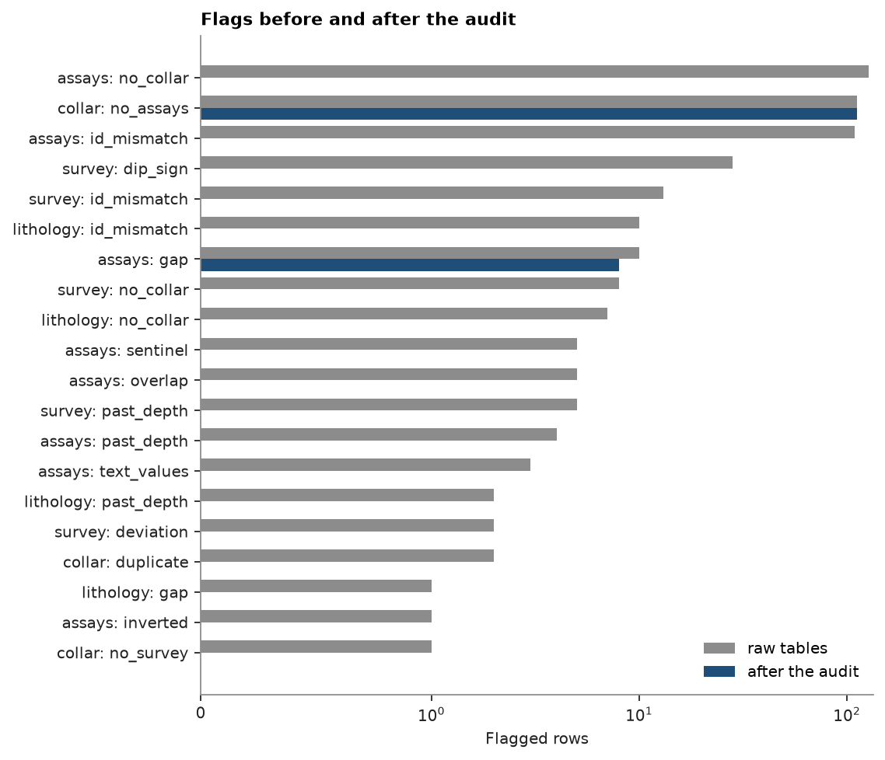

# Audit drill holes before modeling

A project hands you its drill hole database: collars, downhole surveys, assays and lithology, exported from the
logging software. Every later step (desurveying, compositing, variograms, estimation) trusts these tables. One
wrong dip moves a hole under the wrong lens; one `-999` read as a grade drags an ore intercept to zero. You audit
the tables, decide for each problem whether to fix it, drop it or ask the geologist, and check again until no
unexplained flag is left.

<details><summary>Python</summary>

```python
import boitata as bt
import matplotlib.pyplot as plt
import numpy as np
from common import ACCENT, GRAY, save
```

</details>

!!! learn "What you'll learn"
    - The classes of error a drill hole database carries, and which table each one lives in.
    - How to sort each flag into fix by rule, fix by hand from evidence, drop, or query the geologist.
    - How to prove the audit is finished: a second check where every remaining flag is explained.

    Prerequisites: what collar, survey and interval tables hold. [Checking drill holes](../../02-data-and-geometry/01-check-drillholes/README.md)
    lists every check used here; this page covers the decisions.

## The data

The stacked sulphide lenses are three dipping polymetallic lenses cut by diamond (`DD`) and reverse circulation
(`RC`) holes. `raw=True` returns the tables as logged, with typical data-entry errors in them.

<details><summary>Python</summary>

```python
data = bt.datasets.stacked_sulphide_lenses(raw=True)
raw = {
    "collar": data["collars"],
    "survey": data["surveys"],
    "assays": data["assays"],
    "lithology": data["lithology"],
}
for name, table in raw.items():
    print(f"{name:>9}: {table.num_rows:6} rows, columns {', '.join(table.column_names)}")
```

</details>

```text
   collar:    290 rows, columns HOLE_ID, X, Y, Z, LENGTH, TYPE
   survey:   4326 rows, columns HOLE_ID, DEPTH, DIP, AZIMUTH
   assays:  16907 rows, columns HOLE_ID, FROM, TO, ZN_PCT, PB_PCT, CU_PCT, AG_GPT, AU_GPT, DENSITY
lithology:   1726 rows, columns HOLE_ID, FROM, TO, LITH
```

Interval tables (assays, lithology) describe a hole as a stack of `FROM`–`TO` pieces measured along the hole from
the collar. Most of their errors break that stack:

<figure class="bt-figure">
--8<-- "svg/w2-interval-errors.svg"
<figcaption><b>Figure 1.</b> A hole log with the interval errors the check looks for: a gap between two samples,
two samples that overlap, a sample whose FROM is below its TO (inverted), and samples logged past the hole's
recorded length.</figcaption>
</figure>

!!! step "Step 1: Run every check at once"
    `check_drillholes` takes the collar, the survey and a dict of interval tables and returns three tables:
    `flags` (one boolean column per check, one row per record), a `summary` (rows and holes hit per check) and
    `details` (the value behind each flag and its suggested replacement). `max_depth="LENGTH"` names the collar
    column holding the hole length.

<details><summary>Python</summary>

```python
def check(t):
    return bt.check_drillholes(
        t["collar"], t["survey"], {"assays": t["assays"], "lithology": t["lithology"]}, max_depth="LENGTH"
    )


def hit(flags, t, table, name):
    return sorted(set(t[table]["HOLE_ID"][flags[table][name]]))


flags, summary, details = check(raw)
before = {}
print(f"{'table':>9} {'check':<12} {'rows':>5} {'holes':>5}  examples")
for table, name, rows in zip(summary["table"], summary["check"], summary["rows"]):
    if rows:
        holes = hit(flags, raw, table, name)
        before[table, name] = int(rows)
        listed = ", ".join(repr(h) for h in holes[:4]) + (" ..." if len(holes) > 4 else "")
        print(f"{table:>9} {name:<12} {rows:5.0f} {len(holes):5}  {listed}")
```

</details>

```text
    table check         rows holes  examples
   collar duplicate        2     2  'DD0058', 'DD0067'
   collar no_survey        1     1  'DD0151'
   collar no_assays      112   112  'DD0001', 'DD0002', 'DD0003', 'DD0004' ...
   survey deviation        2     1  'DD0197'
   survey dip_sign        28     1  'DD0116'
   survey past_depth       5     1  'DD0055'
   survey id_mismatch     13     1  'DD0104'
   survey no_collar        8     1  'DD0111'
   assays inverted         1     1  'DD0100'
   assays gap             10     8  'DD0062', 'DD0080', 'DD0100', 'DD0200' ...
   assays overlap          5     2  'DD0162', 'DD0200'
   assays past_depth       4     1  'DD0055'
   assays sentinel         5     1  'DD0110'
   assays text_values      3     1  'DD0083'
   assays id_mismatch    109     2  'DD0104', 'dd0062'
   assays no_collar      127     1  'DD0111'
lithology gap              1     1  'DD0132'
lithology past_depth       2     1  'DD0055'
lithology id_mismatch     10     2  'DD0104', 'DD0132 '
lithology no_collar        7     1  'DD0111'
```

Twenty checks fire. The raw count means little: 104 of the 109 `id_mismatch` assay rows come from one trailing
space, while the two `deviation` rows are one flipped azimuth that bends `DD0197` between its stations at 150 and
210 m. Each flag needs a decision.

<figure class="bt-figure">
--8<-- "svg/w2-triage.svg"
<figcaption><b>Figure 2.</b> Triage of a flag. Accept and document a flag that describes the hole
correctly (core never sampled). If the tables alone say what the value should be, a named rule fixes it. If other
tables give evidence, fix it by hand and record why. If neither does, exclude the hole and send the question to
the geologist.</figcaption>
</figure>

!!! step "Step 2: Look at the evidence behind the ambiguous flags"
    Four flags have no obvious answer. `DD0067` has two collars with different coordinates; `DD0055` has
    samples below its recorded length; one `DD0100` assay is inverted; `DD0197` has a survey station whose
    azimuth jumps. The other tables of each hole say which entry to trust.

<details><summary>Python</summary>

```python
c, s, a, lith = raw["collar"], raw["survey"], raw["assays"], raw["lithology"]


def rows_of(table, hole):
    return table["HOLE_ID"] == hole


def deepest(hole):
    return {
        "survey": s["DEPTH"][rows_of(s, hole)].max(),
        "assays": a["TO"][rows_of(a, hole)].max(),
        "lithology": lith["TO"][rows_of(lith, hole)].max(),
    }


for hole in ("DD0067", "DD0055"):
    lengths = c["LENGTH"][rows_of(c, hole)]
    ends = ", ".join(f"{k} {v:.2f}" for k, v in deepest(hole).items())
    print(f"{hole}: collar LENGTH {', '.join(f'{v:.2f}' for v in lengths)} m; deepest {ends} m")
xy = np.c_[c["X"], c["Y"]][rows_of(c, "DD0067")]
print(f"DD0067 collar entries are {np.hypot(*(xy[1] - xy[0])):.0f} m apart")

inverted = a["FROM"] > a["TO"]
print(f"DD0100 inverted assay: FROM {a['FROM'][inverted][0]} TO {a['TO'][inverted][0]}")
dd0197 = rows_of(s, "DD0197")
print("DD0197 azimuths at 150, 180, 210 m:", s["AZIMUTH"][dd0197][5:8])
top = np.abs(s["DIP"][s["DEPTH"] == 0])
print(f"dip at the collar, all surveyed holes: {top.min():.0f} to {top.max():.0f} degrees")
```

</details>

```text
DD0067: collar LENGTH 273.51, 174.68 m; deepest survey 273.51, assays 273.51, lithology 273.51 m
DD0055: collar LENGTH 707.50 m; deepest survey 812.56, assays 714.00, lithology 812.56 m
DD0067 collar entries are 290 m apart
DD0100 inverted assay: FROM 368.14 TO 366.14
DD0197 azimuths at 150, 180, 210 m: [292.14 111.81 291.9 ]
dip at the collar, all surveyed holes: 55 to 75 degrees
```

The evidence settles each one:

- `DD0067`: its survey, assays and lithology all end at 273.51 m, the length of the first collar entry. The second
  entry (174.68 m, 290 m away) is wrong; the `duplicate` rule drops the later entry, which is the right one to
  drop here.
- `DD0055`: three tables agree the hole reaches 812.56 m, past the 707.50 m on the collar. The collar length is
  the typo; set it to the deepest survey station.
- `DD0100`: FROM 368.14, TO 366.14 is a 2 m sample with its ends swapped; swap them back.
- `DD0197`: 292.14° → 111.81° → 291.90° is a flip of 180° and back, a transcription error. The `deviation` rule
  drops the two stations the flip touches, and the stations on either side carry the hole.

!!! pitfall "Pitfall: sentinels read as grades"
    `-999` and `-99` mean "no value", but in a numeric column they average like any grade. `DD0110` has a
    `-999` for zinc in the middle of its ore intercept:

<details><summary>Python</summary>

```python
dd0110 = rows_of(a, "DD0110") & (a["FROM"] >= 40.2) & (a["TO"] <= 47.07)
zn = np.asarray(a["ZN_PCT"][dd0110], dtype=float)
length = (a["TO"] - a["FROM"])[dd0110]
valid = zn > -99
print(f"DD0110, 40.20-47.07 m, {dd0110.sum()} assays: Zn values {zn}")
print(f"  length-weighted Zn with -999 as a number: {np.average(zn, weights=length):.1f} %")
print(f"  length-weighted Zn without it:            {np.average(zn[valid], weights=length[valid]):.2f} %")
```

</details>

```text
DD0110, 40.20-47.07 m, 7 assays: Zn values [   2.979 -999.       4.227    1.945    2.758    3.834    2.692]
  length-weighted Zn with -999 as a number: -139.9 %
  length-weighted Zn without it:            3.07 %
```

One sentinel turns a 3.07 % zinc intercept into −139.9 %. A negative grade is easy to spot; a `-99` in a column of
values near 100 is not. Boitatá's readers map sentinels to null by default (`nodata=`); this page reads the raw
tables with `nodata=[]` to keep the problem visible.

!!! step "Step 3: Fix by hand what needs evidence"
    The manual fixes come first, so the rules in step 4 see corrected tables. Each hand fix is one line of code,
    so the next person can rerun and review the audit. Trailing spaces are stripped from all
    ids here: the collar `'DD0104 '` is the odd one, and a rename rule would copy its space into three tables.
    `DD0151` is dropped: without a survey it would be desurveyed as vertical, while every surveyed hole on the
    project starts at a dip of 55–75°.

<details><summary>Python</summary>

```python
def replace(table, **columns):
    return bt.Table({**{k: table[k] for k in table.column_names}, **columns})


def strip_ids(table):
    return replace(table, HOLE_ID=[h.strip() for h in table["HOLE_ID"]])


tables = {name: strip_ids(t) for name, t in raw.items()}
a = tables["assays"]
swap = a["FROM"] > a["TO"]
tables["assays"] = replace(a, FROM=np.where(swap, a["TO"], a["FROM"]), TO=np.where(swap, a["FROM"], a["TO"]))
c, s = tables["collar"], tables["survey"]
dd0055 = rows_of(c, "DD0055")
tables["collar"] = replace(c, LENGTH=np.where(dd0055, s["DEPTH"][rows_of(s, "DD0055")].max(), c["LENGTH"]))
tables = {name: t.filter(~rows_of(t, "DD0151")) for name, t in tables.items()}
```

</details>

!!! step "Step 4: Apply the rules"
    `fix_drillholes` takes the flags of the corrected tables and applies one named rule per check. The defaults
    drop duplicates, flipped survey stations and rows of holes without a collar, rename ids to their collar
    (`'dd0062'` → `'DD0062'`), keep the first of two overlapping intervals and set sentinels to null. Two rules are
    chosen here: `dip_sign="negate"` turns `DD0116`'s negative dips down like every other hole, and
    `text_values="half"` reads `<0.01` as half the detection limit (`NS`, not sampled, becomes null). The log
    says what each rule did.

<details><summary>Python</summary>

```python
flags, _, _ = check(tables)
fixed, log = bt.fix_drillholes(flags, tables, dip_sign="negate", text_values="half")
for table, name, action, rows in zip(log["table"], log["check"], log["action"], log["rows"]):
    if rows:
        print(f"{action:>10} {rows:4.0f} {table} rows flagged {name}")
```

</details>

```text
      drop    2 collar rows flagged duplicate
      drop    2 survey rows flagged deviation
      drop    8 survey rows flagged no_collar
    negate   28 survey rows flagged dip_sign
keep_first    5 assays rows flagged overlap
      half    3 assays rows flagged text_values
      null    5 assays rows flagged sentinel
      drop  127 assays rows flagged no_collar
    rename    5 assays rows flagged id_mismatch
      drop    7 lithology rows flagged no_collar
```

!!! check "Check before you move on"
    Run the same checks on the fixed tables. What remains must be on a list you can defend, hole by hole; the
    assertion fails if anything else is flagged.

<details><summary>Python</summary>

```python
flags, summary, _ = check(fixed)
after = {(t, n): int(r) for t, n, r in zip(summary["table"], summary["check"], summary["rows"]) if r}
rc_core = {"RC0008", "RC0014", "RC0016", "RC0031"}
accepted = {
    ("assays", "gap"): rc_core | {"DD0080", "DD0200"},
    ("collar", "no_assays"): None,
}
for key, rows in after.items():
    holes = hit(flags, fixed, *key)
    print(
        f"{key[0]:>9} {key[1]:<10} {rows:4} rows: {', '.join(holes) if len(holes) <= 8 else f'{len(holes)} holes'}"
    )
    assert key in accepted, key
    assert accepted[key] is None or set(holes) <= accepted[key], (key, holes)
lith = fixed["lithology"]
mineralized = set(lith["HOLE_ID"][np.isin(lith["LITH"], ["MS", "SMS", "STR"])])
unassayed = mineralized & set(hit(flags, fixed, "collar", "no_assays"))
print("no assays but logged mineralized:", sorted(unassayed))
```

</details>

```text
   collar no_assays   112 rows: 112 holes
   assays gap           8 rows: DD0080, DD0200, RC0008, RC0014, RC0016, RC0031
no assays but logged mineralized: ['DD0043']
```

Two checks still fire, and every hole they name is explained. The RC gaps are core that was never
sampled. The `DD0080` gaps are two lost samples, and the `DD0200` gaps are the two intervals the overlap rule dropped. Of the 112 holes without assays, 111
never log a mineralized unit (`MS`, `SMS`, `STR`) and were not sent to the lab; `DD0043` logs ore and has no
assays.

The audit changed the tables as follows:

<details><summary>Python</summary>

```python
names = {"collar": "collars", "survey": "surveys", "assays": "assays", "lithology": "lithology"}
print(f"{'table':>9} {'rows before':>12} {'rows after':>11} {'flagged before':>15} {'flagged after':>14}")
for name in names:
    flagged_before = sum(v for (t, _), v in before.items() if t == name)
    flagged_after = sum(v for (t, _), v in after.items() if t == name)
    print(
        f"{name:>9} {raw[name].num_rows:12} {fixed[name].num_rows:11} {flagged_before:15} {flagged_after:14}"
    )

checks = sorted(before, key=lambda k: before[k])
fig, ax = plt.subplots(figsize=(7, 6), layout="constrained")
y = np.arange(len(checks))
ax.barh(y + 0.2, [before[k] for k in checks], height=0.4, color=GRAY, label="raw tables")
ax.barh(y - 0.2, [after.get(k, 0) for k in checks], height=0.4, color=ACCENT, label="after the audit")
ax.set_yticks(y, [f"{t}: {n}" for t, n in checks])
ax.set_xscale("symlog", linthresh=1)
ax.set(xlabel="Flagged rows", title="Flags before and after the audit")
ax.legend(loc="lower right")
save(fig, "flags")
```

</details>

```text
    table  rows before  rows after  flagged before  flagged after
   collar          290         287             115            112
   survey         4326        4316              56              0
   assays        16907       16689             264              8
lithology         1726        1705              20              0
```



## The decision

The fixed tables go on to desurveying and compositing. Five questions go to the geologist; until they are
answered, the affected data stay as the table says:

| Hole | Question | Meanwhile |
|---|---|---|
| `DD0111` | Where is its collar? 127 assays cannot be placed without one. | Dropped |
| `DD0151` | Where is its downhole survey? | Dropped |
| `DD0043` | Its lithology logs ore; where are its assays? | Kept, no grades |
| `DD0200` | Of the two overlapping sample pairs, which is right? | First of each pair kept |
| `DD0080` | Were the two missing samples lost, or never taken? | Left as gaps |

Keep the audit script with the project: rerunning it on the next database export repeats every decision and
shows only what is new. [Hole traces](../../02-data-and-geometry/17-hole-traces/README.md) plots the flagged
survey stations in plan and section, and [desurvey](../../02-data-and-geometry/02-desurvey/README.md) is the next
step.

Full script: [`example_14_04.py`](example_14_04.py)
