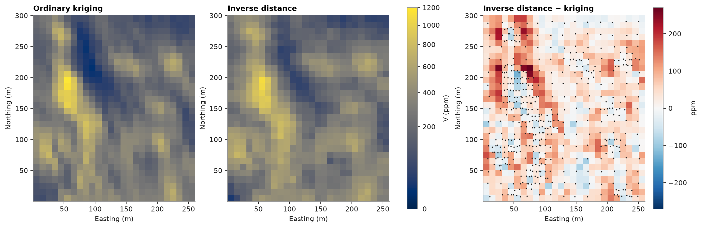
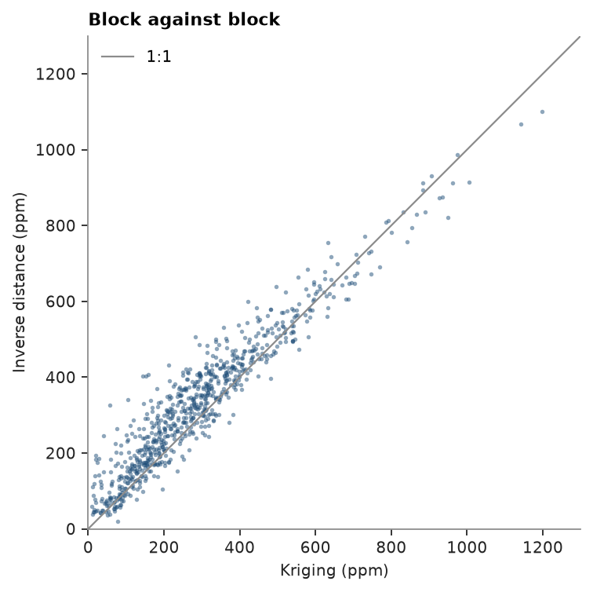
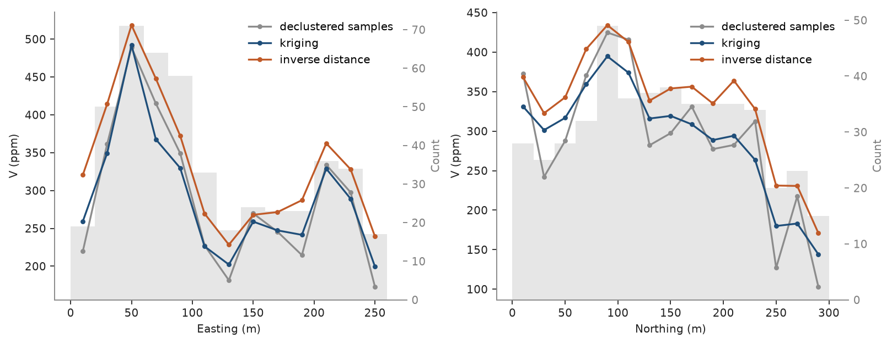

# Compare two estimates of one deposit

Two block models of the same deposit reach your desk: an ordinary kriging built by the resource geologist and an
inverse distance model built quickly for a scoping study. They disagree, and only one can be reported. This
tutorial compares them the way a reviewer would, with only the samples as evidence (global means, a difference
map, block against block, swaths, cross-validation), decides which to keep, and then checks the decision against
the true grades, which Walker Lake happens to have.

<details><summary>Python</summary>

```python
import boitata as bt
import matplotlib.pyplot as plt
import numpy as np
from common import ACCENT, GRAY, HIGHLIGHT, INK, map_axes, save
from matplotlib.colors import PowerNorm, TwoSlopeNorm
```

</details>

!!! learn "What you'll learn"
    - Why two estimates from the same samples can disagree by double-digit percentages.
    - Five checks that need only the samples: declustered mean, difference map, block-to-block scatter, swaths
      and cross-validation.
    - How to turn the checks into a decision you can defend.

    Prerequisites: [ordinary kriging](../../06-kriging/01-ordinary-kriging/README.md) and
    [simple estimators](../../06-kriging/02-simple-estimators/README.md). [Model checks](../../10-checking-models/01-model-checks/README.md)
    validates a single model; this page puts two side by side.

## The data

The 470 Walker Lake samples of `V` (ppm) are clustered: the later drilling concentrated on the high-grade areas.
Cell declustering gives each sample a weight that corrects for this, so the declustered mean is the best estimate
of the deposit mean the samples alone can give.

<details><summary>Python</summary>

```python
samples = bt.datasets.walker_lake()
xy, v = samples.coords, samples["V"]
weights = bt.cell_declustering(xy, v, sizes=np.arange(2.5, 102.5, 2.5)).weights
print(
    f"{len(v)} samples: naive mean {v.mean():.1f} ppm, declustered mean {np.average(v, weights=weights):.1f} ppm"
)
```

</details>

```text
470 samples: naive mean 435.3 ppm, declustered mean 290.7 ppm
```

!!! step "Step 1 — Rebuild both estimates on the same blocks"
    Compare like with like, so that only the method differs: one block model of 10 × 10 m
    blocks, one search (up to 24 samples in an ellipse along the direction of greatest continuity), one set of
    samples. The kriging uses the variogram fitted in [ordinary kriging](../../06-kriging/01-ordinary-kriging/README.md)
    and estimates block averages; inverse distance weights each sample by 1/d².

<details><summary>Python</summary>

```python
azimuths = np.arange(0, 180, 22.5)
directional = [bt.experimental_variogram(xy, v, 10.0, 120.0, azimuth=a) for a in azimuths]
model = bt.Variogram.fit_directional(
    directional, [(a, 0) for a in azimuths], ["spherical", "spherical"], weighting="count/gamma"
)
search = bt.Search(radius=80, max_samples=24, min_samples=4, rotation=model.rotation, ratios=(0.5, 1.0))
kriging = bt.BlockKriging(model, search, size=(10, 10), discretization=(5, 5, 1)).fit(xy, v)
inverse = bt.InverseDistance(search, power=2).fit(xy, v)

blocks = bt.BlockModel(origin=(0.5, 0.5), size=(10, 10), count=(26, 30))
blocks = blocks.with_columns({"ok": kriging.predict(blocks), "id": inverse.predict(blocks)})
ok, idw = blocks["ok"], blocks["id"]
print(blocks)
print(f"unestimated blocks: kriging {np.isnan(ok).sum()}, inverse distance {np.isnan(idw).sum()}")
```

</details>

```text
BlockModel(regular, 780 of 780 cells, count [26, 30, 1], size [10.0, 10.0, 1.0], rotation [0.0, 0.0, 0.0])
  ok: Float64
  id: Float64
unestimated blocks: kriging 0, inverse distance 0
```

!!! step "Step 2 — Global means against the declustered samples"
    An unbiased model reproduces the declustered mean. `global_bias` compares the block mean with the weighted
    sample mean.

<details><summary>Python</summary>

```python
for name, estimate in (("kriging", ok), ("inverse distance", idw)):
    bias = bt.global_bias(estimate, v, data_weights=weights)
    print(
        f"{name:>16}: blocks {bias['estimate_mean']:.1f} ppm, declustered samples {bias['data_mean']:.1f} ppm, "
        f"bias {bias['relative']:+.1%}"
    )
```

</details>

```text
         kriging: blocks 291.7 ppm, declustered samples 290.7 ppm, bias +0.3%
inverse distance: blocks 332.9 ppm, declustered samples 290.7 ppm, bias +14.5%
```

Kriging is within 0.3 % of the declustered mean; inverse distance is 14.5 % above it. That gap needs an
explanation before anything else.

!!! pitfall "Pitfall: checking against the naive mean"
    Against the naive sample mean of 435.3 ppm, inverse distance (332.9 ppm) looks closer than kriging
    (291.7 ppm), and a reviewer might conclude it "honors the data better". The naive mean counts every sample
    in the high-grade clusters at full weight, which is the same error inverse distance makes. Always compare with
    the declustered mean.

The reason is in how each method weighs a cluster. Inverse distance looks only at the distance from the block to
each sample. Kriging also looks at the distances between samples: four samples a few meters apart carry little
more information than one, so they share the weight one sample would get.

<figure class="bt-figure">
--8<-- "svg/w2-cluster-weights.svg"
<figcaption><b>Figure 1.</b> One sample 40 m west of a block, four clustered samples 40 to 48 m east of it.
Inverse distance gives the cluster 0.77 of the weight because it has four samples; ordinary kriging (spherical
variogram, 100 m range, nugget 20 % of the sill) gives it 0.54, about as much as the one sample (0.46). Where the
clusters sit on high grades, inverse distance pulls the estimates up.</figcaption>
</figure>

!!! step "Step 3 — Map the difference"
    A difference map (inverse distance minus kriging, per block) shows where the models disagree. Plot it on a
    diverging scale centered on zero, with the samples on top.

<details><summary>Python</summary>

```python
shape, extent = (30, 26), (0.5, 260.5, 0.5, 300.5)
difference = idw - ok
fig, axes = plt.subplots(1, 3, figsize=(13, 4.8), layout="constrained")
norm = PowerNorm(0.5, vmin=0, vmax=1200)
for ax, image, title in ((axes[0], ok, "Ordinary kriging"), (axes[1], idw, "Inverse distance")):
    im = ax.imshow(image.reshape(shape), origin="lower", extent=extent, norm=norm)
    map_axes(ax, title)
fig.colorbar(im, ax=axes[:2], shrink=0.8, label="V (ppm)")
limit = np.abs(difference).max()
dm = axes[2].imshow(
    difference.reshape(shape),
    origin="lower",
    extent=extent,
    cmap="RdBu_r",
    norm=TwoSlopeNorm(0, -limit, limit),
)
axes[2].scatter(xy[:, 0], xy[:, 1], s=3, color=INK, linewidths=0)
map_axes(axes[2], "Inverse distance − kriging")
fig.colorbar(dm, ax=axes[2], shrink=0.8, label="ppm")
save(fig, "maps")

higher = difference > 0
print(
    f"inverse distance is higher in {higher.mean():.0%} of the blocks; mean difference {difference.mean():+.1f} ppm"
)
```

</details>

```text
inverse distance is higher in 77% of the blocks; mean difference +41.2 ppm
```



Inverse distance is higher in 77 % of the blocks, by 41.2 ppm on average. The largest differences lie at the
edges of the dense clusters, where a block's search reaches a few isolated samples and many clustered ones, the
case Figure 1 draws.

!!! step "Step 4 — Block against block"
    A scatter of one model against the other, block by block, separates a shift (points off the 1:1 line on
    one side) from scatter (points spread around it).

<details><summary>Python</summary>

```python
fig, ax = plt.subplots(figsize=(4.8, 4.6), layout="constrained")
ax.scatter(ok, idw, s=6, color=ACCENT, alpha=0.5, linewidths=0)
ax.plot([0, 1300], [0, 1300], color=GRAY, lw=1, label="1:1")
ax.set(xlim=(0, 1300), ylim=(0, 1300), xlabel="Kriging (ppm)", ylabel="Inverse distance (ppm)")
ax.set_aspect("equal")
ax.set_title("Block against block")
ax.legend(loc="upper left")
save(fig, "scatter")
print(f"correlation {np.corrcoef(ok, idw)[0, 1]:.3f}")
for low, high in ((0, 400), (400, 800), (800, 1300)):
    band = (ok >= low) & (ok < high)
    print(
        f"kriging {low}-{high} ppm: {band.sum():3} blocks, inverse distance higher in {(idw > ok)[band].mean():.0%}, "
        f"mean difference {difference[band].mean():+.1f} ppm"
    )
```

</details>

```text
correlation 0.951
kriging 0-400 ppm: 608 blocks, inverse distance higher in 82%, mean difference +49.7 ppm
kriging 400-800 ppm: 155 blocks, inverse distance higher in 61%, mean difference +17.2 ppm
kriging 800-1300 ppm:  17 blocks, inverse distance higher in 29%, mean difference -42.8 ppm
```



The two models rank the blocks alike (correlation 0.951), yet the cloud sits off the 1:1 line. Of the 608
blocks kriged below 400 ppm, inverse distance puts 82 % higher, by 49.7 ppm on average; of the 17 above 800 ppm,
it puts 71 % lower. Inverse distance lifts the low-grade blocks whose neighborhoods reach into a high-grade
cluster.

!!! step "Step 5 — Swaths against the declustered samples"
    A swath plot averages the blocks and the samples in slices (here 20 m) along one axis. It shows where along
    the deposit each model departs from the data.

<details><summary>Python</summary>

```python
fig, axes = plt.subplots(1, 2, figsize=(10, 3.8), layout="constrained")
for ax, axis, label in ((axes[0], "x", "Easting (m)"), (axes[1], "y", "Northing (m)")):
    series = [
        bt.swath(samples, "V", 20.0, axis=axis, weights=weights),
        bt.swath(blocks, "ok", 20.0, axis=axis),
        bt.swath(blocks, "id", 20.0, axis=axis),
    ]
    bt.plot.swath(series, labels=["declustered samples", "kriging", "inverse distance"], ax=ax)
    for line, color in zip(ax.lines, (GRAY, ACCENT, HIGHLIGHT), strict=True):
        line.set_color(color)
    ax.legend()
    ax.set(xlabel=label, ylabel="V (ppm)")
save(fig, "swaths")
```

</details>



Kriging follows the declustered samples slice by slice. Inverse distance runs above both over most of the
deposit, so its bias is not a local artifact.

!!! step "Step 6 — Tonnage and grade above cutoffs"
    `compare_models` takes the block model, the columns to compare and a list of cutoffs, and returns for each
    cutoff and model the tonnage, mean grade and metal above it, plus each one's difference from a `reference`
    model. Without a density each block weighs its volume (here its area, 100 m²).

<details><summary>Python</summary>

```python
table = bt.compare_models(blocks, ["ok", "id"], [0, 200, 400, 600], reference="ok")
print(
    f"{'cutoff':>6} {'model':>5} {'area above (m²)':>16} {'mean V':>7} {'area diff':>10} {'grade diff':>11}"
)
for row in zip(
    *(table[c] for c in ("cutoff", "model", "tonnage", "mean_grade", "tonnage_diff", "grade_diff"))
):
    cutoff, name, tonnage, grade, dt, dg = row
    print(f"{cutoff:6.0f} {name:>5} {tonnage:16,.0f} {grade:7.1f} {dt:+10.1%} {dg:+11.1%}")
```

</details>

```text
cutoff model  area above (m²)  mean V  area diff  grade diff
     0    ok           78,000   291.7      +0.0%       +0.0%
     0    id           78,000   332.9      +0.0%      +14.1%
   200    ok           50,100   388.3      +0.0%       +0.0%
   200    id           58,200   403.2     +16.2%       +3.8%
   400    ok           17,200   568.7      +0.0%       +0.0%
   400    id           25,400   533.3     +47.7%       -6.2%
   600    ok            5,100   762.3      +0.0%       +0.0%
   600    id            6,000   728.8     +17.6%       -4.4%
```

The shift carries into selection: at 200 ppm inverse distance reports 16.2 % more area above cutoff than
kriging, at a 3.8 % higher grade. The next tutorial turns this into tonnes and metal.

!!! step "Step 7 — Cross-validation"
    Leave-one-out cross-validation re-estimates each sample from its neighbors with itself left out. A small mean
    error, a low RMSE and a slope of actual on estimate near 1 mark the better estimator.

<details><summary>Python</summary>

```python
point_kriging = bt.OrdinaryKriging(model, search).fit(xy, v)
print(f"{'':>16}  mean error   RMSE   corr  slope")
for name, estimator in (("kriging", point_kriging), ("inverse distance", inverse)):
    cv = estimator.cross_validate()
    print(f"{name:>16}  {cv.mean_error:10.1f} {cv.rmse:6.1f} {cv.correlation:6.3f} {cv.slope:6.2f}")
```

</details>

```text
                  mean error   RMSE   corr  slope
         kriging        11.6  185.4  0.787   1.03
inverse distance        56.8  213.0  0.738   1.19
```

Kriging wins on every statistic: mean error 11.6 against 56.8 ppm, RMSE 185.4 against 213.0, and a slope of 1.03
against 1.19. A slope above 1 means the actual grades vary more than the estimates predict: inverse distance is
conditionally biased. (Cross-validation uses point kriging, since the samples are points.)

!!! check "Check before you move on"
    Walker Lake has an exhaustive grid, so the true block averages are known here. They are never known on a real
    deposit; they serve only to test the decision made from the samples.

<details><summary>Python</summary>

```python
truth = bt.datasets.walker_lake_exhaustive()["V"].reshape(300, 260)
true_blocks = truth.reshape(30, 10, 26, 10).mean(axis=(1, 3)).ravel()
print(f"true block mean {true_blocks.mean():.1f} ppm")
for name, estimate in (("kriging", ok), ("inverse distance", idw)):
    rmse = np.sqrt(np.mean((estimate - true_blocks) ** 2))
    print(
        f"{name:>16}: mean {estimate.mean():.1f} ppm ({estimate.mean() / true_blocks.mean() - 1:+.1%}), "
        f"RMSE {rmse:.1f} ppm, correlation {np.corrcoef(estimate, true_blocks)[0, 1]:.3f}"
    )
```

</details>

```text
true block mean 278.0 ppm
         kriging: mean 291.7 ppm (+4.9%), RMSE 100.2 ppm, correlation 0.888
inverse distance: mean 332.9 ppm (+19.8%), RMSE 121.3 ppm, correlation 0.866
```

The truth agrees with the samples: kriging overstates the mean by 4.9 %, inverse distance by 19.8 %, and the
kriged blocks are closer to the true ones (RMSE 100.2 against 121.3 ppm). Most of kriging's 4.9 % comes from the
declustered mean itself: 290.7 ppm is 4.6 % above the true 278.0 ppm, and no check against the samples can see
that.

## The decision

Keep the kriging. Every check made from the samples alone pointed the same way:

<div class="bt-compare" markdown>

| Check | Ordinary kriging | Inverse distance |
|---|---|---|
| Mean against declustered samples | +0.3 % | +14.5 % |
| Blocks above the other model | 23 % | 77 % |
| Swaths | follow the samples | above them over most slices |
| Cross-validation RMSE, slope | 185.4 ppm, 1.03 | 213.0 ppm, 1.19 |

</div>

The cause is known: inverse distance ignores sample clustering, so the scoping model is biased high wherever
a block's neighborhood includes a dense cluster of high-grade drilling. [Grade–tonnage curves and the change in contained metal](../../14-workflows/06-grade-tonnage-and-metal/README.md)
turns this difference into tonnes, grade and metal at a cutoff.

Full script: [`example_14_05.py`](example_14_05.py)
