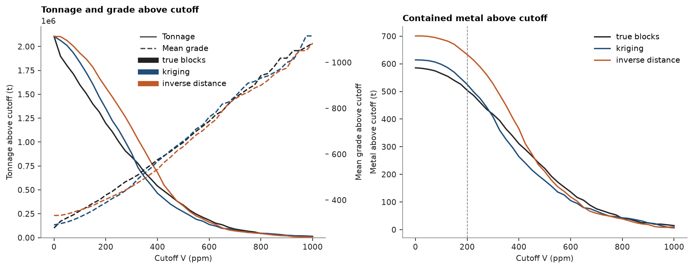

# Grade–tonnage curves and the change in contained metal

[Compare two estimates](../../14-workflows/05-compare-two-estimates/README.md) chose the ordinary kriging over the inverse distance
model of Walker Lake. Management asks the next question: how much metal does that decision remove from the
resource? You build grade–tonnage curves for both models and for the true blocks, report tonnes, grade and metal
at a set of cutoffs, state the change in contained metal at the reporting cutoff, and check that the metal adds
up.

<details><summary>Python</summary>

```python
import boitata as bt
import matplotlib.pyplot as plt
import numpy as np
from common import ACCENT, HIGHLIGHT, INK, save
```

</details>

!!! learn "What you'll learn"
    - What a grade–tonnage curve reports: tonnes, mean grade and metal above each cutoff.
    - Why a smooth estimate reports more tonnes at a lower grade above a low cutoff.
    - How to state a change in contained metal in absolute and relative terms, and check that it balances.

    Prerequisites: [compare two estimates](../../14-workflows/05-compare-two-estimates/README.md), which builds the two models.
    [Result plots](../../10-checking-models/06-result-plots/README.md) documents `bt.plot.grade_tonnage`.

## The data

The blocks are those of the previous tutorial: 26 × 30 blocks of 10 × 10 m. A grade–tonnage report needs tonnes,
which Walker Lake does not have, so two assumptions give them: a 10 m bench centered on the sample plane, and a
density of 2.7 t/m³. Each block is then 10 × 10 × 10 m = 1,000 m³ and weighs 2,700 t. Walker Lake's `V` is read
as a grade in ppm (g/t), so tonnes × ppm gives grams of metal; the tables below divide by 10⁶ to report tonnes of
metal.

<details><summary>Python</summary>

```python
samples = bt.datasets.walker_lake()
xy, v = samples.coords, samples["V"]
azimuths = np.arange(0, 180, 22.5)
directional = [bt.experimental_variogram(xy, v, 10.0, 120.0, azimuth=a) for a in azimuths]
model = bt.Variogram.fit_directional(
    directional, [(a, 0) for a in azimuths], ["spherical", "spherical"], weighting="count/gamma"
)
search = bt.Search(radius=80, max_samples=24, min_samples=4, rotation=model.rotation, ratios=(0.5, 1.0))
kriging = bt.BlockKriging(model, search, size=(10, 10), discretization=(5, 5, 1)).fit(xy, v)
inverse = bt.InverseDistance(search, power=2).fit(xy, v)

density = 2.7
blocks = bt.BlockModel(origin=(0.5, 0.5, -5.0), size=(10, 10, 10), count=(26, 30, 1))
truth = bt.datasets.walker_lake_exhaustive()["V"].reshape(300, 260)
blocks = blocks.with_columns(
    {
        "ok": kriging.predict(blocks),
        "id": inverse.predict(blocks),
        "truth": truth.reshape(30, 10, 26, 10).mean(axis=(1, 3)).ravel(),
    }
)
tonnes = 10 * 10 * 10 * density
print(blocks)
print(f"{blocks['ok'].size} blocks × {tonnes:,.0f} t = {blocks['ok'].size * tonnes:,.0f} t")
```

</details>

```text
BlockModel(regular, 780 of 780 cells, count [26, 30, 1], size [10.0, 10.0, 10.0], rotation [0.0, 0.0, 0.0])
  ok: Float64
  id: Float64
  truth: Float64
780 blocks × 2,700 t = 2,106,000 t
```

The true blocks are the averages of the exhaustive grid over each block. A real deposit has no such column; here
it shows which model reports the right tonnes.

!!! step "Step 1: One grade–tonnage curve"
    For a cutoff \(c\), the tonnage is the sum of the tonnes of the blocks with grade ≥ \(c\), the mean grade is
    their tonne-weighted average, and the metal is tonnage × mean grade. `grade_tonnage` computes this for a list
    of cutoffs. `data=blocks` lets it read the column by name and use each block's volume as its weight;
    `density` turns volume into tonnes.

<details><summary>Python</summary>

```python
cutoffs = np.arange(0, 1001, 25.0)
curve = bt.grade_tonnage("ok", cutoffs, density=density, data=blocks)
print(curve.column_names)
for row in zip(*(curve[c] for c in ("cutoff", "tonnage", "mean_grade", "metal"))):
    if row[0] in (0, 200, 400):
        cutoff, t, g, m = row
        print(f"cutoff {cutoff:3.0f} ppm: {t / 1e6:.3f} Mt at {g:.1f} ppm = {m / 1e6:.1f} t of metal")
```

</details>

```text
['cutoff', 'tonnage', 'mean_grade', 'metal']
cutoff   0 ppm: 2.106 Mt at 291.7 ppm = 614.2 t of metal
cutoff 200 ppm: 1.353 Mt at 388.3 ppm = 525.2 t of metal
cutoff 400 ppm: 0.464 Mt at 568.8 ppm = 264.1 t of metal
```

??? math "The math"
    With block tonnes \(t_i\) and grades \(z_i\), for a cutoff \(c\):
    \[ T(c) = \sum_{z_i \ge c} t_i, \qquad M(c) = \sum_{z_i \ge c} t_i z_i, \qquad \bar z(c) = M(c) / T(c). \]
    At \(c = 0\) the metal is the whole model's, \(\sum_i t_i z_i\).

!!! step "Step 2: All three models on one set of cutoffs"
    `compare_models` repeats `grade_tonnage` for several columns of one block model (a dict names each one) and
    adds each model's difference from a `reference`. The true blocks are the reference here, to see which model
    is closer.

<details><summary>Python</summary>

```python
labels = {"truth": "true blocks", "ok": "kriging", "id": "inverse distance"}
columns = {label: name for name, label in labels.items()}
table = bt.compare_models(blocks, columns, cutoffs, reference="true blocks", density=density)


def at(table, name, cutoff):
    rows = (table["model"] == labels[name]) & (table["cutoff"] == cutoff)
    return {
        c: float(table[c][rows][0])
        for c in ("tonnage", "mean_grade", "metal", "tonnage_diff", "grade_diff", "metal_diff")
    }


print(
    f"{'cutoff':>6} {'model':>16} {'kt':>7} {'V ppm':>6} {'metal t':>8}   vs truth: {'t':>6} {'grade':>6} {'metal':>6}"
)
for cutoff in (0, 100, 200, 300, 400, 600):
    for name, label in labels.items():
        r = at(table, name, cutoff)
        print(
            f"{cutoff:6.0f} {label:>16} {r['tonnage'] / 1e3:7.1f} {r['mean_grade']:6.1f} {r['metal'] / 1e6:8.1f}"
            f"             {r['tonnage_diff']:+6.1%} {r['grade_diff']:+6.1%} {r['metal_diff']:+6.1%}"
        )
```

</details>

```text
cutoff            model      kt  V ppm  metal t   vs truth:      t  grade  metal
     0      true blocks  2106.0  278.0    585.4              +0.0%  +0.0%  +0.0%
     0          kriging  2106.0  291.7    614.2              +0.0%  +4.9%  +4.9%
     0 inverse distance  2106.0  332.8    700.8              +0.0% +19.7% +19.7%
   100      true blocks  1598.4  353.3    564.7              +0.0%  +0.0%  +0.0%
   100          kriging  1833.3  326.1    597.9             +14.7%  -7.7%  +5.9%
   100 inverse distance  1930.5  356.9    688.9             +20.8%  +1.0% +22.0%
   200      true blocks  1196.1  421.3    504.0              +0.0%  +0.0%  +0.0%
   200          kriging  1352.7  388.3    525.2             +13.1%  -7.8%  +4.2%
   200 inverse distance  1571.4  403.1    633.4             +31.4%  -4.3% +25.7%
   300      true blocks   845.1  493.6    417.1              +0.0%  +0.0%  +0.0%
   300          kriging   882.9  462.0    407.9              +4.5%  -6.4%  -2.2%
   300 inverse distance  1150.2  458.6    527.4             +36.1%  -7.1% +26.4%
   400      true blocks   540.0  575.8    310.9              +0.0%  +0.0%  +0.0%
   400          kriging   464.4  568.8    264.1             -14.0%  -1.2% -15.0%
   400 inverse distance   683.1  533.9    364.7             +26.5%  -7.3% +17.3%
   600      true blocks   183.6  743.5    136.5              +0.0%  +0.0%  +0.0%
   600          kriging   137.7  762.4    105.0             -25.0%  +2.5% -23.1%
   600 inverse distance   162.0  729.0    118.1             -11.8%  -2.0% -13.5%
```

Read the kriging rows against the truth. At 100 and 200 ppm kriging reports 14.7 % and 13.1 % too many tonnes at a
grade 7.7 % and 7.8 % too low; the metal is off by 5.9 % and 4.2 %, because the two errors partly cancel.
From 400 ppm up kriging reports too few tonnes (−14.0 % at 400, −25.0 % at 600). Figure 1 shows why.

<figure class="bt-figure">
--8<-- "svg/w2-smoothing-cutoff.svg"
<figcaption><b>Figure 1.</b> Two grade distributions with the same mean; the smoothed one is narrower (standard
deviation 0.6 of the true one). At a cutoff half a standard deviation below the mean, the smoothed estimate puts
80 % of the tonnes above cutoff against 69 % for the truth, and their mean grade drops from 0.51 to 0.21 standard
deviations above the mean. At cutoffs well above the mean, the narrow distribution loses tonnes as
well.</figcaption>
</figure>

!!! key "Key idea"
    Estimation averages neighboring samples, so estimated blocks vary less than true blocks. Above a low cutoff,
    a smooth model lifts waste blocks over the cutoff, adding tonnes and diluting the grade. Above a high cutoff, it pulls the rich blocks down under it and loses tonnes. Tonnage and grade move in
    opposite directions at low cutoffs, so the error in metal is smaller than the error in tonnes.

!!! step "Step 3: Draw the curves"
    `bt.plot.grade_tonnage` draws the `compare_models` table: tonnage solid on the left axis, mean grade
    dashed on the right, one color per model. Metal above cutoff is a third curve worth its own panel.

<details><summary>Python</summary>

```python
fig, (a, b) = plt.subplots(1, 2, figsize=(11, 4.2), layout="constrained")
with plt.rc_context({"axes.prop_cycle": plt.cycler(color=[INK, ACCENT, HIGHLIGHT])}):
    bt.plot.grade_tonnage(table, ax=a)
a.set(xlabel="Cutoff V (ppm)", ylabel="Tonnage above cutoff (t)", title="Tonnage and grade above cutoff")
for name, color in (("truth", INK), ("ok", ACCENT), ("id", HIGHLIGHT)):
    rows = table["model"] == labels[name]
    b.plot(cutoffs, table["metal"][rows] / 1e6, color=color, label=labels[name])
b.axvline(200, color="gray", lw=0.8, ls="--")
b.set(xlabel="Cutoff V (ppm)", ylabel="Metal above cutoff (t)", title="Contained metal above cutoff")
b.legend()
save(fig, "grade_tonnage")
```

</details>



!!! step "Step 4: The change in contained metal at the reporting cutoff"
    The resource is reported above 200 ppm (the dashed line). Replacing the inverse distance model by the
    kriging changes the reported numbers as follows.

<details><summary>Python</summary>

```python
report = 200
old, new, true = (at(table, name, report) for name in ("id", "ok", "truth"))
for key, unit, scale in (("tonnage", "kt", 1e3), ("mean_grade", "ppm", 1), ("metal", "t", 1e6)):
    change = new[key] - old[key]
    print(
        f"{key:>10}: inverse distance {old[key] / scale:8.1f}, kriging {new[key] / scale:8.1f} {unit:>3}, "
        f"change {change / scale:+8.1f} {unit} ({change / old[key]:+.1%}); truth {true[key] / scale:8.1f}"
    )
```

</details>

```text
   tonnage: inverse distance   1571.4, kriging   1352.7  kt, change   -218.7 kt (-13.9%); truth   1196.1
mean_grade: inverse distance    403.1, kriging    388.3 ppm, change    -14.8 ppm (-3.7%); truth    421.3
     metal: inverse distance    633.4, kriging    525.2   t, change   -108.2 t (-17.1%); truth    504.0
```

Switching to kriging removes 218.7 kt (−13.9 %), 14.8 ppm of grade (−3.7 %) and 108.2 t of metal (−17.1 %).
Kriging's 525.2 t is still 4.2 % above the true 504.0 t; inverse distance was 25.7 % above it. At cutoff 0, where
no block is selected out, inverse distance holds 19.7 % more metal than the truth, against 4.9 % for
kriging: most of its excess is the clustering bias of the previous tutorial.

!!! pitfall "Pitfall: quoting only the tonnage change"
    "Kriging loses 13.9 % of the tonnes" is not the metal change, which is 17.1 % here. Tonnage alone can
    get the sign wrong: at 300 ppm kriging reports 4.5 % more tonnes than the truth but 2.2 % less metal.
    Report tonnes, grade and metal together, each in absolute and relative terms.

!!! check "Check before you move on"
    Metal must balance three ways: the reported metal equals tonnage × mean grade at every cutoff; at cutoff 0 it
    equals block tonnes × grade summed over all blocks; and above the reporting cutoff it equals the same sum over
    the blocks at or above the cutoff.

<details><summary>Python</summary>

```python
for name, label in labels.items():
    rows = table["model"] == label
    t, g, m = (table[c][rows] for c in ("tonnage", "mean_grade", "metal"))
    above = ~np.isnan(g)
    assert np.allclose(m[above], t[above] * g[above])
    grade = blocks[name]
    total = (tonnes * grade).sum()
    selected = (tonnes * grade[grade >= report]).sum()
    assert np.isclose(m[0], total) and np.isclose(at(table, name, report)["metal"], selected)
    print(
        f"{label:>16}: metal at cutoff 0 {m[0] / 1e6:5.1f} t = sum over blocks {total / 1e6:5.1f} t; "
        f"above {report} ppm {selected / 1e6:5.1f} t in {(grade >= report).sum()} blocks"
    )
```

</details>

```text
     true blocks: metal at cutoff 0 585.4 t = sum over blocks 585.4 t; above 200 ppm 504.0 t in 443 blocks
         kriging: metal at cutoff 0 614.2 t = sum over blocks 614.2 t; above 200 ppm 525.2 t in 501 blocks
inverse distance: metal at cutoff 0 700.8 t = sum over blocks 700.8 t; above 200 ppm 633.4 t in 582 blocks
```

All three models balance: for kriging, 614.2 t in the whole model, 525.2 t of it in the 501 blocks above
200 ppm. A metal figure that does not balance usually means blocks without a grade (null) were counted in the
tonnes, or the density was applied twice.

## The decision

Report the kriging: 1,352.7 kt at 388.3 ppm, 525.2 t of metal above 200 ppm. The change from the scoping
model is −108.2 t of metal (−17.1 %), which the clustering bias found in [compare two estimates](../../14-workflows/05-compare-two-estimates/README.md)
explains. The remaining smoothing (too many tonnes at too low a grade at this cutoff) is a change-of-support
problem: the [discrete Gaussian model](../../09-recoverable-resources/01-discrete-gaussian-model/README.md) and
[uniform conditioning](../../09-recoverable-resources/02-uniform-conditioning/README.md) estimate the tonnage a
selective mining unit would recover.

Full script: [`example_14_06.py`](example_14_06.py)
