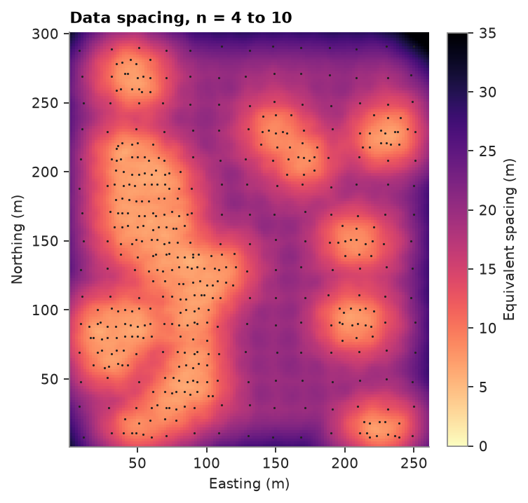
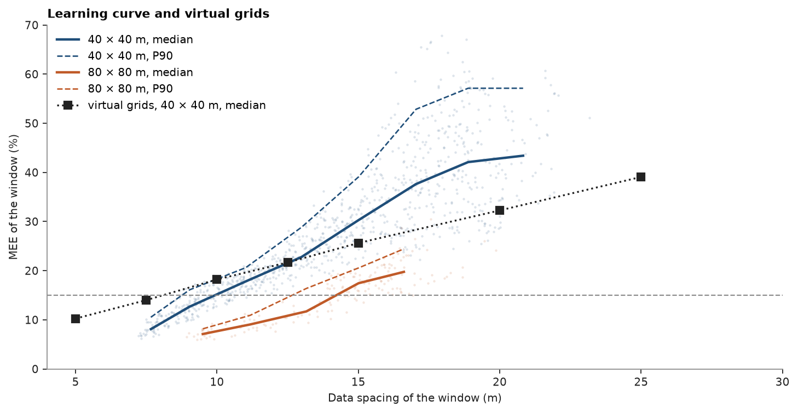

# Drill-hole spacing from a learning curve

[Virtual grids](../../14-workflows/07-drillhole-spacing-virtual-grids/README.md) drilled simulated truths of
Walker Lake on regular grids to find the spacing a production volume needs. A deposit with years of drilling
already holds that relation in its own data: dense areas and sparse areas sit side by side. Cabral Pinto's
learning curve reads it from one conditional simulation. You map the data spacing, measure the uncertainty of
every production window, plot one against the other, and compare the curve with the virtual grids and with the
exhaustive truth.

<details><summary>Python</summary>

```python
import boitata as bt
import matplotlib.pyplot as plt
import numpy as np
from common import ACCENT, GRAY, HIGHLIGHT, INK, map_axes, save
```

</details>

!!! learn "What you'll learn"
    - How to measure data spacing at every node with Cabral Pinto's equivalent spacing.
    - How to build a learning curve of window uncertainty against data spacing, and read a required spacing
      from it.
    - How the learning curve and Wilde's virtual grids check each other (Wilde, 2010, §5.3).

    Prerequisites: [virtual grids](../../14-workflows/07-drillhole-spacing-virtual-grids/README.md), which sets
    up the model, the windows and the MEE; [data spacing](../../03-exploratory-analysis/10-data-spacing/README.md).

## The data

The setup repeats the virtual-grid study: the normal-score variogram of the declustered V, turning bands on 2 m
nodes, and moving windows of 40 × 40 m (a quarter) over 8 m panels and 80 × 80 m (a year) over 16 m panels.
Walker Lake also has an exhaustive grid of V, averaged here to the 2 m nodes; a real deposit has no such
truth, and here it tests the result.

<details><summary>Python</summary>

```python
samples = bt.datasets.walker_lake()
xy, v = samples.coords, samples["V"]
weights = bt.cell_declustering(samples, "V", sizes=np.arange(2.5, 102.5, 2.5)).weights
scores = bt.NormalScore().fit(v, weights=weights).transform(v)
azimuths = (170, 260)
directional = [bt.experimental_variogram(xy, scores, 10, 120, azimuth=a) for a in azimuths]
fitted = bt.Variogram.fit_directional(directional, [(a, 0) for a in azimuths], rotation=[170, 0, 0])
gaussian = fitted.standardized()
nodes = bt.BlockModel(origin=(1, 1), size=(2, 2), count=(130, 150))
panels = {
    side: bt.BlockModel(origin=(1, 1), size=(side / 5,) * 2, count=(1280 // side, 1480 // side))
    for side in (40, 80)
}
tb = bt.TurningBands(gaussian, bands=500, search=bt.Search(radius=100, max_samples=24)).fit(
    xy, v, weights=weights
)
truth = bt.datasets.walker_lake_exhaustive()["V"].reshape(150, 2, 130, 2).mean(axis=(1, 3)).ravel()


def inside(side):
    """Panels whose window of `side` meters lies inside the panels."""
    c = panels[side].coords[:, :2] - 1
    extent = np.array([1280 // side, 1480 // side]) * side / 5
    return ((c >= side / 2) & (c <= extent - side / 2)).all(axis=1)


def window_mean(values, side):
    """Mean of node `values` over the window of each panel, NaN outside the area."""
    total = np.pad(nodes.grid(values)[0], ((1, 0), (1, 0))).cumsum(0).cumsum(1)
    k = side // 2
    i0, j0 = ((panels[side].coords[:, :2] - side / 2 - 1) / 2).round().astype(int).T
    i0, j0 = np.clip(i0, 0, 130 - k), np.clip(j0, 0, 150 - k)
    s = total[j0 + k, i0 + k] - total[j0, i0 + k] - total[j0 + k, i0] + total[j0, i0]
    return np.where(inside(side), s / k**2, np.nan)


print(f"{len(xy)} samples, {len(truth)} nodes; true mean V {truth.mean():.1f} ppm")
```

</details>

```text
470 samples, 19500 nodes; true mean V 278.0 ppm
```

!!! step "Step 1: Data spacing at every node"
    `data_spacing` with `search=None` works in plan. At each node it takes the distances \(d_n\) to the nearest
    samples, sets \(r = (d_n + d_{n+1}) / 2\), the radius of a circle that holds \(n\) samples, and returns
    the side of the square each sample stands for, \(\sqrt{\pi r^2 / n}\), averaged over \(n = 4, \dots, 10\).
    In 3D, give a `Search` and drill holes: the spacing becomes \(\sqrt{V / (c\, n)}\) with \(V\) the volume of
    the search ellipsoid, \(c\) the composite length and \(n\) the composites inside.

<details><summary>Python</summary>

```python
spacing = bt.data_spacing(nodes, samples, None)
p10, p50, p90 = np.percentile(spacing, [10, 50, 90])
print(f"data spacing: median {p50:.2f} m, P10 {p10:.1f} m, P90 {p90:.1f} m")

fig, ax = plt.subplots(figsize=(4.6, 4.8), layout="constrained")
image = ax.imshow(
    nodes.grid(spacing)[0], origin="lower", extent=(1, 261, 1, 301), cmap="magma_r", vmin=0, vmax=35
)
ax.scatter(*xy[:, :2].T, s=2, color=INK, linewidths=0)
fig.colorbar(image, ax=ax, shrink=0.8, label="Equivalent spacing (m)")
map_axes(ax, "Data spacing, n = 4 to 10")
save(fig, "spacing_map")
```

</details>

```text
data spacing: median 15.60 m, P10 8.0 m, P90 22.0 m
```



The median data spacing is 15.6 m; the infilled high-grade areas read under 8 m and the
edges over 22 m.

!!! step "Step 2: Uncertainty of every window"
    One conditional simulation of 100 realizations, summarized at each window size, gives the MEE of every
    window with `relative_error`. Each window takes the mean data spacing of its nodes.

<details><summary>Python</summary>

```python
windows = {}
for side in (40, 80):
    summary = tb.simulate(
        nodes,
        n=100,
        seed=11,
        blocks=panels[side],
        window=(side, side),
        quantiles=[0.05, 0.95],
    )
    windows[side] = (summary, window_mean(spacing, side), window_mean(truth, side))
    keep = inside(side)
    mee = summary.relative_error()[keep]
    print(
        f"{side} m windows: {keep.sum()}, MEE median {np.median(mee):.1%}, {np.mean(mee <= 0.15):.1%} at or below 15 %"
    )
```

</details>

```text
40 m windows: 924, MEE median 26.8%, 15.9% at or below 15 %
80 m windows: 168, MEE median 16.1%, 43.5% at or below 15 %
```

!!! step "Step 3: The learning curve"
    `uncertainty_curve` bins the windows by data spacing, 2 m wide, and gives the median (P50) and P90 of MEE
    in each bin. `required_spacing` reads where each crosses 15 %.

<details><summary>Python</summary>

```python
curves, required = {}, {}
for side, (summary, at_window, _) in windows.items():
    keep = inside(side)
    curves[side] = bt.uncertainty_curve(
        at_window[keep], summary.relative_error()[keep], bins=np.arange(4, 32, 2)
    )
    with warnings.catch_warnings():
        warnings.simplefilter("ignore")
        required[side] = {q: bt.required_spacing(curves[side], column=q) for q in ("P50", "P90")}
    print(
        f"{side} m windows: required spacing {required[side]['P50']:.1f} m (median), {required[side]['P90']:.1f} m (P90)"
    )
```

</details>

```text
40 m windows: required spacing 9.9 m (median), 8.8 m (P90)
80 m windows: required spacing 14.2 m (median), 12.7 m (P90)
```

A quarterly window meets ±15 % at the median up to 9.9 m of data spacing and at the P90 up to 8.8 m; a yearly
window up to 14.2 m and 12.7 m.

!!! step "Step 4: Overlay the virtual grids"
    Wilde (2010, §5.3) checks one method with the other. `spacing_study` repeats the quarterly virtual grids of the
    previous page, and its median MEE per grid goes on the same axes. A grid of spacing \(s\) has an equivalent
    data spacing of \(s\), so both curves share the x axis.

<details><summary>Python</summary>

```python
study = bt.spacing_study(
    tb,
    nodes,
    spacings=[5, 7.5, 10, 12.5, 15, 20, 25],
    truths=3,
    seed=101,
    n=50,
    blocks=panels[40],
    window=(40, 40),
    composite_length=np.inf,
)
study = study.filter(inside(40)[np.asarray(study["row"], dtype=int)])
grid = bt.uncertainty_curve("spacing", "mee", bins=[4, 6, 8.5, 11, 13.5, 17, 22, 27], data=study)

fig, ax = plt.subplots(figsize=(9, 4.6), layout="constrained")
for (side, curve), color in zip(curves.items(), (ACCENT, HIGHLIGHT), strict=True):
    summary, at_window, _ = windows[side]
    keep = inside(side)
    ax.scatter(
        at_window[keep], 100 * summary.relative_error()[keep], s=4, color=color, alpha=0.15, linewidths=0
    )
    ax.plot(curve["spacing"], 100 * curve["P50"], "-", color=color, lw=2, label=f"{side} × {side} m, median")
    ax.plot(curve["spacing"], 100 * curve["P90"], "--", color=color, lw=1.2, label=f"{side} × {side} m, P90")
ax.plot(grid["spacing"], 100 * grid["P50"], "s:", color=INK, label="virtual grids, 40 × 40 m, median")
ax.axhline(15, color=GRAY, ls="--", lw=1)
ax.set(xlabel="Data spacing of the window (m)", ylabel="MEE of the window (%)", xlim=(4, 30), ylim=(0, 70))
ax.set_title("Learning curve and virtual grids")
ax.legend(loc="upper left")
save(fig, "learning_curve")
for s, p50 in zip(grid["spacing"], grid["P50"], strict=True):
    print(f"virtual grid {s:4.1f} m: median MEE {p50:.1%}")
```

</details>

```text
virtual grid  5.0 m: median MEE 10.3%
virtual grid  7.5 m: median MEE 14.0%
virtual grid 10.0 m: median MEE 18.2%
virtual grid 12.5 m: median MEE 21.7%
virtual grid 15.0 m: median MEE 25.6%
virtual grid 20.0 m: median MEE 32.3%
virtual grid 25.0 m: median MEE 39.1%
```



Up to 12.5 m the virtual grids lie up to 3 points above the quarterly median of the learning curve: their
median crosses 15 % near 8 m, against 9.9 m. Beyond 13 m they fall below it. The sparse windows of the learning
curve sit at the edges of the area, with data on one side only, while a virtual grid has holes all around every
window. Where the deposit has both kinds of data, the two methods agree within 2 m on the required spacing.

!!! key "Key idea"
    The learning curve needs one simulation of the current data; virtual grids need one per spacing and truth.
    The learning curve only spans the spacings the deposit already has, and virtual grids reach any spacing.

!!! check "Check before you move on"
    Walker Lake's exhaustive grid tests the MEE: for a calibrated model, the true grade of about 90 % of the
    windows lies within the MEE of the simulated mean. `SimulationSummary.validate` counts them.

<details><summary>Python</summary>

```python
for side, (summary, _, true_window) in windows.items():
    keep = inside(side)
    check = summary.validate(np.nan_to_num(true_window))
    print(f"{side} m windows: truth within the MEE in {np.mean(check['covered'][keep]):.1%}")
```

</details>

```text
40 m windows: truth within the MEE in 78.1%
80 m windows: truth within the MEE in 84.5%
```

The MEE covers the truth in 78.1 % of the quarterly windows and 84.5 % of the yearly ones, short of 90 %: the
model understates the uncertainty a little, so read the required spacings as upper bounds.

## The decision

On the learning curve, 90 % of the yearly windows meet ±15 % where the data spacing is 12.7 m or less; the
virtual grids gave 11.4 m. Drill to about 11 m for yearly planning, and leave the quarters to grade control.

Full script: [`example_14_08.py`](example_14_08.py)
