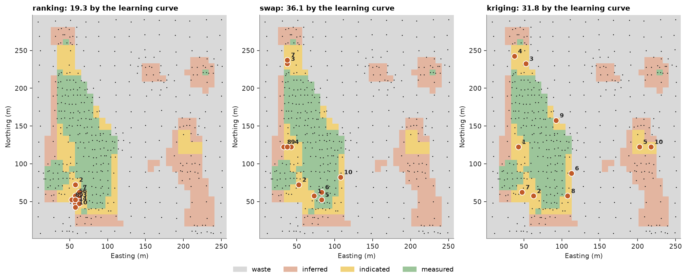
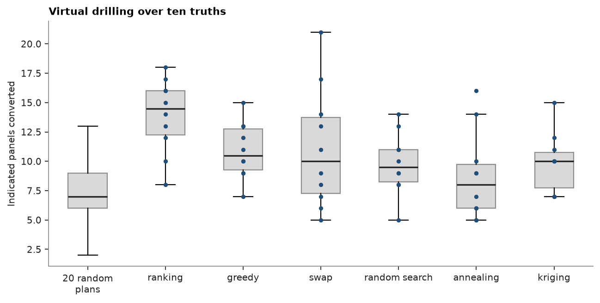

# Where to drill ten infill holes

The quarterly windows of Walker Lake fall into classes by their maximum expected error (MEE): measured when a
40 × 40 m window meets ±15 % at 90 % confidence, indicated when only the 80 × 80 m window around it does. Ten
infill holes should move as many indicated windows as possible to measured. You state that goal as an objective
over candidate collars, two ways: from a learning curve, and with the built-in objective on kriging metrics. Four
searches and one of your own choose the holes, and you drill the plans on simulated truths against random plans of
ten holes.

<details><summary>Python</summary>

```python
import boitata as bt
import matplotlib.pyplot as plt
import numpy as np
from common import ACCENT, GRAY, HIGHLIGHT, INK, LIGHT, map_axes, save
from matplotlib.colors import ListedColormap
from numpy.lib.stride_tricks import sliding_window_view
```

</details>

!!! learn "What you'll learn"
    - How `DrillholePlan` turns a drilling goal into an objective over candidate holes: a custom one built
      from a learning curve, or the built-in ``objective="classification"`` on kriging metrics.
    - How the built-in searches `Greedy`, `Swap`, `ModifiedRandomSearch` and `Annealing` compare, and how to
      plug in a search of your own.
    - How to check a plan by virtual drilling with `spacing_study(plans=...)` against random plans.

    Prerequisites: [virtual grids](../../14-workflows/07-drillhole-spacing-virtual-grids/README.md) for the
    model, the windows and the MEE; [the learning curve](../../14-workflows/08-drillhole-spacing-learning-curve/README.md).

## The data

The model repeats the virtual-grid study: the normal-score variogram of the declustered V, turning bands with
500 bands on 2 m nodes, 8 m panels carrying the 40 × 40 m window and 16 m panels carrying the 80 × 80 m one.

<details><summary>Python</summary>

```python
samples = bt.datasets.walker_lake()
xy, v = samples.coords, samples["V"]
weights = bt.cell_declustering(samples, "V", sizes=np.arange(2.5, 102.5, 2.5)).weights
scores = bt.NormalScore().fit(v, weights=weights).transform(v)
azimuths = (170, 260)
directional = [bt.experimental_variogram(xy, scores, 10, 120, azimuth=a) for a in azimuths]
fitted = bt.Variogram.fit_directional(directional, [(a, 0) for a in azimuths], rotation=[170, 0, 0])
gaussian = bt.Variogram(
    [(s.model, s.sill / fitted.sill, s.range) for s in fitted.structures],
    nugget=fitted.nugget / fitted.sill,
    rotation=fitted.rotation,
    ratios=fitted.ratios,
)
nodes = bt.BlockModel(origin=(1, 1), size=(2, 2), count=(130, 150))
panels = {
    side: bt.BlockModel(origin=(1, 1), size=(side / 5,) * 2, count=(1280 // side, 1480 // side))
    for side in (40, 80)
}
tb = bt.TurningBands(gaussian, bands=500, search=bt.Search(radius=100, max_samples=24)).fit(
    xy, v, weights=weights
)


def inside(side):
    """Panels whose window of `side` meters lies inside the panels."""
    c = panels[side].centroids[:, :2] - 1
    extent = np.array([1280 // side, 1480 // side]) * side / 5
    return ((c >= side / 2) & (c <= extent - side / 2)).all(axis=1)
```

</details>

!!! step "Step 1: Classify the windows today"
    One simulation of 100 realizations gives the MEE of every window. An 8 m panel is ore when, averaged over
    the realizations, at least half the 2 m nodes of its 40 × 40 m window exceed 300 ppm: the mean over its
    window of each node's probability above 300 ppm, which `simulate(cutoffs=[300])` gives, reaches 0.5. An
    ore panel is measured when its quarterly MEE is at most 15 %, and indicated when the yearly window of the
    16 m panel holding it meets 15 % instead. The indicated panels are the targets.

<details><summary>Python</summary>

```python
today = {
    side: tb.simulate(
        nodes,
        n=100,
        seed=11,
        blocks=panels[side],
        window=(side, side),
        quantiles=[0.05, 0.95],
    )
    for side in (40, 80)
}
quarter = today[40].relative_error()
centroids = panels[40].centroids
column, row = ((centroids[:, :2] - 1) // 16).astype(int).T
has_year = row < 1480 // 80
year_index = np.where(has_year, row * (1280 // 80) + column, 0)
year = np.where(has_year & inside(80)[year_index], today[80].relative_error()[year_index], np.inf)
above = tb.simulate(nodes, n=100, seed=11, cutoffs=[300]).probability_above[:, 0]
share = sliding_window_view(above.reshape(150, 130), (20, 20)).mean(axis=(2, 3))
first = np.clip(4 * ((centroids[:, :2] - 1) // 8).astype(int) - 8, 0, np.array(share.shape)[::-1] - 1)
ore = inside(40) & (share[first[:, 1], first[:, 0]] >= 0.5)
classes = np.where(~ore, 0, np.where(quarter <= 0.15, 3, np.where(year <= 0.15, 2, 1)))
target = np.flatnonzero(classes == 2)
print("panels: waste {}, inferred {}, indicated {}, measured {}".format(*np.bincount(classes, minlength=4)))
```

</details>

```text
panels: waste 803, inferred 152, indicated 83, measured 146
```

Of the 1,184 panels, 381 hold ore: 152 inferred, 83 indicated and 146 measured.

!!! step "Step 2: An objective from the learning curve"
    A new hole lowers the data spacing around it, and the learning curve says how much MEE that buys. The data
    spacing here is `data_spacing` with a 30 m search: with samples in plan and `composite_length` set to
    4/3 of the radius, \(\sqrt{V / (c\, n)}\) becomes \(\sqrt{\pi r^2 / n}\), the side of the square each of
    the \(n\) samples within 30 m stands for. `uncertainty_curve` gives the median MEE of the ore panels per
    spacing bin.

<details><summary>Python</summary>

```python
radius = 30.0
with warnings.catch_warnings():
    warnings.simplefilter("ignore")
    spacing = bt.data_spacing(centroids, xy, bt.Search(radius=radius), composite_length=4 * radius / 3)
known = ore & np.isfinite(spacing)
curve = bt.uncertainty_curve(spacing[known], quarter[known], bins=np.arange(4, 40, 3))
for s, p50, n in zip(curve["spacing"], curve["P50"], curve["n"], strict=True):
    print(f"spacing {s:5.1f} m: median MEE {p50:.1%} over {n:.0f} panels")
```

</details>

```text
spacing   8.8 m: median MEE 12.5% over 184 panels
spacing  11.6 m: median MEE 19.8% over 148 panels
spacing  14.1 m: median MEE 24.9% over 32 panels
spacing  16.9 m: median MEE 25.2% over 13 panels
```

??? math "The math"
    Panel \(b\) has MEE \(e_b\) and spacing \(s_b\) today. With new holes its spacing drops to \(s'_b\), and
    the learning curve \(L\) rescales its MEE to \(e'_b = e_b\, L(s'_b) / L(s_b)\). The panel scores its
    progress towards 15 %,
    \[ g_b = \mathrm{clip}\!\left(\frac{e_b - e'_b}{e_b - 0.15},\ 0,\ 1\right), \]
    1 once converted and 0.5 halfway, and the objective sums \(g_b\) over the targets.

    `DrillholePlan` calls the objective with a Table of metrics: ``block`` indexes the targets and
    ``data_spacing`` holds \(s'_b\). It returns one score per row.

<details><summary>Python</summary>

```python
spacing_bins, median_mee = curve["spacing"], curve["P50"]
mee_today, spacing_today = quarter[target], spacing[target]


def learned(s):
    """Median MEE at spacing `s`; no sample within 30 m reads as the widest bin."""
    return np.interp(np.where(np.isnan(s), np.inf, s), spacing_bins, median_mee)


def predicted(metrics):
    b = np.asarray(metrics["block"], dtype=int)
    return mee_today[b] * learned(metrics["data_spacing"]) / learned(spacing_today[b])


def progress(metrics):
    b = np.asarray(metrics["block"], dtype=int)
    return np.clip((mee_today[b] - predicted(metrics)) / (mee_today[b] - 0.15), 0, 1)
```

</details>

!!! step "Step 3: Candidates and the problem"
    `planned_drillholes` lays one vertical candidate every 5 m over the area, 3,120 collars. `exclude=` drops
    those within 3.5 m of a sample, with a small circle around each one. `DrillholePlan` takes the
    candidates, the targets, the existing samples and the objective, and allows ten holes.

<details><summary>Python</summary>

```python
cells = bt.BlockModel(origin=(0, 0), size=(5, 5), count=(52, 60))
candidates = bt.planned_drillholes(cells, 5.0)
angle = np.linspace(0, 2 * np.pi, 16, endpoint=False)
circles = [p[:2] + 3.5 * np.column_stack([np.cos(angle), np.sin(angle)]) for p in xy]
plan = bt.DrillholePlan(
    candidates,
    bt.OrdinaryKriging(gaussian, bt.Search(radius=radius, max_samples=8)),
    centroids[target],
    data=xy,
    objective=progress,
    n_holes=10,
    composite_length=4 * radius / 3,
    exclude=circles,
)
print(f"{len(plan.holes)} candidates, {plan.feasible([]).sum()} outside the circles")
```

</details>

```text
3120 candidates, 2556 outside the circles
```

!!! step "Step 4: Run the searches"
    `optimize` hands the problem to a search and ranks the holes it returns. The four built-ins:

    - `Greedy` adds the hole of largest gain, ten times.
    - `Swap` starts from the greedy plan and makes the best one-for-one exchange until none helps.
    - `ModifiedRandomSearch` moves one hole per iteration, 4,000 times, and keeps a move that raises the
      objective. It moves weak holes more often: hole \(i\) moves with probability proportional to
      \(\max C + \min C - C_i\), \(C_i\) the objective lost without it. A move goes within 25 m, or anywhere
      one time in five.
    - `Annealing` makes the same moves and also keeps a move that loses \(d\) with probability
      \(e^{-d/T}\), the temperature \(T\) falling from 0.3 to 0.01; it returns the best plan it visits.

    A search of your own needs a `search(problem, n)` method and nothing else. `Ranking` takes the ten holes
    that gain most on their own, the "top ten" a spreadsheet would give.

<details><summary>Python</summary>

```python
class Ranking:
    def search(self, problem, n):
        gains = problem.gains([])
        return [int(i) for i in np.argsort(-gains, kind="stable")[:n]]


searches = {
    "ranking": Ranking(),
    "greedy": bt.Greedy(),
    "swap": bt.Swap(),
    "random search": bt.ModifiedRandomSearch(),
    "annealing": bt.Annealing(),
}
tables, chosen = {}, {}
print("search          objective  predicted conversions  seconds")
for name, search in searches.items():
    start = time.perf_counter()
    tables[name] = plan.optimize(search=search)
    seconds = time.perf_counter() - start
    chosen[name] = [plan.holes.index(h) for h in tables[name]["HOLE_ID"]]
    converted = int((predicted(plan.metrics(chosen[name])) <= 0.15).sum())
    print(f"{name:14s}  {plan.score(chosen[name]):9.2f}  {converted:21d}  {seconds:7.2f}")
```

</details>

```text
search          objective  predicted conversions  seconds
ranking             19.31                     13     0.02
greedy              35.44                     16     0.02
swap                36.14                     16     0.13
random search       36.12                     17     1.44
annealing           36.08                     15     1.76
```

The greedy plan scores 35.44 and converts 16 panels by the learning curve. Swap raises it to 36.14, the best
of the five, so greedy gets 98 % of it; the random search reaches 36.12 and annealing 36.08. The ranking
scores 19.31: its ten holes crowd one gap, and each one adds little once its neighbors are drilled.

!!! step "Step 5: Seeds"
    The random searches depend on their seed. Five seeds of each show how far the result moves.

<details><summary>Python</summary>

```python
for name, kind in (("random search", bt.ModifiedRandomSearch), ("annealing", bt.Annealing)):
    values = [plan.optimize(search=kind(seed=seed))["CUMULATIVE"][-1] for seed in range(5)]
    print(f"{name}: objective {min(values):.2f} to {max(values):.2f} over seeds 0 to 4")
```

</details>

```text
random search: objective 35.73 to 36.14 over seeds 0 to 4
annealing: objective 36.04 to 36.10 over seeds 0 to 4
```

The random search ends between 35.73 and 36.14 and annealing between 36.04 and 36.10. No seed beats the swap
plan: on this objective, 4,000 random moves buy nothing over a deterministic exchange that runs in a tenth of a
second.

!!! step "Step 6: The built-in objective"
    The learning curve is one way to forecast MEE. `DrillholePlan` ships another: ``objective="classification"``
    re-kriges the targets with the new holes and scores each one's progress towards the class above it under
    `classify` rules on kriging metrics. Here the metric is the kriging variance of the normal scores on the
    8 m panel, with a 50 m search of 16 samples. The thresholds come from today's classes: the measured
    threshold is the variance of the 146th lowest ore panel, so as many ore panels pass it as are measured by
    MEE, and likewise for indicated. `Swap` from the greedy plan, the default search, picks the holes.

<details><summary>Python</summary>

```python
kriging = bt.BlockKriging(gaussian, bt.Search(radius=50, max_samples=16), (8, 8)).fit(xy, scores)
variance = np.asarray(kriging.predict(centroids[ore], diagnostics=True)["variance"])
counts = np.bincount(classes[ore], minlength=4)
measured_at, indicated_at = np.sort(variance)[[counts[3] - 1, counts[3] + counts[2] - 1]]
rules = [("measured", {"variance": ("<=", measured_at)}), ("indicated", {"variance": ("<=", indicated_at)})]
by_kriging = bt.classify({"variance": variance}, rules, default="inferred")
by_mee = np.array(["waste", "inferred", "indicated", "measured"])[classes[ore]]
print(f"variance thresholds: measured {measured_at:.3f}, indicated {indicated_at:.3f}")
for label in ("measured", "indicated", "inferred"):
    both = np.sum((by_kriging == label) & (by_mee == label))
    print(f"{label:9s}: {both} of {np.sum(by_mee == label)} MEE panels get the same class from kriging")
classified = bt.DrillholePlan(
    candidates,
    kriging,
    centroids[target],
    data=xy,
    rules=rules,
    n_holes=10,
    composite_length=4 * radius / 3,
    exclude=circles,
)
start = time.perf_counter()
tables["kriging"] = classified.optimize()
seconds = time.perf_counter() - start
chosen["kriging"] = [plan.holes.index(h) for h in tables["kriging"]["HOLE_ID"]]
print(f"kriging objective {tables['kriging']['CUMULATIVE'][-1]:.2f} in {seconds:.1f} s")
print("plan       kriging objective  learning-curve objective")
for name in ("ranking", "swap", "kriging"):
    print(f"{name:9s}  {classified.score(chosen[name]):17.2f}  {plan.score(chosen[name]):24.2f}")
```

</details>

```text
variance thresholds: measured 0.077, indicated 0.101
measured : 115 of 146 MEE panels get the same class from kriging
indicated: 20 of 83 MEE panels get the same class from kriging
inferred : 89 of 152 MEE panels get the same class from kriging
kriging objective 54.56 in 0.6 s
plan       kriging objective  learning-curve objective
ranking                14.34                     19.31
swap                   26.90                     36.14
kriging                54.56                     31.83
```

The thresholds land at variances of 0.077 and 0.101. Kriging gives 115 of the 146 measured panels the same
class, but only 20 of the 83 indicated ones: the variance of an 8 m panel cannot see the 80 × 80 m window
that makes a panel indicated, so it ranks the indicated and inferred panels alike. The two objectives
disagree on the plans. The kriging plan scores 54.56 on its own objective, twice the swap plan's 26.90, and
31.83 by the learning curve, against 36.14 for swap.

!!! step "Step 7: The plan and its drilling order"
    Each table lists the holes in drilling order: the hole of largest gain first, then the largest gain given
    the holes above it. ``GAIN`` is that marginal gain, ``CUMULATIVE`` the objective so far and
    ``CONTRIBUTION`` the objective lost if the hole leaves the final plan. The order holds whatever search
    chose the plan, so you can stop drilling early and keep the best prefix.

<details><summary>Python</summary>

```python
best = tables["swap"]
print("order  hole    east  north   gain  cumulative  contribution")
for r in range(best.num_rows):
    print(
        f"{best['ORDER'][r]:5.0f}  {best['HOLE_ID'][r]}  {best['X'][r]:5.1f}  {best['Y'][r]:5.1f}"
        f"  {best['GAIN'][r]:5.2f}  {best['CUMULATIVE'][r]:10.2f}  {best['CONTRIBUTION'][r]:12.2f}"
    )

colors = ListedColormap([LIGHT, "#e3b5a0", "#f1d27a", "#9cc59a"])
image = np.full(len(centroids), np.nan)
image[ore] = classes[ore]
image[~ore] = 0
fig, axes = plt.subplots(1, 3, figsize=(13, 5.4), layout="constrained")
for ax, name in zip(axes, ("ranking", "swap", "kriging"), strict=True):
    ax.imshow(
        image.reshape(37, 32), origin="lower", extent=(1, 257, 1, 297), cmap=colors, vmin=-0.5, vmax=3.5
    )
    ax.scatter(*xy[:, :2].T, s=2, color=INK, linewidths=0)
    holes = tables[name]
    ax.scatter(holes["X"], holes["Y"], s=60, color=HIGHLIGHT, edgecolors="white", linewidths=1, zorder=3)
    for x, y, k in zip(holes["X"], holes["Y"], holes["ORDER"], strict=True):
        ax.annotate(
            f"{k:.0f}", (x, y), (5, 4), textcoords="offset points", fontsize=8, color=INK, weight="bold"
        )
    map_axes(ax, f"{name}: {plan.score(chosen[name]):.1f} by the learning curve")
handles = [plt.Rectangle((0, 0), 1, 1, color=colors(k)) for k in range(4)]
fig.legend(handles, ["waste", "inferred", "indicated", "measured"], loc="outside lower center", ncol=4)
save(fig, "plans")
```

</details>

```text
order  hole    east  north   gain  cumulative  contribution
    1  P0852   72.5   57.5   7.22        7.22          3.65
    2  P0615   52.5   72.5   5.95       13.16          4.14
    3  P0467   37.5  232.5   4.42       17.58          2.42
    4  P0505   42.5  122.5   3.85       21.43          2.01
    5  P0971   82.5   52.5   3.47       24.91          2.84
    6  P0973   82.5   62.5   2.53       27.44          2.51
    7  P0468   37.5  237.5   2.42       29.86          2.42
    8  P0385   32.5  122.5   2.28       32.14          2.01
    9  P0445   37.5  122.5   2.01       34.14          2.01
   10  P1277  107.5   82.5   2.00       36.14          2.00
```



The swap plan puts its holes into four indicated areas of the western body, two to four per area. The first
hole gains 7.22; the last, 2.00. Hole 2 gains 5.95 when it goes in second but loses 4.14 when it leaves the
full plan; holes 1, 5 and 6 lie within 30 m of it and share its panels. The ranking puts all ten holes into
one gap in the south, 5 m apart. The kriging plan spreads them wider, with two in the indicated pocket of the
eastern body.

!!! step "Step 8: Drill the plans on simulated truths"
    The objective is a forecast. `spacing_study(plans=...)` checks it: it draws ten truths conditioned to
    today's data, reads each truth at a plan's holes, refits the simulator on the existing samples plus those
    holes (`existing=True`), simulates 100 realizations and returns the quarterly MEE of every panel. A target
    converts when its MEE drops to 15 % or less. Twenty random plans of ten feasible holes give the reference.
    `optimize` with a search that returns a fixed list builds their tables.

<details><summary>Python</summary>

```python
def drillholes(table):
    """Drillholes from the collars, directions and lengths of an `optimize` table."""
    ids = np.asarray(table["HOLE_ID"], dtype=object)
    zeros = np.zeros(len(ids))
    return bt.Drillholes(
        {"HOLE_ID": ids, "X": table["X"], "Y": table["Y"], "Z": table["Z"]},
        {"HOLE_ID": ids, "DEPTH": zeros, "AZIMUTH": table["AZIMUTH"], "DIP": table["DIP"]},
        {"HOLE_ID": ids, "FROM": zeros, "TO": table["LENGTH"]},
    )


class Fixed:
    def __init__(self, holes):
        self.holes = holes

    def search(self, problem, n):
        return self.holes


rng = np.random.default_rng(99)
feasible = np.flatnonzero(plan.feasible([]))
plans = {name: drillholes(table) for name, table in tables.items()}
for k in range(20):
    holes = rng.choice(feasible, 10, replace=False).tolist()
    plans[f"random {k}"] = drillholes(plan.optimize(search=Fixed(holes)))
study = bt.spacing_study(
    tb,
    nodes,
    plans=plans,
    truths=10,
    seed=101,
    n=100,
    blocks=panels[40],
    window=(40, 40),
    existing=True,
    composite_length=np.inf,
)
on_target = np.isin(np.asarray(study["row"], dtype=int), target)
names, truth_of = np.asarray(study["plan"]), study["realization"]
converted = {
    name: np.array(
        [np.sum(study["mee"][on_target & (names == name) & (truth_of == k)] <= 0.15) for k in range(10)]
    )
    for name in plans
}
random = np.array([converted[f"random {k}"].mean() for k in range(20)])
print(f"random plans: {np.median(random):.1f} conversions (median), {random.min():.1f} to {random.max():.1f}")
for name in tables:
    counts = converted[name]
    print(f"{name:14s} {counts.mean():5.1f} conversions, {counts.min()} to {counts.max()} over the truths")

fig, ax = plt.subplots(figsize=(8, 4), layout="constrained")
ax.boxplot(
    [np.concatenate([converted[f"random {k}"] for k in range(20)])] + [converted[name] for name in tables],
    tick_labels=["20 random\nplans", *tables],
    widths=0.5,
    showfliers=False,
    patch_artist=True,
    boxprops={"facecolor": LIGHT, "edgecolor": GRAY},
    medianprops={"color": INK, "lw": 1.5},
)
for i, name in enumerate(tables, start=2):
    ax.scatter(np.full(10, i), converted[name], s=10, color=ACCENT, zorder=3)
ax.set(ylabel="Indicated panels converted", title="Virtual drilling over ten truths")
save(fig, "validation")
```

</details>

```text
random plans: 7.5 conversions (median), 5.9 to 9.0
ranking         13.9 conversions, 8 to 18 over the truths
greedy          10.9 conversions, 7 to 15 over the truths
swap            11.1 conversions, 5 to 21 over the truths
random search    9.8 conversions, 5 to 14 over the truths
annealing        8.7 conversions, 5 to 16 over the truths
kriging          9.9 conversions, 7 to 15 over the truths
```



A random plan converts 7.5 of the 83 targets in the median, and the best of twenty 9.0. The four searches on
the learning curve convert 8.7 to 11.1: swap 11.1, greedy 10.9, the random search 9.8 and annealing 8.7.
Annealing scores within 0.2 % of swap on the objective and converts no more than the best random plan, so
differences that small in the objective say nothing about the ground. The spread over truths is wider still:
the swap plan converts 5 on one truth and 21 on another.

The kriging plan converts 9.9, about one panel less than the swap plan, with 7 to 15 over the truths. On this
deposit the learning-curve plan converts a little more, but with ten truths virtual drilling cannot separate
the two.

The ranking converts 13.9, the most of all, although both objectives rate it lowest. Its ten holes sit 5 m
apart, denser than any part of the deposit today. The learning curve stops at 8.8 m, its densest bin, and the
objective reads any spacing below it as that bin's MEE of 12.5 %, so it pays nothing for the extra holes of
a cluster. Virtual drilling pays for them: ten holes in one gap bring several 40 × 40 m windows close to the
densest data there is.

!!! key "Key idea"
    The searches agree within 2 % on the learning-curve objective, and virtual drilling cannot tell their
    plans apart. The objective decides where the holes go, and neither objective here foresaw that a tight
    cluster converts most. A learning curve only knows the spacings the deposit already has, and kriging rules only know the
    metric they threshold, so check a plan by drilling simulated truths before you trust its forecast.

!!! check "Check before you move on"
    `Swap` stops at a local optimum: no single exchange improves it. On small problems it often matches the
    best plan over every subset; the tests check it on 49 candidates and three holes. With a budget instead
    of a hole count, give `DrillholePlan` a `budget` and `cost_per_meter`, and `Greedy` ranks holes by gain per
    unit cost.

## The decision

Take the swap plan on the learning-curve objective: `optimize` finds it in a tenth of a second, no random
search beats it, and it converts 11.1 targets on the truths against 7.5 for a random plan. Before drilling,
revise the objective: the cluster of the ranking converts more, so a learning curve that reaches below 8.8 m,
from virtual grids as on [the virtual-grid page](../../14-workflows/07-drillhole-spacing-virtual-grids/README.md),
would reward a cluster as virtual drilling does.

Full script: [`example_14_09.py`](example_14_09.py)
