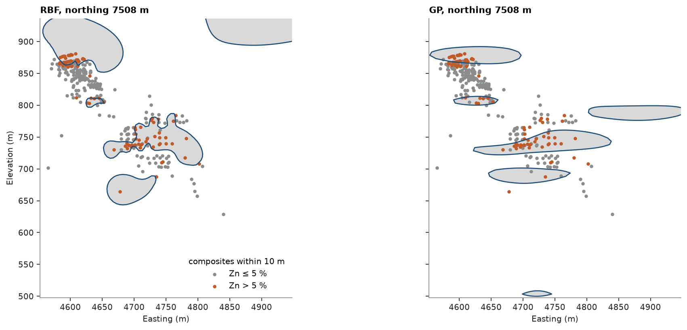
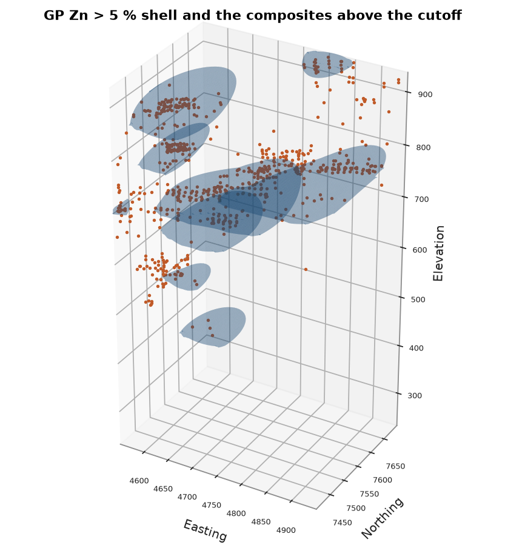

# 15. Implicit modelling

An implicit model fits a scalar field to the data and takes a surface as one of its level sets, instead of
digitising outlines section by section. Here a Zn > 5 % shell is modelled from the composites of the cluster seen
in [chapter 7](../07-solids/README.md).

<details><summary>Python</summary>

```python
import ceres as cs
import matplotlib.pyplot as plt
import numpy as np
from common import ACCENT, GREY, HIGHLIGHT, LIGHT, fetch, save
from mpl_toolkits.mplot3d.art3d import Poly3DCollection
```

</details>

Each composite is coded +1 above the cutoff and −1 below, so the shell is the zero level of the field. Two engines
fit it: a radial basis function (RBF) interpolates the codes exactly by solving one dense system, whose cost grows
with the cube of the sample count, so 10 m composites keep it to about 3,000 samples; a sparse Gaussian process
(GP) smooths through them, learns anisotropic ranges and returns to the mean code away from the data.

<details><summary>Python</summary>

```python
dh = cs.Drillholes(
    cs.read_csv(fetch("drillholes/collar.csv")),
    cs.read_csv(fetch("drillholes/survey.csv")),
    cs.read_csv(fetch("drillholes/assay.csv")),
)
composites = dh.composite(10.0, ["ZN"])
xyz, zn = composites.coords, composites["ZN"]
window = (xyz[:, 0] > 4550) & (xyz[:, 0] < 4950) & (xyz[:, 1] > 7400) & (xyz[:, 1] < 7700) & ~np.isnan(zn)
xyz, zn = xyz[window], zn[window]
indicator = np.where(zn > 5, 1.0, -1.0)
models = {
    "RBF": cs.ImplicitModel("rbf", drift_degree=0).fit(xyz, indicator),
    "GP": cs.ImplicitModel("gp", drift_degree=0).fit(xyz, indicator),
}
print(f"{len(xyz)} composites, {(indicator > 0).sum()} above 5 % Zn")
for name, model in models.items():
    agree = np.mean(np.sign(model.evaluate(xyz)) == indicator)
    print(f"{name}: {agree:.1%} of composites on their side of the shell")
report = models["GP"].report
print(
    f"GP {report['status']} in {report['iterations']} iterations, ranges {np.round(report['lengthscales'])} m"
)
```

</details>

```text
3078 composites, 706 above 5 % Zn
RBF: 100.0% of composites on their side of the shell
GP: 85.8% of composites on their side of the shell
GP converged in 13 iterations, ranges [446. 233.  46.] m
```

`isosurface` samples the field at the block centroids and triangulates the zero level. With `closed=True` the shell
is capped where it leaves the block model, so it bounds a volume, which should match the count of blocks whose
centroid lies inside.

<details><summary>Python</summary>

```python
size = 5.0
lo, hi = xyz.min(axis=0), xyz.max(axis=0)
count = np.ceil((hi - lo) / size).astype(int)
blocks = cs.BlockModel(origin=lo, size=(size, size, size), count=count)
fields, shells = {}, {}
for name, model in models.items():
    vertices, triangles = shells[name] = model.isosurface(blocks, closed=True)
    a, b, c = (vertices[triangles[:, i]] for i in range(3))
    shell_volume = np.einsum("ij,ij->i", a, np.cross(b, c)).sum() / 6
    fields[name] = model.evaluate(blocks).reshape(count[::-1])
    count_volume = (fields[name] > 0).sum() * size**3
    print(
        f"{name}: shell of {len(triangles):,} triangles, {shell_volume:,.0f} m3; blocks inside {count_volume:,.0f} m3"
    )
```

</details>

```text
RBF: shell of 168,776 triangles, 6,106,347 m3; blocks inside 6,163,125 m3
GP: shell of 122,952 triangles, 2,841,743 m3; blocks inside 2,931,375 m3
```

An east–west section through the high-grade composites. The RBF honours every code but bulges into undrilled
ground; the GP draws flat lenses along its learned ranges and leaves some isolated codes outside.

<details><summary>Python</summary>

```python
j = int((np.median(xyz[indicator > 0, 1]) - lo[1]) // size)
northing = lo[1] + (j + 0.5) * size
x = lo[0] + (np.arange(count[0]) + 0.5) * size
z = lo[2] + (np.arange(count[2]) + 0.5) * size
near = np.abs(xyz[:, 1] - northing) < 10
fig, axes = plt.subplots(1, 2, figsize=(12, 5), layout="constrained", sharey=True)
for ax, (name, field) in zip(axes, fields.items()):
    ax.contourf(x, z, field[:, j, :], levels=[0, np.inf], colors=[LIGHT])
    ax.contour(x, z, field[:, j, :], levels=[0], colors=[ACCENT], linewidths=1.2)
    for mask, color, label in ((indicator < 0, GREY, "Zn ≤ 5 %"), (indicator > 0, HIGHLIGHT, "Zn > 5 %")):
        ax.scatter(xyz[near & mask, 0], xyz[near & mask, 2], s=8, color=color, label=label)
    ax.set_aspect("equal")
    ax.set(title=f"{name}, northing {northing:.0f} m", xlabel="Easting (m)")
axes[0].set_ylabel("Elevation (m)")
axes[0].set_ylim(np.percentile(xyz[:, 2], 1) - 50, hi[2])
axes[0].legend(loc="lower right", title="composites within 10 m")
save(fig, "section")
```

</details>



The GP shell:

<details><summary>Python</summary>

```python
vertices, triangles = shells["GP"]
fig = plt.figure(figsize=(7, 5.5), layout="constrained")
ax = fig.add_subplot(projection="3d")
ax.add_collection3d(Poly3DCollection(vertices[triangles], facecolor=ACCENT, edgecolor="none", alpha=0.25))
ax.scatter(*xyz[indicator > 0].T, s=2, color=HIGHLIGHT, depthshade=False)
ax.set(xlim=(lo[0], hi[0]), ylim=(lo[1], hi[1]), zlim=(lo[2], hi[2]))
ax.set_box_aspect(hi - lo)
ax.set_title("GP Zn > 5 % shell and the composites above the cutoff")
ax.set_xlabel("Easting")
ax.set_ylabel("Northing")
ax.set_zlabel("Elevation")
ax.tick_params(labelsize=6)
save(fig, "shell")
```

</details>



Full script: [`example.py`](example.py)
