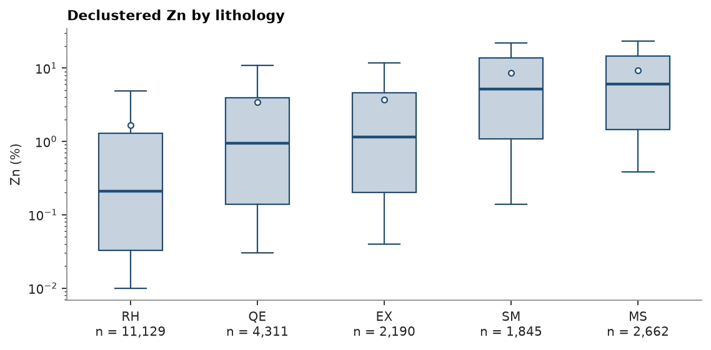
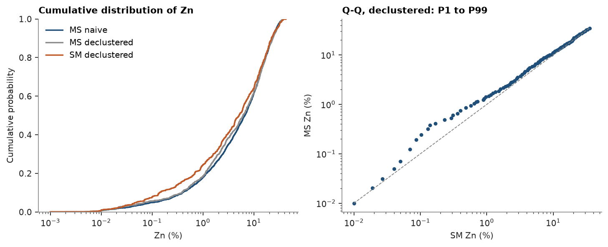
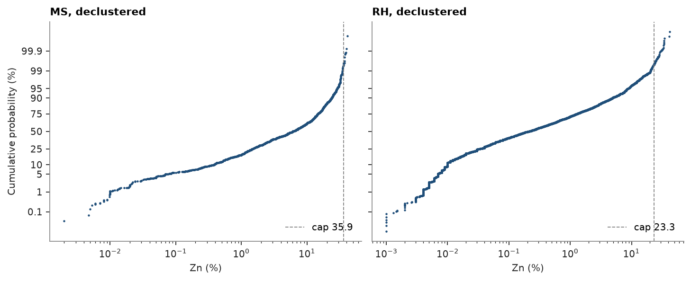
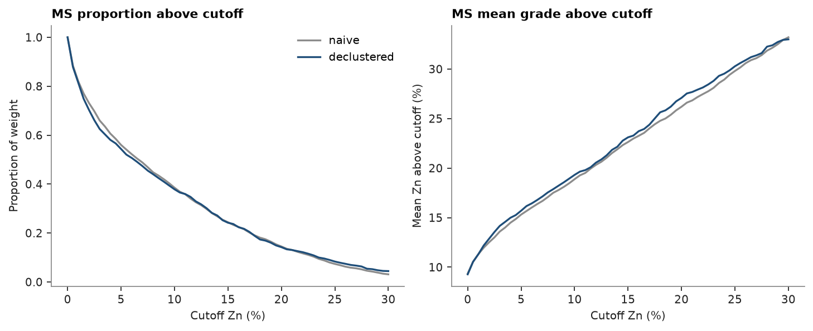
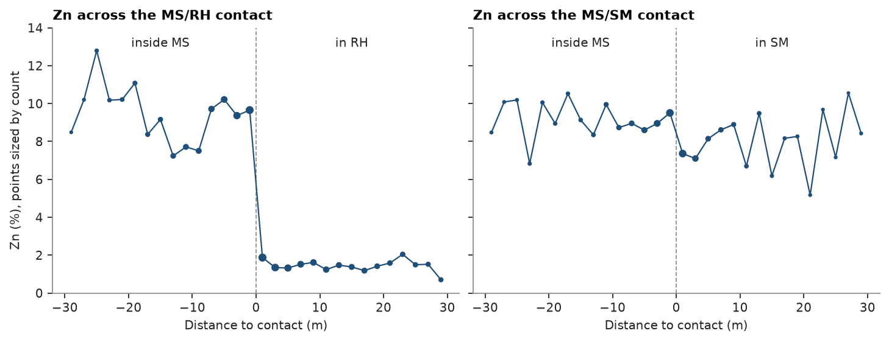
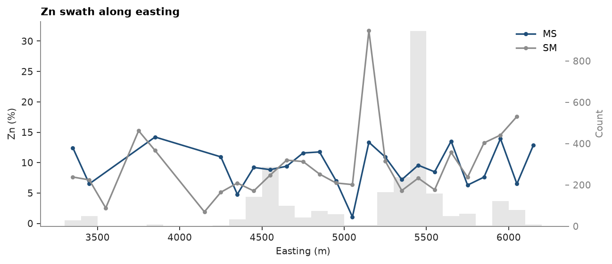
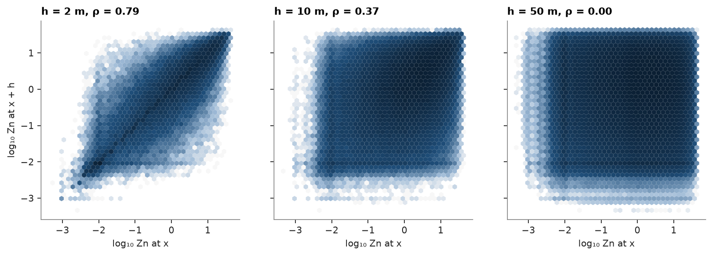
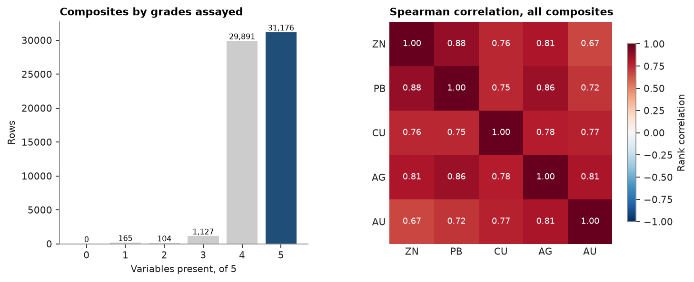

# 16. Exploratory data analysis

Duplicates, statistics and distributions per domain, top cuts, grade-tonnage, contacts, swaths, h-scatterplots and
correlations on the 2 m composites of the drillhole dataset. Every function skips missing values, so raw columns go in as they are.

<details><summary>Python</summary>

```python
import ceres as cs
import matplotlib.pyplot as plt
import numpy as np
from common import ACCENT, GREY, INK, save
```

</details>

The tables are checked and fixed with the default rules first, as in [chapter 6](../06-drillholes/README.md):
overlapping assays keep the one that starts first and abruptly deviating survey stations are dropped.

<details><summary>Python</summary>

```python
tables = cs.datasets.drillhole_tables()
flags, _ = cs.check_drillholes(
    tables["collar"], tables["survey"], {"assay": tables["assay"], "geology": tables["geology"]}
)
tables, _ = cs.fix_drillholes(flags, tables)
intervals = cs.merge_intervals(tables["assay"], tables["geology"])
dh = cs.Drillholes(tables["collar"], tables["survey"], intervals)
grades = ["ZN", "PB", "CU", "AG", "AU"]
composites = dh.composite(2.0, grades, domain="LITH")
print(f"{len(composites)} composites")
```

</details>

```text
62506 composites
```

## Duplicates

Twin holes, re-entries and collars entered twice put several composites at one place, and kriging cannot weight
two samples at the same location. `duplicates` groups the composites closer than a tolerance, transitively, and
reports each group with its first sample and its spread.

<details><summary>Python</summary>

```python
hole = np.array(composites.attributes["hole"])


def holes_per_group(tolerance):
    report, group = cs.duplicates(composites, tolerance)
    return report, [tuple(sorted(set(hole[group == k]))) for k in report["group"]]


report, groups = holes_per_group(0.1)
across = [h for h in groups if len(h) > 1]
print(f"{len(report)} groups within 0.1 m, at most {report['spread'].max():.2f} m from their first composite")
print(f"{len(across)} across {len(set(across))} sets of holes, {len(groups) - len(across)} inside one hole")
exact, groups = holes_per_group(0.0)
print(f"{len(exact)} groups at exactly the same location, from {len(set(groups))} pairs of holes")
```

</details>

```text
160 groups within 0.1 m, at most 0.10 m from their first composite
147 across 27 sets of holes, 13 inside one hole
43 groups at exactly the same location, from 9 pairs of holes
```

The groups inside one hole are short intervals on both sides of a contact, in different lithologies: they stay.
The exact duplicates are the top composites of pairs of holes collared at the same point. One pair puts an MS
composite on one of unknown lithology (UNK), which a length-weighted `merge="mean"` would blend, so each pair keeps the composite
of its first hole instead; the `n` column counts the composites behind each row.

<details><summary>Python</summary>

```python
composites = cs.duplicates(composites, merge="first")
print(f"{len(composites)} composites, {int((composites['n'] > 1).sum())} of them merged pairs")
xyz = composites.coords
zn = composites["ZN"]
lith = np.array(composites.attributes["LITH"])
hole = np.array(composites.attributes["hole"])
```

</details>

```text
62463 composites, 43 of them merged pairs
```

## Declustered statistics

Drilling concentrates where grades are high. Cell declustering (50 m cells) weights each composite by the inverse
of the number of composites in its cell, domain by domain. `describe_by` gives weighted moments and quantiles per
lithology and, on the last row, over all five together.

<details><summary>Python</summary>

```python
domains = ["MS", "SM", "QE", "EX", "RH"]
weights = np.zeros(len(zn))
for name in domains:
    keep = (lith == name) & ~np.isnan(zn)
    weights[keep] = cs.cell_declustering(xyz[keep], zn[keep], cell_size=50.0).weights
five = np.isin(lith, domains)
naive = cs.describe_by(zn[five], lith[five])
stats = cs.describe_by(zn[five], lith[five], weights[five], quantiles=[0.5, 0.9, 0.995])
print(f"{'LITH':<6}{'n':>7}{'mean':>8}{'declust.':>10}{'CV':>6}{'P50':>7}{'P90':>7}")
for name, n, raw, mean, cv, p50, p90 in zip(
    *(stats[c] for c in ["category", "n"]),
    naive["mean"],
    *(stats[c] for c in ["mean", "cv", "P50", "P90"]),
    strict=True,
):
    print(f"{name:<6}{n:>7.0f}{raw:>8.2f}{mean:>10.2f}{cv:>6.2f}{p50:>7.2f}{p90:>7.2f}")
```

</details>

```text
LITH        n    mean  declust.    CV    P50    P90
EX       2190    3.45      3.74  1.54   1.14  11.83
MS       2662    9.35      9.27  1.00   6.10  23.52
QE       4311    3.58      3.43  1.60   0.94  10.79
RH      11129    1.60      1.66  2.24   0.21   4.87
SM       1845    8.49      8.63  1.06   5.14  22.13
all     22137    3.68      3.70  1.73   0.70  12.43
```

The same declustered quantiles as box plots, sorted by median: the box spans P25 to P75, the whiskers P10 to P90,
the dot is the declustered mean.

<details><summary>Python</summary>

```python
fig, ax = plt.subplots(figsize=(7, 3.4), layout="constrained")
cs.plot.boxplot(zn[five], lith[five], weights=weights[five], sort=True, log=True, ax=ax)
ax.set(title="Declustered Zn by lithology", ylabel="Zn (%)")
save(fig, "boxplot")
```

</details>



Cumulative distributions show that declustering shifts MS only slightly towards low grades. The Q-Q plot compares
MS with SM quantile by quantile: above about 1 % Zn they follow the 1:1 line, below it MS is richer, so the two
domains differ in their low tail rather than in their high grades.

<details><summary>Python</summary>

```python
ms, sm = lith == "MS", lith == "SM"
fig, (a, b) = plt.subplots(1, 2, figsize=(9, 3.6), layout="constrained")
cs.plot.cdf(
    [zn[ms], zn[ms], zn[sm]],
    weights=[None, weights[ms], weights[sm]],
    labels=["MS naive", "MS declustered", "SM declustered"],
    log=True,
    ax=a,
)
a.set(title="Cumulative distribution of Zn", xlabel="Zn (%)")
cs.plot.qq(zn[sm], zn[ms], weights[sm], weights[ms], log=True, ax=b)
b.set(title="Q-Q, declustered: P1 to P99", xlabel="SM Zn (%)", ylabel="MS Zn (%)")
save(fig, "distributions")
```

</details>



## Top cuts

`capping` reports, for caps at high quantiles, the share of composites cut and of metal removed. A cap that removes
a few percent of the metal from a fraction of a percent of the samples tames the tail without flattening it.

<details><summary>Python</summary>

```python
ms = (lith == "MS") & ~np.isnan(zn)
caps = cs.capping(zn[ms], weights[ms])
print(f"{'cap':>7}{'cut (%)':>9}{'metal (%)':>11}{'mean':>7}{'CV':>6}")
for cap, frac, metal, mean, cv in zip(*caps.values(), strict=True):
    print(f"{cap:>7.2f}{100 * frac:>9.1f}{100 * metal:>11.2f}{mean:>7.2f}{cv:>6.2f}")
```

</details>

```text
    cap  cut (%)  metal (%)   mean    CV
  23.52      9.9       6.21   8.69  0.92
  28.86      5.0       1.99   9.08  0.97
  32.10      2.5       0.63   9.21  0.99
  34.55      1.1       0.21   9.25  0.99
  35.92      0.5       0.11   9.26  0.99
  39.43      0.1       0.01   9.27  1.00
```

Zn is bounded by the zinc content of sphalerite: on a log-probability plot the upper tails bend towards a ceiling
near 40 % instead of trailing off into isolated outliers. A cap at the declustered P99.5 of each domain, dashed,
only trims the last half percent of that tail.

<details><summary>Python</summary>

```python
cap = dict(zip(stats["category"], stats["P99.5"], strict=True))
fig, axes = plt.subplots(1, 2, figsize=(9, 3.6), layout="constrained", sharey=True)
for ax, name in zip(axes, ["MS", "RH"], strict=True):
    keep = (lith == name) & (zn > 0)
    cs.plot.probability(zn[keep], weights[keep], log=True, cap=cap[name], ax=ax, color=ACCENT, ms=2)
    ax.set(title=f"{name}, declustered", xlabel="Zn (%)")
    ax.legend(loc="lower right")
axes[1].set_ylabel("")
save(fig, "probability")
```

</details>



`capping_report` applies one cap per domain and compares the declustered statistics before and after, with the
metal removed; the last row pools the domains. Only RH, the low-grade host rock, loses more than a fraction of a
percent of its metal.

<details><summary>Python</summary>

```python
report = cs.capping_report(zn[five], lith[five], {k: cap[k] for k in domains}, weights[five])
columns = ["domain", "cap", "n_capped", "mean", "mean_capped", "cv", "cv_capped"]
print(f"{'LITH':<6}{'cap':>7}{'cut':>5}{'mean':>7}{'capped':>8}{'CV':>6}{'capped':>8}{'metal (%)':>11}")
for name, c, n, mean, capped, cv, cv_capped in zip(*(report[k] for k in columns), strict=True):
    print(
        f"{name:<6}{'' if np.isnan(c) else f'{c:.2f}':>7}{n:>5.0f}{mean:>7.2f}{capped:>8.2f}{cv:>6.2f}"
        f"{cv_capped:>8.2f}{100 * (1 - capped / mean):>11.2f}"
    )
```

</details>

```text
LITH      cap  cut   mean  capped    CV  capped  metal (%)
EX      29.31    8   3.74    3.73  1.54    1.54       0.20
MS      35.92   13   9.27    9.26  1.00    0.99       0.11
QE      30.06   10   3.43    3.42  1.60    1.59       0.31
RH      23.28   54   1.66    1.64  2.24    2.18       1.25
SM      37.32    6   8.63    8.63  1.06    1.06       0.08
all             91   3.70    3.69  1.73    1.73       0.41
```

## Grade-tonnage of the data

`grade_tonnage` sums the weight of the composites at or above each cutoff and their mean grade: a first look at
selectivity on composite support, here as a proportion of the total. Declustering moves the MS curves only a
little, as it did the mean: slightly less material above low cutoffs, slightly richer above most of them. Blocks are
less selective than composites; [chapter 9](../09-change-of-support/README.md) models that change of support.

<details><summary>Python</summary>

```python
cutoffs = np.linspace(0, 30, 61)
fig, (a, b) = plt.subplots(1, 2, figsize=(9, 3.6), layout="constrained")
for w, color, label in ((None, GREY, "naive"), (weights[ms], ACCENT, "declustered")):
    gt = cs.grade_tonnage(zn[ms], cutoffs, w)
    a.plot(cutoffs, gt["tonnage"] / gt["tonnage"][0], color=color, label=label)
    b.plot(cutoffs, gt["mean_grade"], color=color)
a.set(title="MS proportion above cutoff", xlabel="Cutoff Zn (%)", ylabel="Proportion of weight")
a.legend()
b.set(title="MS mean grade above cutoff", xlabel="Cutoff Zn (%)", ylabel="Mean Zn above cutoff (%)")
save(fig, "grade_tonnage")
```

</details>



## Contact analysis

Zn against distance to a contact of MS, measured down each hole to the nearest composite of the other domain:
negative inside MS, positive outside. Into the RH host rock, Zn drops from about 9 % to under 2 % within a composite:
a sharp step that supports a hard boundary in estimation. Into the semi-massive sulphide SM it steps down by only
about 2 %, and SM keeps 6 to 10 % out to 30 m: near the contact the samples of one domain say much about the other,
the case for a soft boundary ([chapter 20](../20-workflow/README.md)).

<details><summary>Python</summary>

```python
fig, axes = plt.subplots(1, 2, figsize=(9, 3.4), layout="constrained", sharey=True)
for ax, other in zip(axes, ["RH", "SM"], strict=True):
    c = cs.contact(xyz, zn, lith, hole, "MS", other, max_distance=30.0, bin=2.0)
    ax.axvline(0, color=GREY, lw=0.8, ls="--")
    ax.plot(c["distance"], c["mean"], color=ACCENT, lw=1)
    ax.scatter(c["distance"], c["mean"], s=np.sqrt(c["count"]), color=ACCENT)
    ax.text(-15, 13, "inside MS", color=INK, ha="center")
    ax.text(15, 13, f"in {other}", color=INK, ha="center")
    ax.set(title=f"Zn across the MS/{other} contact", xlabel="Distance to contact (m)", ylim=(0, 14))
axes[0].set_ylabel("Zn (%), points sized by count")
save(fig, "contact")
```

</details>



## Swath

Mean Zn in 100 m slices along easting, with the counts of the first swath as bars. The same call on block
centroids and estimates gives the model swath to check for local bias.

<details><summary>Python</summary>

```python
swaths = [cs.swath(xyz[lith == name], zn[lith == name], 100.0, axis="x") for name in ["MS", "SM"]]
fig, ax = plt.subplots(figsize=(8, 3.4), layout="constrained")
cs.plot.swath(swaths, labels=["MS", "SM"], ax=ax)
ax.set(title="Zn swath along easting", xlabel="Easting (m)", ylabel="Zn (%)")
save(fig, "swath")
```

</details>



## h-scatterplots

Pairs of composites a lag apart: tail value against head value. Correlation drops as the lag grows, the mirror image
of the variogram rising.

<details><summary>Python</summary>

```python
log_zn = np.log10(np.where(zn > 0, zn, np.nan))
fig, axes = plt.subplots(1, 3, figsize=(10, 3.4), layout="constrained", sharey=True)
for ax, lag in zip(axes, [2.0, 10.0, 50.0], strict=True):
    head, tail, r = cs.h_scatter(xyz, log_zn, lag, 0.1 * lag)
    ax.hexbin(tail, head, gridsize=40, bins="log", linewidths=0)
    ax.set(title=f"h = {lag:g} m, ρ = {r:.2f}", xlabel="log₁₀ Zn at x", aspect="equal")
axes[0].set_ylabel("log₁₀ Zn at x + h")
save(fig, "h_scatter")
```

</details>



## Correlations

The scatter-plot matrix of the MS grades on log axes, with declustered histograms on the diagonal and, in each
panel, the declustered Pearson (r) and rank correlation of the pair. Pearson's r, on the raw grades, falls well
below the rank correlation wherever a few high values dominate a pair; on skewed grades the rank correlation is the
one to read. Zn, Pb and Ag move together most closely. The rows of points at Ag 1 g/t and Au 0.01 g/t are
detection limits.

<details><summary>Python</summary>

```python
ms = lith == "MS"
fig, axes = cs.plot.scatter_matrix({g: composites[g][ms] for g in grades}, weights=weights[ms], log=True)
fig.suptitle("MS grades, declustered", x=0.02, ha="left", fontweight="bold", fontsize=10)
save(fig, "scatter_matrix")
```

</details>


Spearman correlation of the grades over all composites, each pair over the composites where both are assayed.

<details><summary>Python</summary>

```python
r = cs.correlation(np.column_stack([composites[g] for g in grades]), method="spearman")
fig, ax = plt.subplots(figsize=(4.4, 3.8), layout="constrained")
im = ax.imshow(r, vmin=0, vmax=1)
for i in range(len(grades)):
    for j in range(len(grades)):
        ax.text(j, i, f"{r[i, j]:.2f}", ha="center", va="center", color=INK if r[i, j] > 0.4 else "white")
ax.set_xticks(range(len(grades)), grades)
ax.set_yticks(range(len(grades)), grades)
ax.spines[:].set_visible(False)
ax.set_title("Spearman correlation")
fig.colorbar(im, ax=ax, shrink=0.8)
save(fig, "correlation")
```

</details>



Full script: [`example_16.py`](example_16.py)
