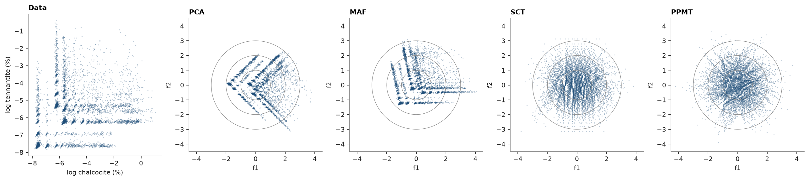
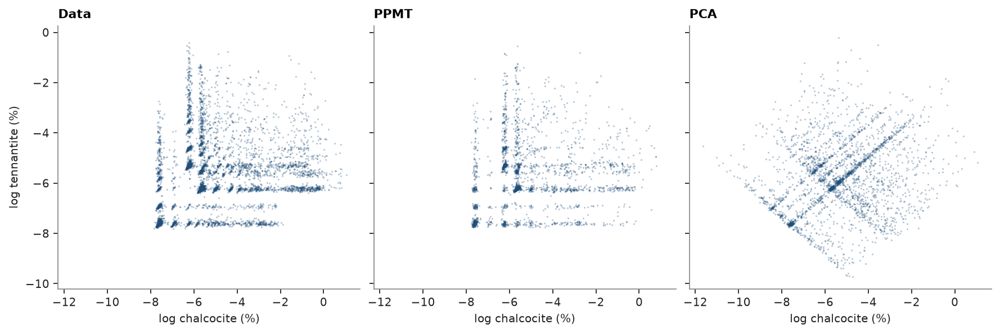
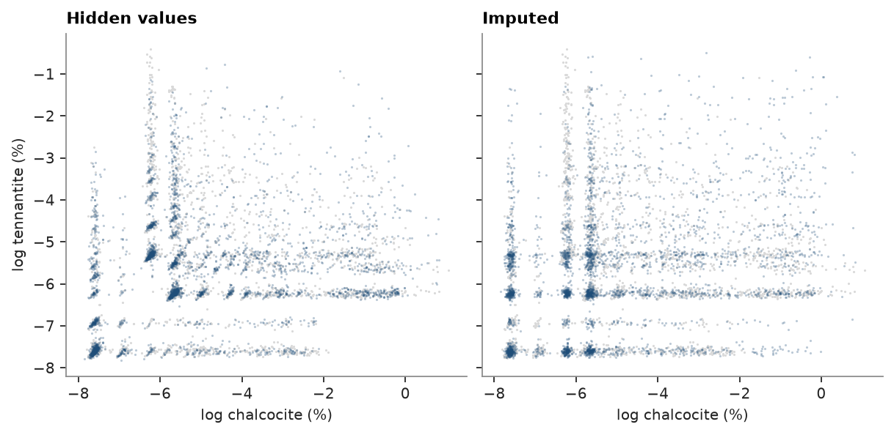

# 17. Multivariate transforms

Cosimulating correlated grades is simpler on independent factors: simulate each factor alone, then transform
back. Four transforms reach independence to different degrees. PCA and min/max autocorrelation factors (MAF) are
linear rotations: they remove correlation but not curved dependence. The stepwise conditional transform (SCT)
and the projection-pursuit multivariate transform (PPMT) are nonlinear and Gaussian by construction.

<details><summary>Python</summary>

```python
import ceres as cs
import matplotlib.pyplot as plt
import numpy as np
from common import ACCENT, GREY, LIGHT, fetch, save

data = cs.read_csv(fetch("geomet/porphyry_01/synthetic_drillholes.csv"))
coords = np.column_stack([data["midx"], data["midy"], data["midz"]])
pair = np.log(np.column_stack([data["calcosina"], data["tenantita"]]))
names = ["log chalcocite (%)", "log tennantite (%)"]
print(f"{len(pair)} composites, correlation {np.corrcoef(pair.T)[0, 1]:.2f}")
```

</details>

```text
6817 composites, correlation 0.19
```

PCA rotates onto the eigenvectors of the correlation matrix. MAF rotates the sphered data onto the eigenvectors of
its variogram matrix at one lag (5 m, the composite length), so the factors are also uncorrelated at that lag, most
continuous first. SCT normal-scores the second variable within classes of the first; PPMT normal-scores each
variable, then Gaussianizes the least Gaussian projections in turn.

<details><summary>Python</summary>

```python
transforms = {
    "PCA": cs.PCA(standardize=True).fit(pair),
    "MAF": cs.MAF(lag=5.0, tolerance=1.0).fit(pair, coords),
    "SCT": cs.StepwiseConditional(classes=12).fit(pair),
    "PPMT": cs.PPMT(seed=7).fit(pair),
}
factors = {name: t.transform(pair) for name, t in transforms.items()}

print(f"{'':6}{'r(f1, f2)':>11}{'r(f1², f2)':>12}{'skew f2':>9}{'round trip':>12}")
for name, f in factors.items():
    back = transforms[name].inverse_transform(f)
    skew = ((f[:, 1] - f[:, 1].mean()) ** 3).mean() / f[:, 1].std() ** 3
    r2 = np.corrcoef(f[:, 0] ** 2, f[:, 1])[0, 1]
    error = np.abs(back - pair).max()
    print(f"{name:6}{np.corrcoef(f.T)[0, 1]:11.3f}{r2:12.3f}{skew:9.2f}{error:12.1e}")
print("MAF variogram of each factor at 5 m:", np.round(transforms["MAF"].gammas_, 3))
```

</details>

```text
        r(f1, f2)  r(f1², f2)  skew f2  round trip
PCA         0.000       0.074    -0.07     1.9e-15
MAF        -0.000      -0.078     0.88     3.8e-15
SCT         0.014      -0.029    -0.00     0.0e+00
PPMT        0.001      -0.000     0.00     2.4e-12
MAF variogram of each factor at 5 m: [0.087 0.106]
```

The data and the four sets of factors. Linear factors are uncorrelated but keep the L-shaped cloud of two mineral
associations; the nonlinear ones fill the standard bivariate normal.

<details><summary>Python</summary>

```python
fig, axes = plt.subplots(1, 5, figsize=(16, 3.5), layout="constrained")
axes[0].scatter(pair[:, 0], pair[:, 1], s=2, color=ACCENT, alpha=0.3, linewidths=0)
axes[0].set(xlabel=names[0], ylabel=names[1], title="Data")
t = np.linspace(0, 2 * np.pi, 200)
for ax, (name, f) in zip(axes[1:], factors.items()):
    ax.scatter(f[:, 0], f[:, 1], s=2, color=ACCENT, alpha=0.3, linewidths=0)
    for radius in (1, 2, 3):
        ax.plot(radius * np.cos(t), radius * np.sin(t), color=GREY, lw=0.6)
    ax.set(xlim=(-4.5, 4.5), ylim=(-4.5, 4.5), xlabel="f1", ylabel="f2", title=name, aspect="equal")
save(fig, "factors")
```

</details>



## Simulating the factors

`MultivariateSimulation` puts the pieces together: it fits the transform, simulates each factor on its own with its
own variogram and seed, and back-transforms every realization at the nodes, before any averaging to blocks. Each
factor gets the omnidirectional variogram of its scores; turning bands simulate 20 realizations on 25 m nodes.
Statistics of the data are declustered with 50 m cells.

<details><summary>Python</summary>

```python
weights = cs.cell_declustering(coords, pair[:, 0], cell_size=50.0).weights
lo, hi = coords.min(axis=0), coords.max(axis=0)
count = np.ceil((hi - lo) / (100, 100, 50)).astype(int)
blocks = cs.BlockModel(origin=tuple(lo), size=(100, 100, 50), count=tuple(count))
nodes = cs.BlockModel(origin=tuple(lo), size=(25, 25, 25), count=tuple(count * (4, 4, 2)))
search = cs.Search(radius=250, max_samples=16)

runs = {}
for name, transform in {"PPMT": cs.PPMT(seed=7), "PCA": cs.PCA(standardize=True)}.items():
    f = transform.fit(pair, weights=weights).transform(pair)
    variograms = [cs.experimental_variogram(coords, f[:, j], 25.0, 300.0).fit("spherical") for j in range(2)]
    simulation = cs.MultivariateSimulation(transform, [cs.TurningBands(v, search=search) for v in variograms])
    runs[name] = simulation.fit(coords, pair, weights=weights)
reals = {
    name: [s.realizations for s in sim.simulate(nodes, n=20, seed=1, realizations=True)]
    for name, sim in runs.items()
}
print(f"{len(nodes.centroids)} nodes, 20 realizations")
```

</details>

```text
36608 nodes, 20 realizations
```

Both keep the correlation, the only dependence a linear rotation carries. PPMT also keeps the declustered
histograms and honours the composites; PCA factors are not Gaussian, so simulating them as if they were shortens
the upper tails and sends high chalcocite and high tennantite together too often.

<details><summary>Python</summary>

```python
def weighted_quantiles(values, weights, qs):
    order = np.argsort(values)
    cum = np.cumsum(weights[order]) / weights.sum()
    return values[order][np.searchsorted(cum, qs)]


qs = [0.1, 0.5, 0.9]
high = np.quantile(pair, 0.8, axis=0)
cov = np.cov(pair.T, aweights=weights)
rows = [
    (
        "data",
        cov[0, 1] / np.sqrt(cov[0, 0] * cov[1, 1]),
        *weighted_quantiles(pair[:, 0], weights, qs),
        *weighted_quantiles(pair[:, 1], weights, qs),
        np.average((pair > high).all(axis=1), weights=weights),
    )
]
for name, (a, b) in reals.items():
    r = np.mean([np.corrcoef(x, y)[0, 1] for x, y in zip(a, b)])
    rows.append((name, r, *np.quantile(a, qs), *np.quantile(b, qs), np.mean((a > high[0]) & (b > high[1]))))
print(f"{'':6}{'r':>6}{'chalcocite q10, q50, q90':>27}{'tennantite q10, q50, q90':>27}{'both > q80':>12}")
for name, r, *q, both in rows:
    cc, tn = (", ".join(f"{v:.2f}" for v in part) for part in (q[:3], q[3:]))
    print(f"{name:6}{r:6.2f}{cc:>27}{tn:>27}{both:12.3f}")

at_data = runs["PPMT"].simulate(coords[:500], n=5, seed=2)
error = max(np.abs(s.mean - pair[:500, j]).max() + s.std.max() for j, s in enumerate(at_data))
print(f"PPMT at 500 composites: largest departure from the data {error:.1e}")
```

</details>

```text
           r   chalcocite q10, q50, q90   tennantite q10, q50, q90  both > q80
data    0.23        -7.61, -5.68, -2.35        -7.62, -6.06, -3.80       0.038
PPMT    0.21        -7.61, -5.70, -2.54        -7.62, -6.15, -3.96       0.025
PCA     0.25        -7.69, -5.50, -3.03        -7.62, -5.86, -3.97       0.062
PPMT at 500 composites: largest departure from the data 2.3e-11
```

One realization of each: PPMT rebuilds the L-shaped cloud of the data; PCA spreads a rotated square over it,
reaching below the lowest assays and into the corner the data leave empty.

<details><summary>Python</summary>

```python
pick = np.random.default_rng(0).choice(len(nodes.centroids), 3000, replace=False)
fig, axes = plt.subplots(1, 3, figsize=(11, 3.6), layout="constrained", sharex=True, sharey=True)
panels = [(pair[:, 0], pair[:, 1], "Data")] + [
    (a[0][pick], b[0][pick], name) for name, (a, b) in reals.items()
]
for ax, (x, y, title) in zip(axes, panels):
    ax.scatter(x, y, s=2, color=ACCENT, alpha=0.3, linewidths=0)
    ax.set(xlabel=names[0], title=title)
axes[0].set_ylabel(names[1])
save(fig, "simulated")
```

</details>



At block support, `blocks=` averages each realization after the back-transform; averaging the factors instead would
give other values, since the transform is not linear. Here 100 × 100 × 50 m blocks.

<details><summary>Python</summary>

```python
by_block = runs["PPMT"].simulate(nodes, n=20, seed=1, realizations=True, blocks=blocks)
for j, s in enumerate(by_block):
    print(
        f"{names[j]}: variance {reals['PPMT'][j].var(axis=1).mean():.2f} at nodes, "
        f"{s.realizations.var(axis=1).mean():.2f} in {s.realizations.shape[1]} blocks"
    )
```

</details>

```text
log chalcocite (%): variance 3.52 at nodes, 1.52 in 1144 blocks
log tennantite (%): variance 1.87 at nodes, 0.85 in 1144 blocks
```

## Missing variables

Minor minerals are often logged in some holes only. Hiding tennantite in every other hole leaves half of the
composites incomplete, and `MultivariateSimulation` would drop them. `GaussianImputer` fills them instead: it
normal-scores each variable on its own values, fits the correlation of the scores to all composites, and draws each
missing score given the scores present in its row. Drawn values keep the histogram and the correlation of the
scores, which predicted values would shrink.

<details><summary>Python</summary>

```python
hidden = np.asarray(data["DHID"]) % 2 == 0
holed = pair.copy()
holed[hidden, 1] = np.nan
imputer = cs.GaussianImputer(seed=3).fit(holed)
filled = imputer.transform(holed)

full = cs.GaussianImputer().fit(pair).correlation_[0, 1]
print(f"{hidden.sum()} of {len(pair)} composites miss tennantite")
print(f"score correlation {imputer.correlation_[0, 1]:.3f} fitted to them, {full:.3f} to the full data")
for name, x in {"hidden": pair[hidden], "imputed": filled[hidden]}.items():
    print(f"{name:8} tennantite q10, q50, q90: " + ", ".join(f"{v:.2f}" for v in np.quantile(x[:, 1], qs)))

fig, axes = plt.subplots(1, 2, figsize=(7.5, 3.6), layout="constrained", sharex=True, sharey=True)
for ax, (x, title) in zip(axes, [(pair, "Hidden values"), (filled, "Imputed")]):
    ax.scatter(pair[~hidden, 0], pair[~hidden, 1], s=2, color=LIGHT, linewidths=0)
    ax.scatter(x[hidden, 0], x[hidden, 1], s=2, color=ACCENT, alpha=0.3, linewidths=0)
    ax.set(xlabel=names[0], title=title)
axes[0].set_ylabel(names[1])
save(fig, "imputed")
```

</details>

```text
3334 of 6817 composites miss tennantite
score correlation 0.275 fitted to them, 0.273 to the full data
hidden   tennantite q10, q50, q90: -7.59, -5.82, -3.94
imputed  tennantite q10, q50, q90: -7.61, -6.10, -3.59
```



The correlation holds, the L shape does not: a Gaussian dependence cannot tell the two mineral associations apart,
so imputed tennantite spreads along chalcocite into the corner the data leave empty.

`fit(..., impute=True)` does this inside the simulation, with a fresh imputation in every realization, so the
uncertainty of the missing values reaches the realizations. The transform and the factor variograms come from the
complete composites.

<details><summary>Python</summary>

```python
f = cs.PPMT(seed=7).fit(pair[~hidden], weights=weights[~hidden]).transform(pair[~hidden])
variograms = [
    cs.experimental_variogram(coords[~hidden], f[:, j], 25.0, 300.0).fit("spherical") for j in range(2)
]
simulation = cs.MultivariateSimulation(
    cs.PPMT(seed=7), [cs.TurningBands(v, search=search) for v in variograms]
)
simulation.fit(coords, holed, weights=weights, impute=True)
a, b = (s.realizations for s in simulation.simulate(nodes, n=20, seed=1, realizations=True))
r = np.mean([np.corrcoef(x, y)[0, 1] for x, y in zip(a, b)])
print(f"r {r:.2f}, tennantite q10, q50, q90: " + ", ".join(f"{v:.2f}" for v in np.quantile(b, qs)))
```

</details>

```text
r 0.23, tennantite q10, q50, q90: -7.62, -6.18, -3.92
```

Full script: [`example_17.py`](example_17.py)
