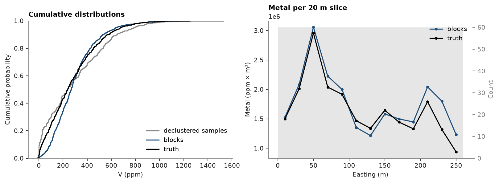
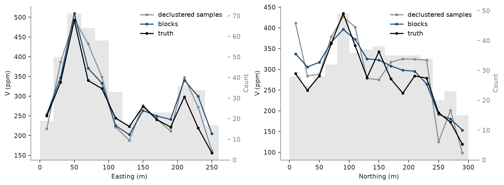
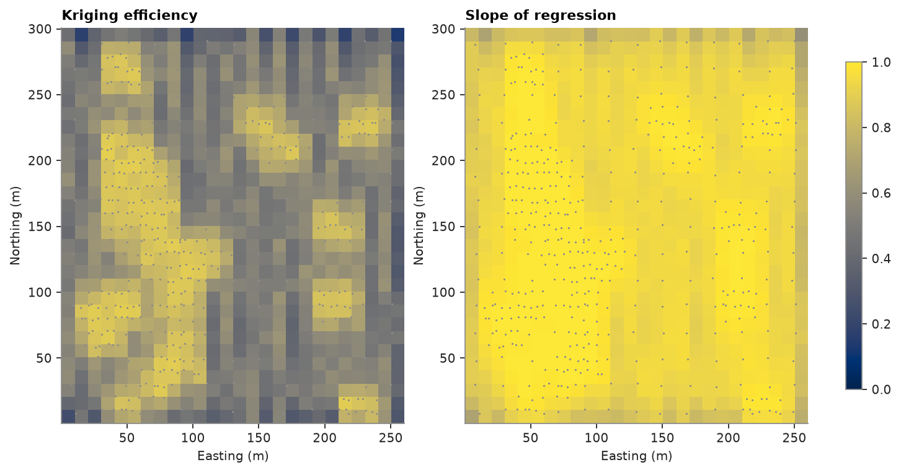
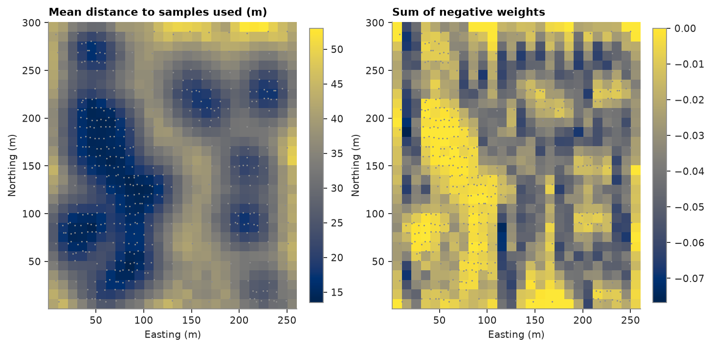
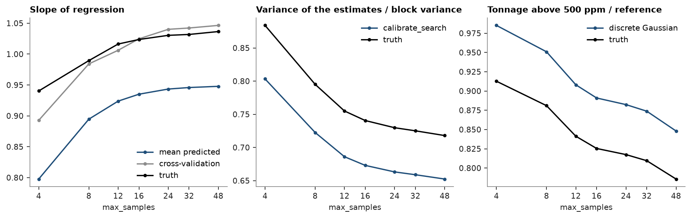
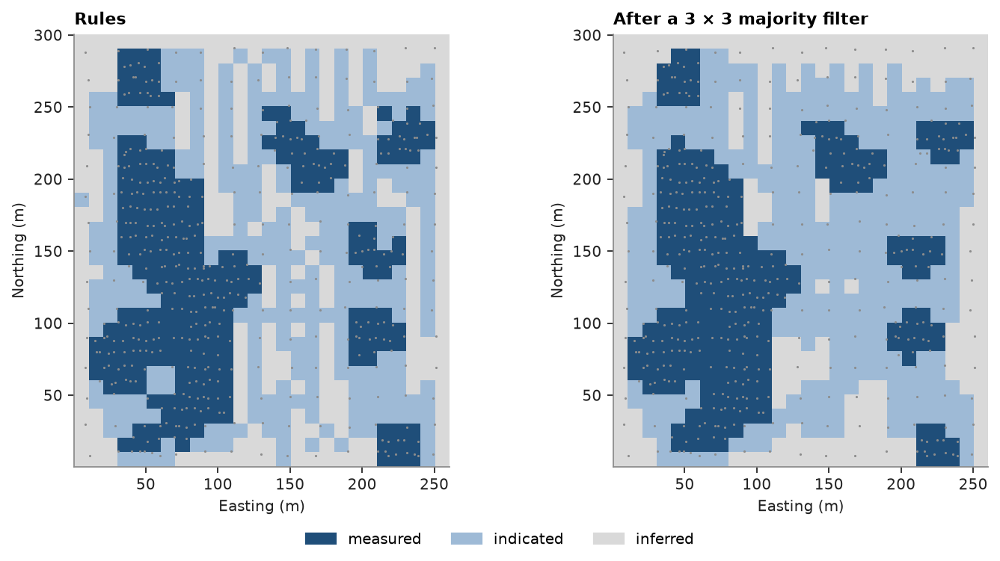

# 18. Validation and classification

Block kriging of Walker Lake `V` on 10 × 10 m blocks, then the checks a resource estimate needs: global and local
bias against the declustered data, leave-one-out and k-fold cross-validation, kriging efficiency, slope of regression
and the neighborhood diagnostics per block, scores for candidate searches, a classification from the diagnostics and
the sample spacing, and a majority filter that removes isolated blocks. The exhaustive grid checks what the slope of
regression and the search scores predict.

<details><summary>Python</summary>

```python
import ceres as cs
import matplotlib.pyplot as plt
import numpy as np
from common import ACCENT, GRAY, LIGHT, map_axes, save

samples = cs.datasets.walker_lake()
truth = cs.datasets.walker_lake_exhaustive()["V"].reshape(300, 260)
xy, v = samples.coords, samples["V"]
model = cs.Variogram.from_json((HERE.parent / "03-variography" / "model.json").read_text())
weights = cs.cell_declustering(xy, v, sizes=np.arange(2.5, 102.5, 2.5)).weights

blocks = cs.BlockModel(origin=(0.5, 0.5), size=(10, 10), count=(26, 30))
search = cs.Search(radius=80, max_samples=24, min_samples=4, rotation=(170, 0, 0), ratios=(0.5, 1.0))
kriging = cs.BlockKriging(model, search, size=(10, 10), discretization=(5, 5, 1)).fit(xy, v)
d = kriging.predict(blocks, diagnostics=True)
true_blocks = truth.reshape(30, 10, 26, 10).mean(axis=(1, 3)).ravel()
```

</details>

`validate_model` sets the blocks against the samples, naive and declustered, with the true blocks as a reference.
Differences are relative to the declustered samples. The blocks reproduce the declustered mean and, being 10 × 10 m
averages smoothed by kriging, have a much smaller variance; the true blocks sit in between, since averaging over a
block alone already removes part of the sample variance.

<details><summary>Python</summary>

```python
kriged = blocks.with_columns({"value": d["value"], "truth": true_blocks})
table = cs.validate_model(kriged, "value", samples, "V", weights=weights, reference="truth")
print(f"{'':12}{'n':>6}{'mean':>7}{'CV':>6}{'P10':>6}{'P50':>6}{'P90':>7}{'mean diff':>11}{'var. ratio':>11}")
for row in zip(
    *(table[c] for c in ["source", "n", "mean", "cv", "P10", "P50", "P90", "mean_diff", "variance_ratio"])
):
    source, n, mean, cv, p10, p50, p90, diff, ratio = row
    print(
        f"{source:<12}{n:>6.0f}{mean:>7.0f}{cv:>6.2f}{p10:>6.0f}{p50:>6.0f}{p90:>7.0f}{diff:>+11.1%}{ratio:>11.2f}"
    )
```

</details>

```text
                 n   mean    CV   P10   P50    P90  mean diff var. ratio
naive          470    435  0.69    31   424    819     +48.5%       1.34
declustered    470    293  0.88     2   236    646      +0.0%       1.00
model          780    296  0.62    94   268    537      +0.8%       0.51
reference      780    278  0.78    26   239    576      -5.2%       0.70
```

Their cumulative distributions show the same smoothing: the blocks have fewer low and high grades than the true
blocks, the declustered samples more. Swaths of metal, grade × area per 20 m slice of easting, show where the
estimate puts the metal; they add up to the metal of the whole model.

<details><summary>Python</summary>

```python
fig, axes = plt.subplots(1, 2, figsize=(10, 3.6), layout="constrained")
cs.plot.cdf([v, d["value"], true_blocks], [weights, None, None], ax=axes[0])
metal = [cs.swath(kriged, g, 20.0, axis="x") for g in ("value", "truth")]
cs.plot.swath(metal, labels=["blocks", "truth"], y="metal", ax=axes[1])
for ax, colors in ((axes[0], (GRAY, ACCENT, "black")), (axes[1], (ACCENT, "black"))):
    for line, color in zip(ax.lines, colors, strict=True):
        line.set_color(color)
axes[0].legend(axes[0].lines, ["declustered samples", "blocks", "truth"])
axes[1].legend()
axes[0].set(xlabel="V (ppm)", title="Cumulative distributions")
axes[1].set(xlabel="Easting (m)", ylabel="Metal (ppm × m²)", title="Metal per 20 m slice")
save(fig, "distributions")
```

</details>



Local bias shows in swaths: mean grade in 20 m slices along easting and northing, for the blocks, the declustered
samples and the truth. Blocks track the truth slice by slice and are smoother than the samples, whose slice means
scatter where few samples fall.

<details><summary>Python</summary>

```python
fig, axes = plt.subplots(1, 2, figsize=(10, 3.6), layout="constrained")
for ax, axis, name in ((axes[0], "x", "Easting (m)"), (axes[1], "y", "Northing (m)")):
    series = [
        cs.swath(samples, "V", 20.0, axis=axis, weights=weights),
        cs.swath(kriged, "value", 20.0, axis=axis),
        cs.swath(kriged, "truth", 20.0, axis=axis),
    ]
    cs.plot.swath(series, labels=["declustered samples", "blocks", "truth"], ax=ax)
    for line, color in zip(ax.lines, (GRAY, ACCENT, "black"), strict=True):
        line.set_color(color)
    ax.legend()
    ax.set(xlabel=name, ylabel="V (ppm)")
save(fig, "swaths")
```

</details>



Cross-validation re-estimates every sample from the others with the same variogram and search. Leave-one-out
removes one sample at a time; k-fold removes a whole fold, sample `i` going to fold `i % k`, so each estimate sees
data a fraction `1/k` sparser. Errors grow as folds get fewer: leave-one-out judges the model at the sample
spacing, which in the clustered areas is finer than most blocks see. A slope above 1 and a standardized squared
error below 1 hold at every k: high estimates slightly understate the samples, and the kriging variance is too
large.

<details><summary>Python</summary>

```python
point_kriging = cs.OrdinaryKriging(model, search).fit(xy, v)
for folds in (None, 10, 5, 2):
    cv = point_kriging.cross_validate(folds=folds)
    print(
        f"{'leave-one-out' if folds is None else f'{folds}-fold':>13}: RMSE {cv.rmse:5.1f} ppm, "
        f"correlation {cv.correlation:.2f}, slope {cv.slope:.2f}, "
        f"standardized squared error {cv.standardized_squared_error:.2f}"
    )
```

</details>

```text
leave-one-out: RMSE 187.2 ppm, correlation 0.78, slope 1.08, standardized squared error 0.64
      10-fold: RMSE 191.3 ppm, correlation 0.77, slope 1.07, standardized squared error 0.66
       5-fold: RMSE 195.4 ppm, correlation 0.76, slope 1.07, standardized squared error 0.68
       2-fold: RMSE 204.1 ppm, correlation 0.73, slope 1.08, standardized squared error 0.67
```

Kriging efficiency compares the block variance with the kriging variance: 1 for a perfectly known block, 0 or less
for one no better known than the global mean. The slope of regression of true on estimated grades is 1 when
estimates are conditionally unbiased; below 1, high estimates overstate and low ones understate the truth. Both
fall away from the samples:

<details><summary>Python</summary>

```python
shape, extent = (30, 26), (0.5, 260.5, 0.5, 300.5)
fig, axes = plt.subplots(1, 2, figsize=(9, 4.6), layout="constrained")
for ax, key, title in (
    (axes[0], "efficiency", "Kriging efficiency"),
    (axes[1], "slope", "Slope of regression"),
):
    im = ax.imshow(d[key].reshape(shape), origin="lower", extent=extent, vmin=0, vmax=1)
    ax.scatter(xy[:, 0], xy[:, 1], s=2, color=GRAY, linewidths=0)
    map_axes(ax, title)
fig.colorbar(im, ax=axes, shrink=0.8)
save(fig, "diagnostics")
```

</details>



The truth checks both. Globally, the regression of true on estimated block grades has a slope close to the mean
predicted slope, so the estimate is nearly conditionally unbiased. Blocks with efficiency of 0.7 or more are
clearly closer to the truth; below that efficiency separates them poorly, one reason classification also uses
sample spacing.

<details><summary>Python</summary>

```python
observed = np.polyfit(d["value"], true_blocks, 1)[0]
print(f"slope of regression: predicted mean {d['slope'].mean():.2f}, observed {observed:.2f}")
groups = np.digitize(d["efficiency"], [0.5, 0.7])
for g, label in enumerate(("efficiency < 0.5", "0.5 to 0.7", ">= 0.7")):
    k = groups == g
    error = np.sqrt(np.mean((d["value"][k] - true_blocks[k]) ** 2))
    corr = np.corrcoef(d["value"][k], true_blocks[k])[0, 1]
    print(f"{label:>16}: {k.sum():3d} blocks, RMSE {error:5.1f} ppm, correlation with truth {corr:.2f}")
```

</details>

```text
slope of regression: predicted mean 0.94, observed 1.03
efficiency < 0.5: 224 blocks, RMSE 109.9 ppm, correlation with truth 0.69
      0.5 to 0.7: 328 blocks, RMSE 113.0 ppm, correlation with truth 0.69
          >= 0.7: 228 blocks, RMSE  83.2 ppm, correlation with truth 0.93
```

The other diagnostics say why a block is weak. `mean_distance` is the mean distance to the samples used, and
`max_samples_reached` flags searches that stopped at 24 samples before the ellipse ran out: those blocks sit in
denser data and have the higher slope. `negative_weight_sum` adds the weights below zero, which samples screened
by closer ones receive. They are strongest on the sparse regular pattern between the clusters, and blocks with
strongly negative sums carry the largest errors, overstate the truth, and give the only negative grades. `lagrange`
(the Lagrange multiplier) and `n_holes` (distinct drill holes used; each Walker Lake sample is its own) complete
the set.

<details><summary>Python</summary>

```python
full = d["max_samples_reached"] == 1
for label, k in (("full search", full), ("ellipse ran out", ~full)):
    print(
        f"{label:>15}: {k.mean():4.0%} of blocks, mean distance {d['mean_distance'][k].mean():4.1f} m, "
        f"mean slope {d['slope'][k].mean():.2f}"
    )
groups = np.digitize(d["negative_weight_sum"], [-0.05, -0.03])
for g, label in enumerate(("below -0.05", "-0.05 to -0.03", "above -0.03")):
    k = groups == g
    error = np.sqrt(np.mean((d["value"][k] - true_blocks[k]) ** 2))
    print(
        f"negative weights {label:>14}: {k.sum():3d} blocks, RMSE {error:5.1f} ppm, "
        f"mean {d['value'][k].mean():3.0f} ppm against {true_blocks[k].mean():3.0f} true"
    )
negative = d["value"] < 0
print(
    f"{negative.sum()} negative estimates, negative weights {d['negative_weight_sum'][negative].max():.2f} or below"
)
```

</details>

```text
    full search:  89% of blocks, mean distance 28.2 m, mean slope 0.95
ellipse ran out:  11% of blocks, mean distance 40.5 m, mean slope 0.86
negative weights    below -0.05: 116 blocks, RMSE 126.8 ppm, mean 212 ppm against 190 true
negative weights -0.05 to -0.03: 231 blocks, RMSE 106.8 ppm, mean 218 ppm against 194 true
negative weights    above -0.03: 433 blocks, RMSE  95.7 ppm, mean 359 ppm against 347 true
4 negative estimates, negative weights -0.04 or below
```

<details><summary>Python</summary>

```python
fig, axes = plt.subplots(1, 2, figsize=(9, 4.6), layout="constrained")
for ax, key, title in (
    (axes[0], "mean_distance", "Mean distance to samples used (m)"),
    (axes[1], "negative_weight_sum", "Sum of negative weights"),
):
    im = ax.imshow(d[key].reshape(shape), origin="lower", extent=extent)
    ax.scatter(xy[:, 0], xy[:, 1], s=2, color=GRAY, linewidths=0)
    map_axes(ax, title)
    fig.colorbar(im, ax=ax, shrink=0.8)
save(fig, "neighborhood")
```

</details>



The search is a choice too. `calibrate_search` re-estimates the blocks with each candidate search, keeping the
variogram and samples, and scores it: the variance of the estimates against the block variance (sill minus the
mean variogram within a block, nugget excluded), slope and efficiency (mean and 10th percentile), negative weights,
the share of blocks each pass fills, declustered cross-validation at the samples, and the global bias. With cutoffs
and a Hermite anamorphosis it adds tonnage and metal above each cutoff over those of the discrete Gaussian model's
block distribution. It picks no winner. Here the candidates differ only in `max_samples`, and the exhaustive grid
checks every score.

<details><summary>Python</summary>

```python
counts = (4, 8, 12, 16, 24, 32, 48)
candidates = [
    cs.Search(radius=80, max_samples=n, min_samples=4, rotation=(170, 0, 0), ratios=(0.5, 1.0))
    for n in counts
]
anamorphosis = cs.HermiteAnamorphosis().fit(v, weights=weights)
scores = cs.calibrate_search(
    kriging, candidates, blocks, weights=weights, cutoffs=[500], anamorphosis=anamorphosis
)
true_scores = {"slope": [], "variance": [], "tonnage": []}
for candidate in candidates:
    estimate = kriging.with_search(candidate).predict(blocks)
    true_scores["slope"].append(np.polyfit(estimate, true_blocks, 1)[0])
    true_scores["variance"].append(estimate.var() / true_blocks.var())
    true_scores["tonnage"].append(np.mean(estimate >= 500) / np.mean(true_blocks >= 500))
print(f"{'':7} {'slope of regression':^20} {'variance ratio':^13} {'tonnage >= 500':^13} {'negative':>8}")
print(
    f"{'samples':>7}"
    + "".join(f"{h:>7}" for h in ("mean", "CV", "true", "scores", "true", "scores", "true"))
    + "  weights"
)
for i, n in enumerate(counts):
    row = (scores["slope_mean"][i], scores["cv_slope"][i], true_scores["slope"][i])
    row += (scores["variance_ratio"][i], true_scores["variance"][i])
    row += (scores["tonnage_ratio_500"][i], true_scores["tonnage"][i])
    print(f"{n:7d}" + "".join(f"{x:7.2f}" for x in row) + f"{scores['negative_weight_sum'][i]:9.3f}")
```

</details>

```text
        slope of regression  variance ratio tonnage >= 500 negative
samples   mean     CV   true scores   true scores   true  weights
      4   0.80   0.89   0.94   0.80   0.88   0.99   0.91    0.000
      8   0.89   0.98   0.99   0.72   0.80   0.95   0.88   -0.000
     12   0.92   1.01   1.02   0.69   0.75   0.91   0.84   -0.003
     16   0.94   1.02   1.02   0.67   0.74   0.89   0.83   -0.010
     24   0.94   1.04   1.03   0.66   0.73   0.88   0.82   -0.028
     32   0.95   1.04   1.03   0.66   0.73   0.87   0.81   -0.046
     48   0.95   1.05   1.04   0.65   0.72   0.85   0.79   -0.067
```

Every score moves with the truth. More samples raise the slope, and the cross-validation slope follows the true
one closely; the mean predicted slope sits lower, as above. Estimates grow smoother, so the variance ratio falls
and fewer blocks clear 500 ppm. The true variance ratio sits higher because the blocks of this 260 × 300 m area
vary less than the sill implies, and the discrete Gaussian reference puts slightly fewer blocks above 500 ppm than
the truth. Past 16 to 24 samples the slope barely rises while the negative weights keep growing, and that trade-off
is the user's to settle.

<details><summary>Python</summary>

```python
fig, axes = plt.subplots(1, 3, figsize=(11, 3.4), layout="constrained")
panels = (
    (
        "Slope of regression",
        [(scores["slope_mean"], "mean predicted"), (scores["cv_slope"], "cross-validation")],
        "slope",
    ),
    (
        "Variance of the estimates / block variance",
        [(scores["variance_ratio"], "calibrate_search")],
        "variance",
    ),
    ("Tonnage above 500 ppm / reference", [(scores["tonnage_ratio_500"], "discrete Gaussian")], "tonnage"),
)
for ax, (title, lines, key) in zip(axes, panels, strict=True):
    for (series, label), color in zip(lines, (ACCENT, GRAY), strict=False):
        ax.plot(counts, series, "o-", color=color, label=label, ms=3)
    ax.plot(counts, true_scores[key], "o-", color="black", label="truth", ms=3)
    ax.set(title=title, xlabel="max_samples", xscale="log", xticks=counts, xticklabels=counts)
    ax.minorticks_off()
    ax.legend()
save(fig, "calibration")
```

</details>



Classification combines slope and efficiency with the distance to the nearest sample, from `neighborhood_stats`.
These points carry no hole ids; with drill holes, `hole_distance` measures spacing between holes instead, counting
each hole once ([chapter 20](../20-workflow/README.md)). Rules apply in order and the first that holds wins; a
3 × 3 majority filter then absorbs isolated blocks into their surroundings.

<details><summary>Python</summary>

```python
near = cs.neighborhood_stats(blocks, xy, v, k=8, radius=80)
criteria = {"slope": d["slope"], "efficiency": d["efficiency"], "distance": near["nearest_dist"]}
rules = [
    ("measured", {"slope": (">=", 0.95), "efficiency": (">=", 0.7), "distance": ("<=", 7)}),
    ("indicated", {"slope": (">=", 0.9), "efficiency": (">=", 0.5)}),
]
classes = cs.classify(criteria, rules, default="inferred")
smoothed = cs.smooth_classes(blocks, classes, window=(3, 3, 1))
names = ["measured", "indicated", "inferred"]
for name in names:
    print(
        f"{name:>9}: {np.mean(classes == name):5.1%} of blocks, {np.mean(smoothed == name):5.1%} after smoothing"
    )
```

</details>

```text
 measured: 28.3% of blocks, 27.9% after smoothing
indicated: 40.0% of blocks, 43.6% after smoothing
 inferred: 31.7% of blocks, 28.5% after smoothing
```

<details><summary>Python</summary>

```python
resource_classes = cs.Categories(names, colors=[ACCENT, "#9ebad6", LIGHT])
cmap, norm = cs.plot.category_colors(resource_classes)
fig, axes = plt.subplots(1, 2, figsize=(9, 4.6), layout="constrained")
for ax, c, title in ((axes[0], classes, "Rules"), (axes[1], smoothed, "After a 3 × 3 majority filter")):
    ax.imshow(resource_classes.encode(c).reshape(shape), origin="lower", extent=extent, cmap=cmap, norm=norm)
    ax.scatter(xy[:, 0], xy[:, 1], s=2, color=GRAY, linewidths=0)
    map_axes(ax, title)
cs.plot.category_legend(resource_classes, fig, loc="outside lower center", ncol=3)
save(fig, "classes")
```

</details>



Full script: [`example_18.py`](example_18.py)
