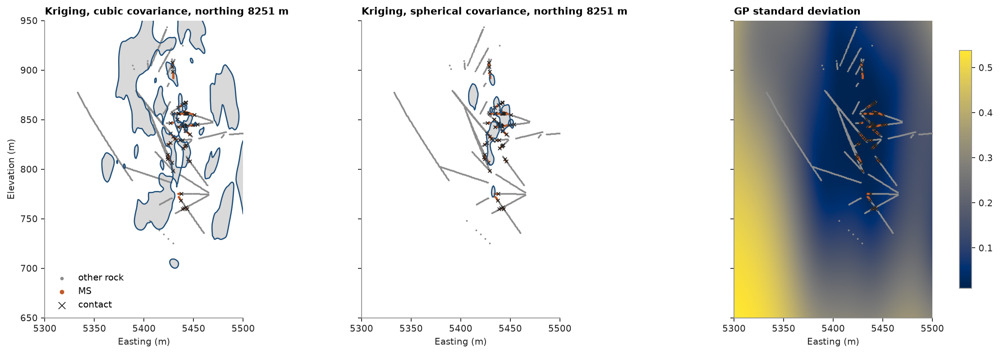
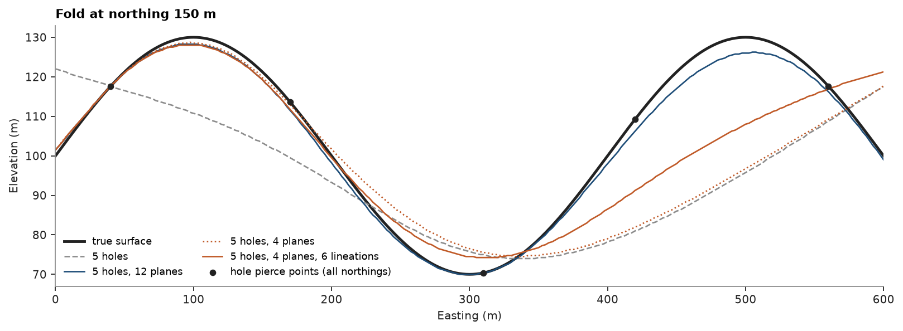
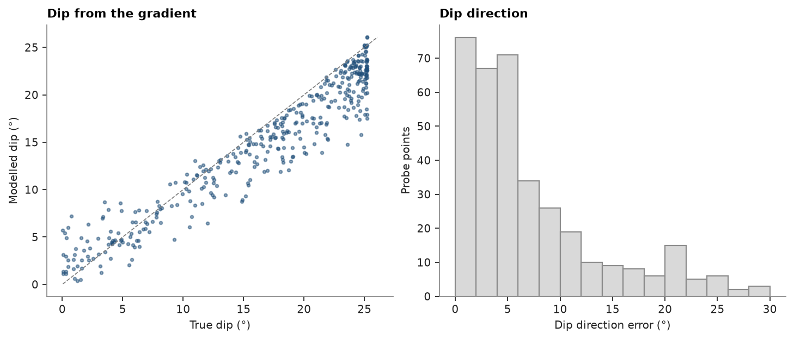

# 19. Geological modelling

[Chapter 15](../15-implicit/README.md) modelled a grade shell. A geological unit is modelled from where the drill
holes cross its contacts, and from structural readings where the rock is measured. Here the massive sulphide
(`MS`) of the drillhole dataset is modelled from its logged contacts with three engines, then a synthetic fold
shows what plane and lineation readings add and how the field's gradient returns the dip.

<details><summary>Python</summary>

```python
import ceres as cs
import matplotlib.pyplot as plt
import numpy as np
from common import ACCENT, GREY, HIGHLIGHT, INK, LIGHT, save
```

</details>

Every change between `MS` and another rock down a hole is a contact; `Drillholes.at` places it in space from the
desurveyed path. The field is pinned to 0 at the contacts, +1 at the middle of each `MS` interval and −1 outside,
using the intervals next to a contact and a sparse subset of the others, which keeps the systems small.

<details><summary>Python</summary>

```python
tables = cs.datasets.drillhole_tables()
dh = cs.Drillholes(tables["collar"], tables["survey"], tables["geology"])
logged = dh.samples()
xyz = logged.coords
hole = np.array(logged["HOLEID"], dtype=object)
lith = np.array(logged["LITH"], dtype=object)
top, bottom = logged["FROM"], logged["TO"]
window = (xyz[:, 0] > 5300) & (xyz[:, 0] < 5500) & (xyz[:, 1] > 8100) & (xyz[:, 1] < 8400)
order = np.lexsort((top, hole))[window[np.lexsort((top, hole))]]
xyz, hole, lith, top, bottom = xyz[order], hole[order], lith[order], top[order], bottom[order]

ms = lith == "MS"
change = (hole[1:] == hole[:-1]) & (ms[1:] != ms[:-1]) & np.isclose(bottom[:-1], top[1:])
contacts = dh.at(list(hole[:-1][change]), bottom[:-1][change])
beside = np.r_[change, False] | np.r_[False, change]
sparse = np.random.default_rng(1).random(len(ms)) < 0.08
coded = ms | beside | sparse
points, code = xyz[coded], np.where(ms[coded], 1.0, -1.0)
print(
    f"{len(set(hole))} holes, {ms.sum()} MS intervals, {len(contacts)} contacts, {coded.sum()} coded points"
)
```

</details>

```text
244 holes, 1232 MS intervals, 598 contacts, 2564 coded points
```

The covariance of the `MS` intervals shows a steep lens striking N16°E, plunging 26° north and thin east–west.
The `kriging` engine is a potential field: dual kriging with a covariance, here of 150 m along the plunge, 68 m up
the lens and 33 m across it (`rotation` azimuth, dip, rake and `ratios`). The RBF takes the same anisotropy. The
Gaussian process learns its own ranges along the `rotation` axes. The share of the window each model calls `MS`
tells a sound model from one that invents bodies:

<details><summary>Python</summary>

```python
rotation, ratios = (16, 26, 90), (0.45, 0.22)


def potential(covariance):
    variogram = cs.Variogram([(covariance, 1.0, 150.0)], rotation=rotation, ratios=ratios)
    return cs.ImplicitModel("kriging", variogram=variogram, drift_degree=0)


models = {
    "kriging, cubic": potential("cubic"),
    "kriging": potential("spherical"),
    "RBF": cs.ImplicitModel("rbf", drift_degree=0, rotation=rotation, ratios=ratios),
    "GP": cs.ImplicitModel("gp", drift_degree=0, rotation=rotation),
}
volume = np.random.default_rng(0).uniform([5300, 8100, 650], [5500, 8400, 950], (20_000, 3))
for name, model in models.items():
    model.fit(points, code, boundaries=contacts)
    right = np.mean(np.sign(model.evaluate(points)) == code)
    share = np.mean(model.evaluate(volume) > 0)
    print(f"{name:>14}: {right:6.1%} of coded points on their side, {share:5.1%} of the window is MS")
report = models["GP"].report
print(f"GP noise variance {report['noise_variance']:.2f}, signal variance {report['signal_variance']:.2f}")
```

</details>

```text
kriging, cubic:  99.9% of coded points on their side, 12.6% of the window is MS
       kriging:  99.9% of coded points on their side,  1.1% of the window is MS
           RBF:  99.9% of coded points on their side,  1.1% of the window is MS
            GP:  71.3% of coded points on their side,  6.9% of the window is MS
GP noise variance 0.77, signal variance 0.31
```

Kriging and the RBF honour every contact and all but a few coded points, yet with a cubic covariance kriging
calls about ten times more of the window `MS`: the smooth cubic overshoots between codes a metre apart and grows bodies
away from the holes. The spherical covariance, rougher at the origin, does not, and agrees with the RBF. The GP
explains most of the codes as noise, so its field is a smooth trend that misses more than a quarter of them; its
standard deviation still shows where the model rests on data and where it does not. On an east–west section
across the lens:

<details><summary>Python</summary>

```python
north = np.median(xyz[ms, 1])
near = np.abs(xyz[:, 1] - north) < 10
east, elevation = np.meshgrid(np.linspace(5300, 5500, 201), np.linspace(650, 950, 301))
section = np.c_[east.ravel(), np.full(east.size, north), elevation.ravel()]
extent = (5300, 5500, 650, 950)

fig, axes = plt.subplots(1, 3, figsize=(14, 4.8), sharey=True, layout="constrained")
for ax, name, covariance in zip(axes[:2], ("kriging, cubic", "kriging"), ("cubic", "spherical"), strict=True):
    field = models[name].evaluate(section).reshape(east.shape)
    ax.contourf(east, elevation, field, levels=[0, np.inf], colors=[LIGHT])
    ax.contour(east, elevation, field, levels=[0], colors=ACCENT, linewidths=1.2)
    ax.set_title(f"Kriging, {covariance} covariance, northing {north:.0f} m")
_, variance = models["GP"].evaluate(section, variance=True)
sd = axes[2].imshow(
    np.sqrt(variance).reshape(east.shape), origin="lower", extent=extent, cmap="Greys", aspect="auto"
)
axes[2].set_title("GP standard deviation")
fig.colorbar(sd, ax=axes[2], shrink=0.8)
for ax in axes:
    ax.scatter(xyz[near & ~ms, 0], xyz[near & ~ms, 2], s=3, color=GREY, linewidths=0, label="other rock")
    ax.scatter(xyz[near & ms, 0], xyz[near & ms, 2], s=5, color=HIGHLIGHT, linewidths=0, label="MS")
    close = np.abs(contacts[:, 1] - north) < 10
    ax.scatter(
        contacts[close, 0], contacts[close, 2], s=12, marker="x", color=INK, linewidths=0.8, label="contact"
    )
    ax.set(xlim=extent[:2], ylim=extent[2:], xlabel="Easting (m)")
    ax.set_aspect("equal")
axes[0].set_ylabel("Elevation (m)")
axes[0].legend(loc="lower left", markerscale=2)
save(fig, "section")
```

</details>



## Structural readings

Drill holes give contacts at a few places; mapping and oriented core give the dip of the surface at many more.
A synthetic fold, `z = 100 + 30 sin(2πx / 400)` with its axis north–south, is known exactly. Five holes pierce it,
twelve outcrops spread along it give its dip and dip direction, and fold-axis lineations (plunge 0, trend 0) are measured at six
other places. Planes and lineations need the triharmonic kernel; one point above the surface sets which side is
positive.

<details><summary>Python</summary>

```python
rng = np.random.default_rng(4)


def surface(x):
    return 100 + 30 * np.sin(2 * np.pi * x / 400)


def true_dip(xy):
    slope = 30 * 2 * np.pi / 400 * np.cos(2 * np.pi * xy[:, 0] / 400)
    return np.degrees(np.arctan(np.abs(slope))), np.where(slope < 0, 90.0, 270.0)


def on_surface(xy):
    return np.c_[xy, surface(xy[:, 0])]


picks = on_surface(np.array([[40.0, 150], [170, 60], [310, 90], [420, 250], [560, 180]]))
outcrops = np.c_[np.linspace(20, 580, 12) + rng.uniform(-20, 20, 12), rng.uniform(0, 300, 12)]
planes = np.c_[on_surface(outcrops), np.column_stack(true_dip(outcrops))]
axis_readings = rng.uniform([0, 0], [600, 300], (6, 2))
lineations = np.c_[on_surface(axis_readings), np.zeros((6, 2))]
above = [[300.0, 150, 200]]
fits = {
    "5 holes": {},
    "5 holes, 12 planes": {"planes": planes},
    "5 holes, 4 planes": {"planes": planes[:4]},
    "5 holes, 4 planes, 6 lineations": {"planes": planes[:4], "lineations": lineations},
}
x = np.linspace(0, 600, 241)
z = np.linspace(0, 200, 801)
X, Z = np.meshgrid(x, z)
probe = rng.uniform([0, 0], [600, 300], (400, 2))
folds, depths = {}, {}
for name, readings in fits.items():
    folds[name] = cs.ImplicitModel(kernel="triharmonic").fit(above, [1.0], boundaries=picks, **readings)
    field = folds[name].evaluate(np.c_[X.ravel(), np.full(X.size, 150.0), Z.ravel()]).reshape(X.shape)
    depths[name] = z[np.argmin(np.abs(field), axis=0)]
    _, gradient = folds[name].evaluate(on_surface(probe), gradient=True)
    dip = np.degrees(np.arccos(np.abs(gradient[:, 2]) / np.linalg.norm(gradient, axis=1)))
    error = np.abs(depths[name] - surface(x))
    print(
        f"{name:>31}: surface within {np.median(error):4.1f} m (median), {error.max():4.1f} m (max); "
        f"dip within {np.median(np.abs(dip - true_dip(probe)[0])):3.1f}°"
    )
```

</details>

```text
                        5 holes: surface within 13.2 m (median), 37.0 m (max); dip within 7.1°
             5 holes, 12 planes: surface within  1.5 m (median),  4.5 m (max); dip within 1.7°
              5 holes, 4 planes: surface within  5.5 m (median), 36.0 m (max); dip within 5.0°
5 holes, 4 planes, 6 lineations: surface within  3.2 m (median), 24.5 m (max); dip within 4.6°
```

Twelve planes bring the surface from 13 m to 1.5 m of the truth (median) and the dip from 7° to under 2°. With
only four planes, the lineations add the direction of the fold axis and improve both.

<details><summary>Python</summary>

```python
fig, ax = plt.subplots(figsize=(10, 3.6), layout="constrained")
ax.plot(x, surface(x), color=INK, lw=2.2, label="true surface")
for (name, depth), color, style in zip(
    depths.items(), (GREY, ACCENT, HIGHLIGHT, HIGHLIGHT), ("--", "-", ":", "-"), strict=True
):
    ax.plot(x, depth, color=color, ls=style, lw=1.2, label=name)
ax.scatter(picks[:, 0], picks[:, 2], color=INK, zorder=3, s=18, label="hole pierce points (all northings)")
ax.set(xlabel="Easting (m)", ylabel="Elevation (m)", title="Fold at northing 150 m", xlim=(0, 600))
ax.legend(ncol=2, loc="lower left", fontsize=8)
save(fig, "fold")
```

</details>



The gradient of the field is normal to the surface, so `evaluate(..., gradient=True)` returns the modelled dip and
dip direction anywhere, here against the truth at the 400 probe points of the twelve-plane model:

<details><summary>Python</summary>

```python
_, gradient = folds["5 holes, 12 planes"].evaluate(on_surface(probe), gradient=True)
dip = np.degrees(np.arccos(np.abs(gradient[:, 2]) / np.linalg.norm(gradient, axis=1)))
direction = np.degrees(np.arctan2(gradient[:, 0], gradient[:, 1])) % 360
truth_dip, truth_direction = true_dip(probe)
fig, (a, b) = plt.subplots(1, 2, figsize=(9, 3.8), layout="constrained")
cs.plot.scatter(truth_dip, dip, line=False, ax=a, color=ACCENT)
a.set(xlabel="True dip (°)", ylabel="Modelled dip (°)", title="Dip from the gradient")
b.hist(
    np.abs((direction - truth_direction + 180) % 360 - 180),
    bins=np.arange(0, 32, 2),
    color=LIGHT,
    edgecolor=GREY,
)
b.set(xlabel="Dip direction error (°)", ylabel="Probe points", title="Dip direction")
save(fig, "dip")
```

</details>



Full script: [`example_19.py`](example_19.py)
