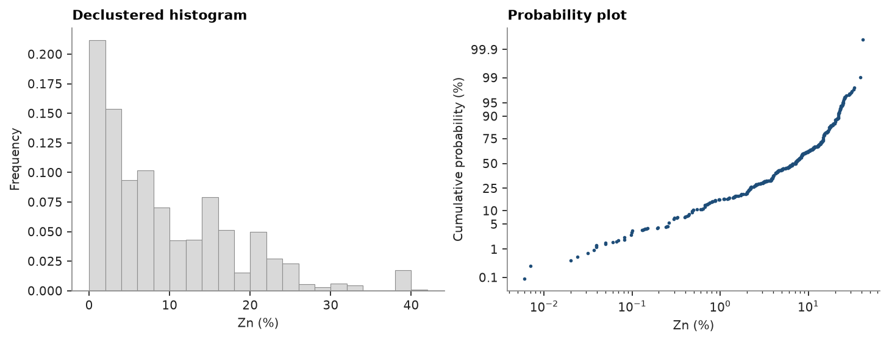
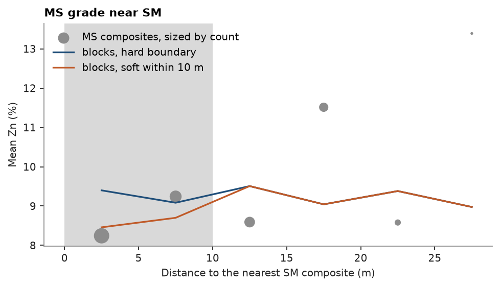
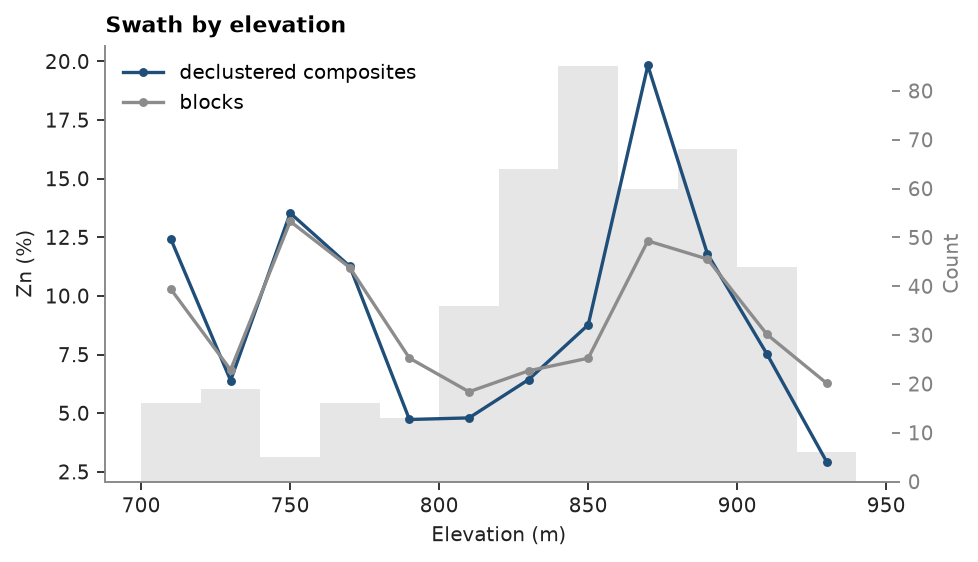
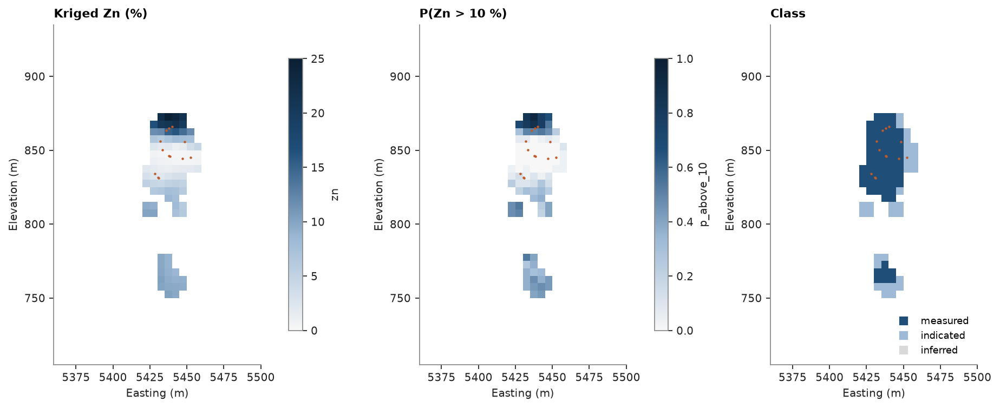

# 20. From drill holes to a classified model

One pass through a resource workflow on the massive sulphide (`MS`) lens of [chapter 19](../19-geological-model/README.md):
composites from the drill-hole CSVs, the lens modeled from its contacts and kept within the drilling, exploratory
statistics, declustering, the normal-score variogram, ordinary kriging in search passes and across a soft boundary,
block-support simulation for risk, across the same boundary, classification, and the model saved to Parquet.

<details><summary>Python</summary>

```python
import tempfile

import ceres as cs
import matplotlib.pyplot as plt
import numpy as np
from common import ACCENT, GRAY, HIGHLIGHT, LIGHT, save
```

</details>

## Composites

Assays and logged lithology are merged and desurveyed by minimum curvature, with tangential desurvey kept for
comparison. Whole runs (`length=None`) show how thick the `MS` intercepts are. The tables are checked and fixed first
with the default rules, as in [chapter 6](../06-drillholes/README.md).

<details><summary>Python</summary>

```python
tables = cs.datasets.drillhole_tables()
flags, _ = cs.check_drillholes(
    tables["collar"], tables["survey"], {"assay": tables["assay"], "geology": tables["geology"]}
)
tables, _ = cs.fix_drillholes(flags, tables)
intervals = cs.merge_intervals(tables["assay"], tables["geology"])
drillholes = cs.Drillholes(tables["collar"], tables["survey"], intervals, method="minimum_curvature")
tangential = cs.Drillholes(tables["collar"], tables["survey"], intervals, method="tangential")


def in_window(points):
    return (points[:, 0] > 5300) & (points[:, 0] < 5500) & (points[:, 1] > 8100) & (points[:, 1] < 8400)


runs = drillholes.composite(None, ["ZN"], domain="LITH")
run_length = runs["length"][in_window(runs.coords) & (np.array(runs["LITH"], dtype=object) == "MS")]
print(
    f"{len(run_length)} MS intercepts: median {np.median(run_length):.1f} m, "
    f"90 % shorter than {np.quantile(run_length, 0.9):.1f} m, longest {run_length.max():.1f} m"
)
```

</details>

```text
306 MS intercepts: median 2.2 m, 90 % shorter than 10.0 m, longest 35.3 m
```

Most intercepts are shorter than a 5 m composite, so each is one composite of its own length; in longer runs the
last piece, if under half a composite, joins the one before (`residual="merge"`) rather than standing alone.
Composites are taken within each lithology and sorted down each hole, in the lens window.

<details><summary>Python</summary>

```python
composites = drillholes.composite(5.0, ["ZN"], domain="LITH", residual="merge")
shift = np.linalg.norm(
    tangential.composite(5.0, ["ZN"], domain="LITH", residual="merge").coords - composites.coords, axis=1
)
xyz, zn = composites.coords, composites["ZN"]
lith = np.array(composites["LITH"], dtype=object)
hole = np.array(composites["hole"], dtype=object)
top, bottom, length = composites["from"], composites["to"], composites["length"]
order = np.lexsort((top, hole))
order = order[in_window(xyz[order])]
xyz, zn, lith, hole, top, bottom, length, shift = (
    a[order] for a in (xyz, zn, lith, hole, top, bottom, length, shift)
)
ms = lith == "MS"
print(
    f"{ms.sum()} MS composites, {length[ms].min():.1f}-{length[ms].max():.1f} m; tangential desurvey moves them "
    f"{np.median(shift[ms]):.2f} m (median), {shift[ms].max():.1f} m at most"
)
```

</details>

```text
392 MS composites, 0.1-7.0 m; tangential desurvey moves them 0.26 m (median), 6.8 m at most
```

## The lens and the drilled volume

As in chapter 19, the lens is a potential field pinned to 0 at every `MS` contact down a hole, +1 in `MS` and −1
around it. The field continues the lens along its plunge past the last hole, so blocks are kept only inside the
convex hull of the `MS` composites: no block is estimated from data entirely on one side of it.

<details><summary>Python</summary>

```python
change = (hole[1:] == hole[:-1]) & (ms[1:] != ms[:-1]) & np.isclose(bottom[:-1], top[1:])
contacts = drillholes.at(list(hole[:-1][change]), bottom[:-1][change])
coded = ms | np.r_[change, False] | np.r_[False, change] | (np.random.default_rng(1).random(len(ms)) < 0.1)
field = cs.Variogram([("spherical", 1.0, 150.0)], rotation=(16, 26, 90), ratios=(0.45, 0.22))
lens = cs.ImplicitModel("kriging", variogram=field, drift_degree=0).fit(
    xyz[coded], np.where(ms[coded], 1.0, -1.0), boundaries=contacts
)

sm = (lith == "SM") & ~np.isnan(zn)
sm_xyz, sm_zn, sm_holes = xyz[sm], zn[sm], hole[sm]
keep = ms & ~np.isnan(zn)
xyz, zn, holes, length = xyz[keep], zn[keep], hole[keep], length[keep]
hull = cs.convex_hull(xyz)
lo, hi = hull.bounds
origin = np.floor(np.array(lo) / 5) * 5
count = tuple(int(c) for c in np.ceil((np.array(hi) - origin) / 5))
grid = cs.BlockModel(origin=tuple(origin), size=(5, 5, 5), count=count)
in_lens = lens.evaluate(grid.centroids) > 0
in_hull = hull.contains(grid.centroids)
blocks = grid.mask(in_lens & in_hull)
print(
    f"{len(contacts)} contacts; {in_lens.sum()} blocks in the lens, {len(blocks)} of them inside the hull "
    f"({len(blocks) * 125 / 1e3:.0f} thousand m3)"
)
```

</details>

```text
582 contacts; 2733 blocks in the lens, 2069 of them inside the hull (259 thousand m3)
```

## Statistics and declustering

Holes cluster where the lens is rich, so cell declustering weights the composites before any statistic. Capping
at 31 % Zn would cut 2.7 % of the composites and 1.7 % of the metal; instead they stay, restricted in the search
below.

<details><summary>Python</summary>

```python
weights = cs.cell_declustering(xyz, zn, sizes=np.arange(5, 80, 5)).weights
weights /= weights.mean()
naive, declustered = cs.describe(zn), cs.describe(zn, weights)
print(f"mean {naive['mean']:.2f} % Zn, declustered {declustered['mean']:.2f} %, CV {declustered['cv']:.2f}")
caps = cs.capping(zn, weights)
for cap, fraction, removed in zip(caps["cap"], caps["fraction"], caps["metal_removed"], strict=True):
    print(f"cap {cap:5.1f} % Zn: {fraction:5.1%} of composites cut, {removed:5.1%} of the metal removed")

fig, (a, b) = plt.subplots(1, 2, figsize=(9, 3.4), layout="constrained")
cs.plot.histogram(zn, weights, bins=np.arange(0, 44, 2), ax=a, color=LIGHT, edgecolor=GRAY)
a.set(xlabel="Zn (%)", title="Declustered histogram")
cs.plot.probability(zn[zn > 0], weights[zn > 0], log=True, ax=b, color=ACCENT, ms=3)
b.set(xlabel="Zn (%)", title="Probability plot")
save(fig, "statistics")
```

</details>

```text
mean 9.03 % Zn, declustered 9.23 %, CV 0.93
cap  21.9 % Zn: 10.6% of composites cut,  5.9% of the metal removed
cap  24.6 % Zn:  5.0% of composites cut,  3.9% of the metal removed
cap  30.9 % Zn:  2.7% of composites cut,  1.7% of the metal removed
cap  38.4 % Zn:  1.8% of composites cut,  0.1% of the metal removed
cap  39.9 % Zn:  0.1% of composites cut,  0.0% of the metal removed
cap  41.0 % Zn:  0.1% of composites cut,  0.0% of the metal removed
```



## Variograms

Simulation needs the variogram of the normal scores, rescaled to a unit sill; kriging uses the variogram of the
grades. Both are fitted omnidirectionally here: the lens is too narrow across strike for reliable directional
pairs.

<details><summary>Python</summary>

```python
scores = cs.NormalScore().fit_transform(zn, weights=weights)
experimental = cs.experimental_variogram(xyz, scores, 10.0, 120.0)
fitted = experimental.fit("spherical")
sill = fitted.nugget + fitted.structures[0].sill
gaussian = cs.Variogram(
    [("spherical", fitted.structures[0].sill / sill, fitted.structures[0].range)], nugget=fitted.nugget / sill
)
grades = cs.experimental_variogram(xyz, zn, 10.0, 120.0).fit("spherical")
print(gaussian)

fig, ax = cs.plot.variogram(experimental, fitted, color=ACCENT)
ax.set(xlabel="Lag distance (m)", ylabel="γ(h) of normal scores", title="Normal-score variogram")
save(fig, "variogram")
```

</details>

```text
Variogram(nugget=0, structures=[Structure("spherical", sill=1, range=29.377377682207207)], rotation=(0.0, 0.0, 0.0), ratios=(1.0, 1.0))
```


## Kriging in passes

The first pass wants eight composites within 30 m, about the variogram range, from at least two holes; blocks it
leaves go to a 60 m pass. In both, composites above 30 % Zn inform only blocks within 15 m, so a rich intercept
does not spread through the lens.

<details><summary>Python</summary>

```python
def passes(high_grade=None):
    return [
        cs.Search(radius=r, max_samples=16, min_samples=m, max_per_hole=4, high_grade=high_grade)
        for r, m in ((30, 8), (60, 4))
    ]


ok = cs.OrdinaryKriging(grades, passes(high_grade=(30.0, 15.0))).fit(xyz, zn, holes=holes)
kriged = ok.predict(blocks, diagnostics=True)
free = cs.OrdinaryKriging(grades, passes()).fit(xyz, zn, holes=holes).predict(blocks)
check = cs.validate_model(kriged["value"], zn, weights=weights)
mean = dict(zip(check["source"], check["mean"], strict=True))
print(f"pass 1: {np.mean(kriged['pass'] == 1):.0%} of blocks, pass 2: {np.mean(kriged['pass'] == 2):.0%}")
print(
    f"mean {mean['model']:.2f} % Zn against {mean['declustered']:.2f} % declustered "
    f"({check['mean_diff'][-1]:+.1%}); {np.mean(free):.2f} % without the high-grade restriction"
)
```

</details>

```text
pass 1: 80% of blocks, pass 2: 20%
mean 9.29 % Zn against 9.23 % declustered (+0.6%); 9.41 % without the high-grade restriction
```

## A soft boundary with SM

The lens is estimated from `MS` composites alone: a hard boundary. That suits the contact with the RH host rock,
where Zn drops sharply, but [chapter 16](../16-eda/README.md) shows grade carrying on across the contact with the
semi-massive sulphide `SM`, with only a small step. Fitted on the `MS` and `SM` composites with their lithology as
`domains`, every block is predicted as `MS`. Without `soft` the boundary stays hard and the estimate is the one
above, bit for bit; with `soft=10.0`, `SM` composites within 10 m of a block also inform it.

<details><summary>Python</summary>

```python
both = (np.vstack([xyz, sm_xyz]), np.r_[zn, sm_zn])
labels = np.r_[np.full(len(zn), "MS"), np.full(len(sm_zn), "SM")]
distance = cs.neighborhood_stats(blocks, sm_xyz, sm_zn, k=1)["nearest_dist"]
contact_ms = cs.neighborhood_stats(xyz, sm_xyz, sm_zn, k=1)["nearest_dist"]
by_rule = {}
for name, soft in (("hard", None), ("soft", 10.0)):
    searches = [
        cs.Search(radius=r, max_samples=16, min_samples=m, max_per_hole=4, high_grade=(30.0, 15.0), soft=soft)
        for r, m in ((30, 8), (60, 4))
    ]
    estimator = cs.OrdinaryKriging(grades, searches).fit(*both, holes=np.r_[holes, sm_holes], domains=labels)
    by_rule[name] = estimator.predict(blocks, diagnostics=True, domains="MS")
print(f"hard boundary equals MS only: {np.array_equal(by_rule['hard']['value'], kriged['value'])}")
near = distance < 10
print(f"{len(sm_zn)} SM composites; {near.mean():.0%} of the blocks lie within 10 m of one")
print(f"MS composites within 10 m of SM: {zn[contact_ms < 10].mean():.2f} % Zn (naive)")
for name, d in by_rule.items():
    print(
        f"{name}: mean {np.mean(d['value']):.2f} % Zn, {np.mean(d['value'][near]):.2f} % near SM, "
        f"{np.mean(d['value'][~near]):.2f} % elsewhere; SM used in {np.mean(d['n_other_domain'] > 0):.0%} of blocks"
    )

bins = np.arange(0, 35, 5.0)
middle = bins[:-1] + 2.5


def binned(d, v):
    inside = [np.digitize(d, bins) == i for i in range(1, len(bins))]
    return np.array([np.mean(v[i]) for i in inside]), np.array([i.sum() for i in inside])


fig, ax = plt.subplots(figsize=(6, 3.4), layout="constrained")
ax.axvspan(0, 10, color=LIGHT, lw=0)
mean, n = binned(contact_ms, zn)
ax.scatter(middle, mean, s=n, color=GRAY, label="MS composites, sized by count")
for name, color, label in (("hard", ACCENT, "hard boundary"), ("soft", HIGHLIGHT, "soft within 10 m")):
    ax.plot(middle, binned(distance, by_rule[name]["value"])[0], color=color, label=f"blocks, {label}")
ax.set(xlabel="Distance to the nearest SM composite (m)", ylabel="Mean Zn (%)", title="MS grade near SM")
ax.legend(loc="upper left")
save(fig, "soft")
```

</details>

```text
hard boundary equals MS only: True
175 SM composites; 30% of the blocks lie within 10 m of one
MS composites within 10 m of SM: 8.61 % Zn (naive)
hard: mean 9.29 % Zn, 9.14 % near SM, 9.35 % elsewhere; SM used in 0% of blocks
soft: mean 9.15 % Zn, 8.66 % near SM, 9.35 % elsewhere; SM used in 29% of blocks
```



Only the blocks within 10 m of an `SM` composite, shaded, change. The `MS` composites there average 8.6 % Zn; the
hard boundary carries the lens grade up to the contact, 9.1 %, and the soft one, drawing on the leaner `SM` next to
it, brings them to 8.7 %. Farther in both estimates are the same, and the mean of the lens drops by 0.14 % Zn. The
rest of the chapter keeps the hard boundary.

## Simulation at block support

Thirty sequential Gaussian simulations on 2.5 m nodes, eight per block (`discretize(2)`), in the passes of the
kriging, high-grade restriction included. A node takes the first pass that finds enough composites, as a block
does in kriging, and is simulated from that pass's composites and nodes already simulated; `passes` gives the map.
`blocks=` averages each realization over the nodes of every 5 m block before summarizing, so the probability above
10 % Zn is that of the block grade, which is what a stope mines.

<details><summary>Python</summary>

```python
nodes = blocks.discretize(2)

sgs = cs.SGS(gaussian, passes(high_grade=(30.0, 15.0))).fit(xyz, zn, weights=weights, holes=holes)
summary = sgs.simulate(nodes, n=30, seed=1, cutoffs=[10.0], blocks=blocks)
low, high = np.quantile(summary.realization_above[0], [0.1, 0.9])
on = sgs.passes(nodes)
print(
    f"{len(nodes)} nodes in {len(blocks)} blocks; pass 1: {np.mean(on == 1):.0%} of nodes, "
    f"pass 2: {np.mean(on == 2):.0%}, neither: {np.mean(np.isnan(on)):.0%}"
)
print(
    f"blocks above 10 % Zn: P10 {low:.1%}, P90 {high:.1%} of the lens; kriged {np.mean(kriged['value'] > 10):.1%}"
)

fig, ax = plt.subplots(figsize=(6, 3.4), layout="constrained")
cs.plot.swath(
    [
        cs.swath(xyz, zn, 20.0, axis="z", weights=weights),
        cs.swath(blocks.centroids, kriged["value"], 20.0, axis="z"),
        cs.swath(blocks.centroids, summary.mean, 20.0, axis="z"),
    ],
    labels=["declustered composites", "kriged blocks", "mean of 30 simulations"],
    ax=ax,
)
ax.set(xlabel="Elevation (m)", ylabel="Zn (%)", title="Swath by elevation")
ax.legend(loc="upper center", bbox_to_anchor=(0.5, -0.22), ncol=3)
save(fig, "swath")
```

</details>

```text
16552 nodes in 2069 blocks; pass 1: 80% of nodes, pass 2: 20%, neither: 0%
blocks above 10 % Zn: P10 37.7%, P90 46.5% of the lens; kriged 38.2%
```



By elevation the kriged blocks and the mean of the simulations agree, and follow the composites more smoothly, as
they should, damping the rich level at 860–880 m.

The soft boundary with `SM` carries over to simulation. Fitted with `domains`, each domain is normal-scored on its
own, with its own declustering weights, and every node is back-transformed through the table of its domain; one
normal-score variogram serves both. Here every node is `MS`, so the hard boundary again gives the simulation above,
bit for bit. With `soft=10.0`, `SM` composites within 10 m of a node inform it, as in kriging, and so would `SM`
nodes already simulated had any been asked for. They enter by their grade, normal-scored through the `MS` table:
the node is `MS`, so its neighbors are read as `MS` grades.

<details><summary>Python</summary>

```python
sm_weights = cs.cell_declustering(sm_xyz, sm_zn, sizes=np.arange(5, 80, 5)).weights
sm_weights /= sm_weights.mean()
simulated = {}
for name, soft in (("hard", None), ("soft", 10.0)):
    searches = [
        cs.Search(radius=r, max_samples=16, min_samples=m, max_per_hole=4, high_grade=(30.0, 15.0), soft=soft)
        for r, m in ((30, 8), (60, 4))
    ]
    zoned = cs.SGS(gaussian, searches).fit(
        *both, weights=np.r_[weights, sm_weights], holes=np.r_[holes, sm_holes], domains=labels
    )
    simulated[name] = zoned.simulate(nodes, n=30, seed=1, cutoffs=[10.0], blocks=blocks, domains="MS")
print(f"hard boundary equals MS only: {np.array_equal(simulated['hard'].mean, summary.mean)}")
for name, s in simulated.items():
    print(
        f"{name}: mean {s.mean.mean():.2f} % Zn, {s.mean[near].mean():.2f} % within 10 m of SM, "
        f"{s.mean[~near].mean():.2f} % elsewhere; P(block > 10 %) near SM {s.probability_above[0][near].mean():.1%}"
    )
```

</details>

```text
hard boundary equals MS only: True
hard: mean 9.65 % Zn, 9.33 % within 10 m of SM, 9.78 % elsewhere; P(block > 10 %) near SM 41.3%
soft: mean 9.38 % Zn, 8.75 % within 10 m of SM, 9.65 % elsewhere; P(block > 10 %) near SM 38.2%
```

Near `SM` the soft boundary lowers the simulated block grade from 9.3 to 8.8 % Zn, as it lowered the kriged one
from 9.1 to 8.7 %: the leaner `SM` grades score low in the `MS` table and pull the nodes next to them down. The
chance that a block there exceeds 10 % Zn drops by three points. Unlike kriging, the rest of the lens moves too, by
0.13 %: nodes simulated near `SM` condition the nodes after them, so the leaner contact reaches beyond 10 m.

Turning bands takes the same `domains` and soft boundary, with one search. Both domains share the bands of a
realization; each node kriges the residuals of the composites of its domain, and of the `SM` composites within
10 m read through the `MS` table, and is back-transformed through the table of its own domain.

<details><summary>Python</summary>

```python
banded = {}
for name, soft in (("hard", None), ("soft", 10.0)):
    search = cs.Search(radius=60, max_samples=16, max_per_hole=4, high_grade=(30.0, 15.0), soft=soft)
    bands = cs.TurningBands(gaussian, search=search).fit(
        *both, weights=np.r_[weights, sm_weights], holes=np.r_[holes, sm_holes], domains=labels
    )
    banded[name] = bands.simulate(nodes, n=30, seed=1, cutoffs=[10.0], blocks=blocks, domains="MS")
for name, s in banded.items():
    print(
        f"turning bands, {name}: mean {s.mean.mean():.2f} % Zn, {s.mean[near].mean():.2f} % within 10 m of SM, "
        f"{s.mean[~near].mean():.2f} % elsewhere"
    )
```

</details>

```text
turning bands, hard: mean 9.60 % Zn, 9.35 % within 10 m of SM, 9.71 % elsewhere
turning bands, soft: mean 9.39 % Zn, 8.72 % within 10 m of SM, 9.68 % elsewhere
```

Near `SM` the soft boundary lowers the block grade from 9.35 to 8.72 % Zn, close to what it does in SGS. Farther in
the lens barely moves, 9.71 against 9.68 %: turning bands conditions on composites only, as kriging does, so only
the nodes within 10 m of an `SM` composite see it, and a few of them sit in blocks whose center lies farther away.

## Classification

Measured blocks come from the first pass with a slope of regression of at least 0.8; indicated, from either pass
with a slope of 0.5. A 3 × 3 × 3 majority filter removes isolated blocks.

<details><summary>Python</summary>

```python
rules = [
    ("measured", {"pass": ("<=", 1), "slope": (">=", 0.8)}),
    ("indicated", {"slope": (">=", 0.5)}),
]
classes = cs.classify(kriged, rules, default="inferred")
classes = cs.smooth_classes(blocks, classes, window=(3, 3, 3))
names = ["measured", "indicated", "inferred"]
for name in names:
    inside = classes == name
    print(f"{name:>9}: {inside.mean():5.1%} of blocks, mean {np.nanmean(kriged['value'][inside]):5.2f} % Zn")
```

</details>

```text
 measured: 50.7% of blocks, mean  9.61 % Zn
indicated: 13.8% of blocks, mean  8.94 % Zn
 inferred: 35.6% of blocks, mean  8.97 % Zn
```

Drill spacing gives a second opinion that does not depend on the variogram fit. `hole_distance` takes, for each
block, the nearest composite of every hole, and averages the distances to the `n` nearest holes, so a hole with
many composites near a block still counts once. Measured blocks are on average within half the variogram range
(15 m) of three holes; indicated, within the range (30 m) of two; holes beyond the 60 m of the second pass do not
count.

<details><summary>Python</summary>

```python
spacing = cs.hole_distance(blocks, xyz, holes, n=[2, 3], search=cs.Search(radius=60))
rules = [
    ("measured", {"three": ("<=", 15)}),
    ("indicated", {"two": ("<=", 30)}),
]
by_distance = cs.classify({"two": spacing[2], "three": spacing[3]}, rules, default="inferred")
by_distance = cs.smooth_classes(blocks, by_distance, window=(3, 3, 3))
print(f"{'':>9}  " + "".join(f"{n:>10}" for n in names) + "   (rows: pass and slope, columns: distance)")
for name in names:
    print(f"{name:>9}: " + "".join(f"{np.mean((classes == name) & (by_distance == m)):10.1%}" for m in names))
print(f"same class for {np.mean(classes == by_distance):.0%} of blocks")
```

</details>

```text
             measured indicated  inferred   (rows: pass and slope, columns: distance)
 measured:      50.2%      0.4%      0.0%
indicated:       9.2%      4.5%      0.0%
 inferred:       1.8%     29.0%      4.8%
same class for 60% of blocks
```

Where the slope is high, spacing agrees: almost every block measured by slope is measured by distance too. Spacing
is the more generous of the two elsewhere, placing most blocks the slope leaves inferred within 30 m of two holes.
Most intercepts give a hole one composite in the lens, so a block near two holes may still rest on few data; the
slope sees that and the distance does not. Rules can combine both, as in chapter 18.

On the east–west section through the middle of the lens, the simulated block grade is drawn with
`plot.uncertain`: the mean of the realizations sets the color and their standard deviation, over the spread of
all simulated blocks, fades it to white. Blocks along the holes keep their color; the western ones, informed
only by composites off the section, fade almost to white, and are the inferred ones.

<details><summary>Python</summary>

```python
std_all = np.sqrt(summary.variance.mean() + summary.mean.var())
resource_classes = cs.Categories(names, colors=[ACCENT, "#9ebad6", LIGHT])
blocks = (
    blocks.with_column("zn", kriged["value"])
    .with_column("mean", summary.mean)
    .with_column("uncertainty", summary.std / std_all)
    .with_column("p_above_10", summary.probability_above[0])
    .with_column("class", resource_classes.encode(classes))
)
rows = blocks.index // count[0] % count[1]
row = int(np.bincount(rows).argmax())
on_row = blocks.centroids[rows == row]
xlim, ylim = ((on_row[:, j].min() - 12.5, on_row[:, j].max() + 12.5) for j in (0, 2))
north = on_row[0, 1]

fig = plt.figure(figsize=(11, 6.4), layout="constrained")
axes = fig.subplots(2, 4, height_ratios=[4, 1])
grade = plt.Normalize(0, 25)
cs.plot.section(blocks, "zn", axis="y", index=row, ax=axes[0, 0], colorbar=False, norm=grade)
cs.plot.uncertain(
    "mean",
    "uncertainty",
    block_model=blocks,
    axis="y",
    index=row,
    norm=grade,
    label="Zn (%)",
    legend_ax=axes[1, 1],
    ax=axes[0, 1],
)
cs.plot.section(blocks, "p_above_10", axis="y", index=row, ax=axes[0, 2], colorbar=False, vmin=0, vmax=1)
cs.plot.section(blocks, "class", axis="y", index=row, ax=axes[0, 3], colorbar=False, scheme=resource_classes)
titles = ("Kriged Zn", "Simulated block Zn", "P(block Zn > 10 %)", "Class")
for ax, title in zip(axes[0], titles, strict=True):
    cs.plot.slab(xyz, plane=((0, north, 0), 90, 90), thickness=10, s=4, color=HIGHLIGHT, linewidths=0, ax=ax)
    ax.set(title=title, xlim=xlim, ylim=ylim)
for ax, image, label in (
    (axes[1, 0], axes[0, 0].images[0], "Zn (%)"),
    (axes[1, 2], axes[0, 2].images[0], "probability"),
):
    ax.axis("off")
    fig.colorbar(image, cax=ax.inset_axes([0.1, 0.6, 0.8, 0.15]), orientation="horizontal", label=label)
axes[1, 3].axis("off")
cs.plot.category_legend(resource_classes, axes[1, 3], loc="upper center", fontsize=8)
save(fig, "section")
```

</details>



## Comparing models

`compare_models` sets several models of the same blocks side by side: tonnage, mean grade and metal at or above
each cutoff, per class and over all, with each model's difference from the first. Here the kriged blocks, the soft
boundary with `SM` and the mean of the simulations, at a 10 % Zn cutoff, with 125 m³ blocks and an assumed
density of 3.5 t/m³.

<details><summary>Python</summary>

```python
models = {"kriged": kriged["value"], "soft SM": by_rule["soft"]["value"], "simulated": summary.mean}
table = cs.compare_models(models, [10.0], categories=classes, volume=125.0, density=3.5)
print(f"{'':21}{'kt':>7}{'Zn %':>7}{'kt Zn':>7}{'tonnes':>9}{'metal':>8}")
columns = ["category", "model", "tonnage", "mean_grade", "metal", "tonnage_diff", "metal_diff"]
for category, model, tonnage, grade, metal, tonnage_diff, metal_diff in zip(
    *(table[c] for c in columns), strict=True
):
    print(
        f"{category:10}{model:11}{tonnage / 1e3:7.1f}{grade:7.2f}{metal / 1e5:7.2f}"
        f"{tonnage_diff:+9.1%}{metal_diff:+8.1%}"
    )
```

</details>

```text
                          kt   Zn %  kt Zn   tonnes   metal
indicated kriged        44.6  13.46   6.01    +0.0%   +0.0%
indicated soft SM       48.6  13.17   6.40    +8.8%   +6.5%
indicated simulated     58.2  12.74   7.41   +30.4%  +23.4%
inferred  kriged       101.1  12.32  12.45    +0.0%   +0.0%
inferred  soft SM      101.1  12.31  12.44    +0.0%   -0.1%
inferred  simulated    136.1  11.38  15.49   +34.6%  +24.4%
measured  kriged       199.9  14.97  29.93    +0.0%   +0.0%
measured  soft SM      189.0  14.95  28.26    -5.5%   -5.6%
measured  simulated    213.5  14.91  31.82    +6.8%   +6.3%
all       kriged       345.6  14.00  48.39    +0.0%   +0.0%
all       soft SM      338.6  13.91  47.09    -2.0%   -2.7%
all       simulated    407.8  13.42  54.72   +18.0%  +13.1%
```

The soft boundary takes 2.7 % of the metal above cutoff, most of it from measured blocks. The mean of the
simulations puts 18 % more tonnes above 10 % Zn, at a lower grade, and 13 % more metal, mostly in indicated and
inferred blocks, where kriging, far from the composites, smooths grades towards the mean and below the cutoff.

## Saving

The block model, with its geometry, mask and columns, goes to Parquet and back unchanged.

<details><summary>Python</summary>

```python
with tempfile.TemporaryDirectory() as folder:
    path = Path(folder) / "ms_lens.parquet"
    cs.write_parquet(path, blocks)
    stored = cs.read_parquet(path)
print(
    f"{len(stored)} blocks, columns {stored.attributes.column_names}, same Zn: {np.allclose(stored['zn'], blocks['zn'])}"
)
```

</details>

```text
2069 blocks, columns ['zn', 'mean', 'uncertainty', 'p_above_10', 'class'], same Zn: True
```

Full script: [`example_20.py`](example_20.py)
