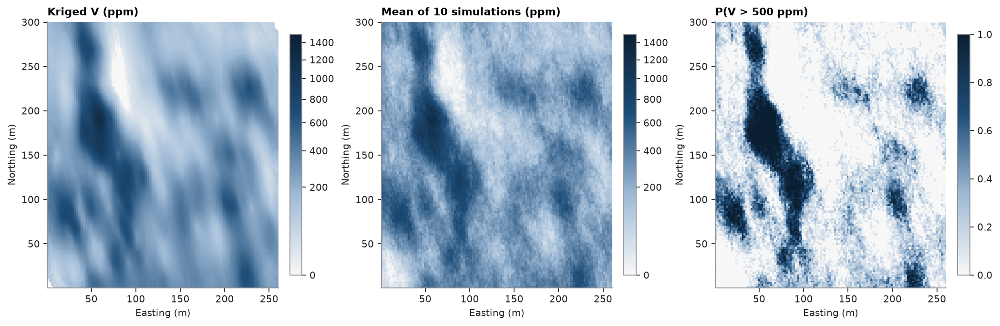

# 21. Models larger than memory

A block model can stay in a Parquet file and be processed a chunk at a time, so its size is limited by the disk, not
by memory. Here Walker Lake is modelled on 0.25 m blocks — 1.25 million of them — kriged and simulated without
ever holding more than 250 000 blocks.

<details><summary>Python</summary>

```python
import tempfile
import time

import ceres as cs
import matplotlib.pyplot as plt
import numpy as np
from common import map_axes, save
from matplotlib.colors import PowerNorm

samples = cs.datasets.walker_lake()
xy, v = samples.coords, samples["V"]
model = cs.Variogram.from_json((HERE.parent / "03-variography" / "model.json").read_text())
weights = cs.cell_declustering(xy, v, sizes=np.arange(2.5, 102.5, 2.5)).weights
folder = Path(tempfile.mkdtemp())
```

</details>

The model is written once. A regular model stores no coordinates, only its geometry, so the file is tiny until
columns are added. `BlockModelFile` reads the geometry and hands out `BlockModel` pieces of at most `rows` blocks.

<details><summary>Python</summary>

```python
grid = cs.BlockModel(origin=(0.5, 0.5), size=(0.25, 0.25), count=(1040, 1200))
cs.write_parquet(folder / "grid.parquet", grid)
file = cs.BlockModelFile(folder / "grid.parquet")
print(f"{len(file):,} blocks, {(folder / 'grid.parquet').stat().st_size / 1e3:.0f} kB on disk")
print([len(chunk) for chunk in file.chunks(rows=250_000)])
```

</details>

```text
1,248,000 blocks, 1787 kB on disk
[250000, 250000, 250000, 250000, 248000]
```

`map_blocks` streams the file through any function of a chunk and writes the columns it returns next to the
input's. Ordinary kriging is independent block by block, so chunked kriging equals kriging the whole model.

<details><summary>Python</summary>

```python
kriging = cs.OrdinaryKriging(model, cs.Search(radius=80, max_samples=24, min_samples=4)).fit(xy, v)


def krige(chunk):
    estimate, variance = kriging.predict(chunk, return_variance=True)
    return {"estimate": estimate, "variance": variance}


start = time.perf_counter()
cs.map_blocks(folder / "grid.parquet", folder / "kriged.parquet", krige, rows=250_000)
print(f"kriged in {time.perf_counter() - start:.1f} s")
```

</details>

```text
kriged in 0.8 s
```

Turning bands simulates every realization's bands once over the model's extent, then evaluates and conditions
them chunk by chunk: `simulate_to_parquet` writes the same summary `simulate` would return for the whole model,
plus each realization's global statistics.

<details><summary>Python</summary>

```python
gaussian = cs.Variogram([("spherical", 0.68, 82.0)], nugget=0.32, rotation=(170, 0, 0), ratios=(0.43, 1.0))
bands = cs.TurningBands(gaussian, bands=200).fit(xy, v, weights=weights)
start = time.perf_counter()
result = bands.simulate_to_parquet(
    folder / "kriged.parquet", folder / "simulated.parquet", n=10, seed=1, cutoffs=[500.0], rows=250_000
)
low, high = np.quantile(result["realization_above"][0], [0.1, 0.9])
print(
    f"10 realizations in {time.perf_counter() - start:.1f} s; area above 500 ppm: P10 {low:.1%}, P90 {high:.1%}"
)
```

</details>

```text
10 realizations in 18.5 s; area above 500 ppm: P10 19.0%, P90 21.7%
```

The result is an ordinary block model file; small enough here to read back whole and map (every eighth block).

<details><summary>Python</summary>

```python
out = cs.read_parquet(folder / "simulated.parquet")
print(out.attributes.column_names)
extent = (0.5, 260.5, 0.5, 300.5)
fig, axes = plt.subplots(1, 3, figsize=(13, 4.6), layout="constrained")
for ax, column, title, style in (
    (axes[0], "estimate", "Kriged V (ppm)", {"norm": PowerNorm(0.5, vmin=0, vmax=1500)}),
    (axes[1], "mean", "Mean of 10 simulations (ppm)", {"norm": PowerNorm(0.5, vmin=0, vmax=1500)}),
    (axes[2], "p_above_500", "P(V > 500 ppm)", {"vmin": 0, "vmax": 1}),
):
    im = ax.imshow(out[column].reshape(1200, 1040)[::8, ::8], origin="lower", extent=extent, **style)
    map_axes(ax, title)
    fig.colorbar(im, ax=ax, shrink=0.7)
save(fig, "maps")
```

</details>

```text
['estimate', 'variance', 'mean', 'p_above_500', 'mean_above_500']
```



Full script: [`example_21.py`](example_21.py)
