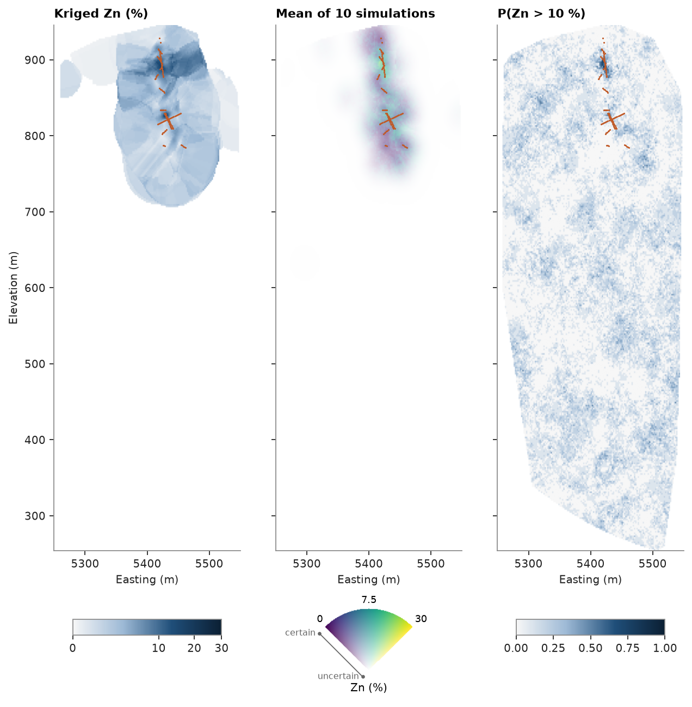

# 21. Models larger than memory

A block model can stay in a Parquet file and be processed a chunk at a time, so its size is limited by the disk, not
by memory. Here the zinc of the drill-hole dataset is modeled on 2 m blocks inside the convex hull of the composites
— ten million blocks — kriged and simulated without ever holding more than a million of them.

<details><summary>Python</summary>

```python
import shutil
import tempfile
import time

import ceres as cs
import matplotlib.pyplot as plt
import numpy as np
from common import HIGHLIGHT, save
from matplotlib.colors import PowerNorm

composites = cs.datasets.drillholes().composite(2.0, ["ZN"])
xyz, zn = composites.coords, composites["ZN"]
window = ~np.isnan(zn) & (xyz[:, 0] > 5250) & (xyz[:, 0] < 5550) & (xyz[:, 1] > 8000) & (xyz[:, 1] < 8500)
xyz, zn = xyz[window], zn[window]
holes = np.array(composites["hole"], dtype=object)[window]
weights = cs.cell_declustering(xyz, zn, sizes=np.arange(10, 100, 10)).weights
print(f"{len(zn):,} composites of 2 m from {len(set(holes))} holes")
```

</details>

```text
4,575 composites of 2 m from 499 holes
```

Blocks beyond the drilling would be extrapolation, so the model keeps only those inside the convex hull of the
composites. A point is inside a convex solid when it is behind every face, which is tested one level at a time.
The kept blocks are a masked model: the grid geometry plus the sorted index of the cells present.

<details><summary>Python</summary>

```python
hull = cs.convex_hull(xyz)
a, b, c = hull.vertices[hull.triangles].transpose(1, 0, 2)
normal = np.cross(b - a, c - a)
offset = (normal * a).sum(axis=1)

origin = np.floor(xyz.min(axis=0) / 2) * 2
count = tuple(int(c) for c in np.ceil((xyz.max(axis=0) - origin) / 2))
nx, ny, nz = count
row, column = np.divmod(np.arange(nx * ny), nx)
plan = origin[:2] + (np.c_[column, row] + 0.5) * 2
kept = []
for k in range(nz):
    level = np.c_[plan, np.full(nx * ny, origin[2] + (k + 0.5) * 2)]
    kept.append(k * nx * ny + np.flatnonzero((level @ normal.T <= offset).all(axis=1)))
index = np.concatenate(kept).astype(np.uint64)

folder = Path(tempfile.mkdtemp())
grid = cs.BlockModel(origin=tuple(origin), size=(2, 2, 2), count=count, index=index)
cs.write_parquet(folder / "grid.parquet", grid)
file = cs.BlockModelFile(folder / "grid.parquet")
size = (folder / "grid.parquet").stat().st_size / 1e6
print(
    f"{len(file):,} of {nx * ny * nz:,} blocks inside the hull of {hull.volume / 1e6:.0f} Mm³, {size:.0f} MB"
)
print(f"{sum(1 for _ in file.chunks(rows=1_000_000))} chunks of at most 1,000,000 blocks")
```

</details>

```text
10,223,191 of 19,762,500 blocks inside the hull of 82 Mm³, 13 MB
11 chunks of at most 1,000,000 blocks
```

`map_blocks` streams the file through any function of a chunk and writes the columns it returns next to the
input's. Ordinary kriging is independent block by block, so chunked kriging equals kriging the whole model; blocks
with fewer than four composites within 60 m are left unestimated. The same pass keeps the simple-kriging variance
of the normal scores: the share of the variance the composites leave unexplained, 1 beyond the variogram range —
how much the data say about a block, whatever its grade.

<details><summary>Python</summary>

```python
grades = cs.experimental_variogram(xyz, zn, 10.0, 150.0).fit("spherical")
search = cs.Search(radius=60, max_samples=16, min_samples=4, max_per_hole=4)
kriging = cs.OrdinaryKriging(grades, search).fit(xyz, zn, holes=holes)

scores = cs.NormalScore().fit_transform(zn, weights=weights)
fitted = cs.experimental_variogram(xyz, scores, 10.0, 150.0).fit("spherical")
sill = fitted.nugget + fitted.structures[0].sill
reach = fitted.structures[0].range
gaussian = cs.Variogram([("spherical", fitted.structures[0].sill / sill, reach)], nugget=fitted.nugget / sill)
neighborhood = cs.Search(radius=reach, max_samples=16)
scoring = cs.SimpleKriging(gaussian, neighborhood).fit(xyz, scores, holes=holes)


def estimate(chunk):
    return {"zn": kriging.predict(chunk), "score_variance": scoring.predict(chunk, return_variance=True)[1]}


start = time.perf_counter()
cs.map_blocks(folder / "grid.parquet", folder / "kriged.parquet", estimate)
print(f"kriged in {time.perf_counter() - start:.1f} s")
```

</details>

```text
kriged in 9.5 s
```

Turning bands simulates every realization's bands once over the model's extent, then evaluates and conditions
them chunk by chunk. Conditioning only reaches nodes within the variogram range of a composite, so beyond it the
search is skipped. `simulate_to_parquet` writes the same summary `simulate` would return for the whole model,
plus each realization's global statistics.

<details><summary>Python</summary>

```python
bands = cs.TurningBands(gaussian, bands=100, search=neighborhood)
bands.fit(xyz, zn, weights=weights, holes=holes)
start = time.perf_counter()
result = bands.simulate_to_parquet(
    folder / "kriged.parquet", folder / "simulated.parquet", n=10, seed=1, cutoffs=[10.0]
)
seconds = time.perf_counter() - start
low, high = np.quantile(result["realization_above"][0], [0.1, 0.9])
print(f"10 realizations in {seconds:.0f} s; blocks above 10 % Zn: P10 {low:.2%}, P90 {high:.2%} of the model")
print(f"output {(folder / 'simulated.parquet').stat().st_size / 1e6:.0f} MB")
```

</details>

```text
10 realizations in 19 s; blocks above 10 % Zn: P10 7.92%, P90 9.20% of the model
output 262 MB
```

Mining selects panels, not points. Given a file of 10 m panels, `discretization` simulates each at 2 × 2 × 2
nodes and writes the realizations averaged over the panel, as `simulate(panels.discretize(...), blocks=panels)`
would; the panels are read a chunk at a time, so their nodes never outgrow memory either. Averaging smooths the
highs, so fewer panels than points pass 10 % Zn.

<details><summary>Python</summary>

```python
ijk = np.c_[index % nx, (index // nx) % ny, index // (nx * ny)] // 5
pnx, pny, pnz = (-(-np.array(count) // 5)).tolist()
cells = np.unique(ijk[:, 0] + pnx * (ijk[:, 1] + pny * ijk[:, 2])).astype(np.uint64)
panels = cs.BlockModel(origin=tuple(origin), size=(10, 10, 10), count=(pnx, pny, pnz), index=cells)
cs.write_parquet(folder / "panels.parquet", panels)
start = time.perf_counter()
panel = bands.simulate_to_parquet(
    folder / "panels.parquet",
    folder / "panels_simulated.parquet",
    n=10,
    seed=1,
    cutoffs=[10.0],
    discretization=(2, 2, 2),
)
seconds = time.perf_counter() - start
low, high = np.quantile(panel["realization_above"][0], [0.1, 0.9])
print(
    f"{len(panels):,} panels in {seconds:.0f} s; above 10 % Zn: P10 {low:.2%}, P90 {high:.2%} of the panels"
)
```

</details>

```text
87,912 panels in 2 s; above 10 % Zn: P10 5.98%, P90 6.83% of the panels
```

The output is too big to want in memory, so the east–west section with the most composites is collected from the
chunks, reading only the columns it needs. Near the holes the simulations follow the data; beyond the variogram
range kriging leaves blocks unestimated while each realization draws from the declustered histogram. `plot.uncertain`
shows both at once: the mean of the realizations sets the color and the normal-score kriging variance fades it
to white, so beyond the range of every composite the section is blank. The fan is its legend — the value across,
certainty from the center out.

<details><summary>Python</summary>

```python
row = int(np.bincount(((xyz[:, 1] - origin[1]) // 2).astype(int), minlength=ny).argmax())
section = {name: np.full((nz, nx), np.nan) for name in ("zn", "mean", "score_variance", "p_above_10")}
for chunk in cs.BlockModelFile(folder / "simulated.parquet").chunks(columns=list(section)):
    index = chunk.index
    on = (index // nx) % ny == row
    k, i = index[on] // (nx * ny), index[on] % nx
    for name, image in section.items():
        image[k, i] = chunk[name][on]

levels = np.flatnonzero(np.isfinite(section["mean"]).any(axis=1))
bottom, top = origin[2] + 2 * levels[0], origin[2] + 2 * (levels[-1] + 1)
north = origin[1] + (row + 0.5) * 2
near = np.abs(xyz[:, 1] - north) < 2
extent = (origin[0], origin[0] + 2 * nx, origin[2], origin[2] + 2 * nz)
grade = PowerNorm(0.5, vmin=0, vmax=30)
fig, axes = plt.subplots(2, 3, figsize=(8, 8), layout="constrained", sharey="row", height_ratios=(1, 0.2))
im = axes[0, 0].imshow(section["zn"], origin="lower", extent=extent, norm=grade)
fig.colorbar(im, cax=axes[1, 0].inset_axes([0.1, 0.6, 0.8, 0.15]), orientation="horizontal")
cs.plot.uncertain(
    section["mean"],
    section["score_variance"],
    extent=extent,
    cmap="cividis",
    norm=grade,
    label="Zn (%)",
    legend_ax=axes[1, 1],
    ax=axes[0, 1],
)
im = axes[0, 2].imshow(section["p_above_10"], origin="lower", extent=extent, vmin=0, vmax=1)
fig.colorbar(im, cax=axes[1, 2].inset_axes([0.1, 0.6, 0.8, 0.15]), orientation="horizontal")
for ax, title in zip(axes[0], ("Kriged Zn (%)", "Mean of 10 simulations", "P(Zn > 10 %)"), strict=True):
    ax.scatter(xyz[near, 0], xyz[near, 2], s=2, color=HIGHLIGHT, linewidths=0)
    ax.set(title=title, xlabel="Easting (m)", aspect="auto", ylim=(bottom, top))
axes[0, 0].set_ylabel("Elevation (m)")
for ax in axes[1, [0, 2]]:
    ax.axis("off")
save(fig, "section")
```

</details>



Full script: [`example_21.py`](example_21.py)
