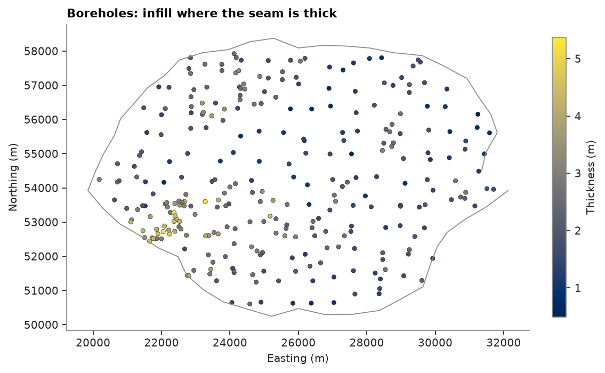
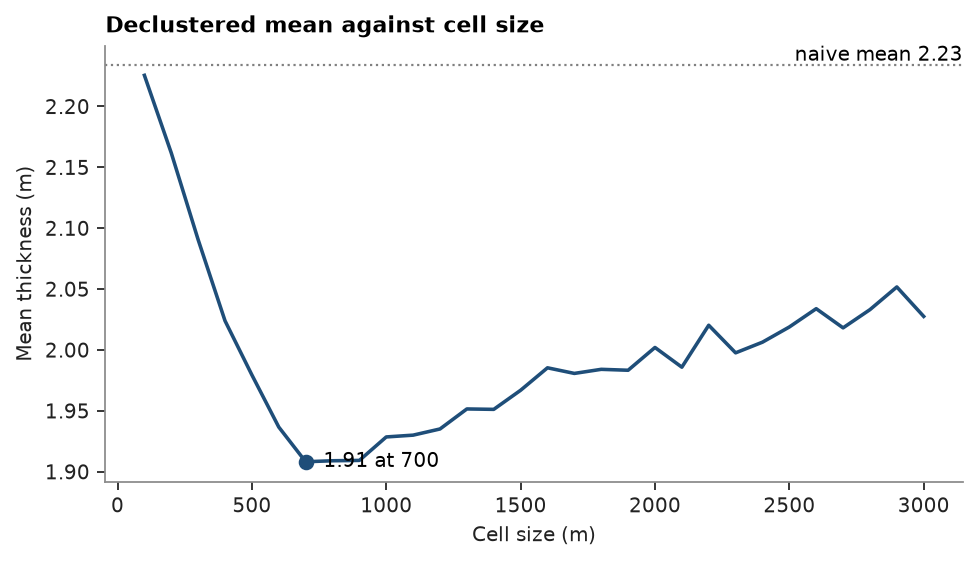
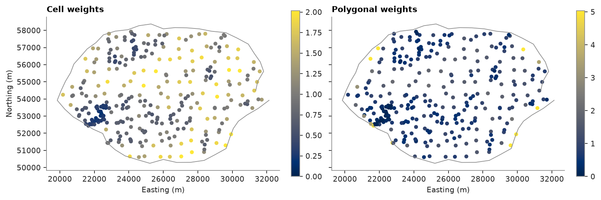
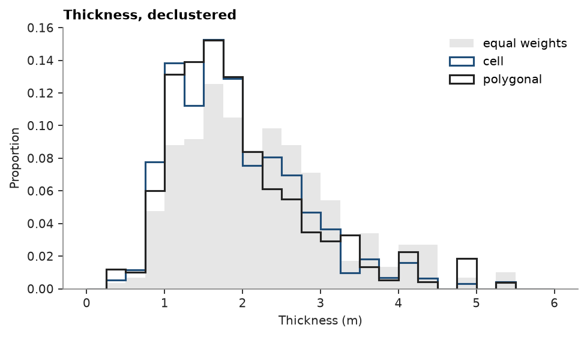

# 7. Declustering

A coal seam drilled on a regular mesh, then infilled where the seam is thick. The infill holes over-represent thick
coal, so the plain mean of the boreholes overstates the thickness of the seam. Declustering weights each hole by the
area it stands for: cell declustering by the number of holes sharing its cell, polygonal declustering by the area
nearer to it than to any other hole.

<details><summary>Python</summary>

```python
import ceres as cs
import matplotlib.pyplot as plt
import numpy as np
from common import ACCENT, GRAY, INK, map_axes, save

data = cs.datasets.coal_seam_thickness()
holes, lease = data["boreholes"], data["boundary"]
thickness = holes["THICKNESS_M"]
x, y = holes.coords[:, 0], holes.coords[:, 1]
print(f"{len(holes)} holes, mean thickness {thickness.mean():.2f} m")

fig, ax = plt.subplots(figsize=(7, 4.4), layout="constrained")
drawn = ax.scatter(x, y, c=thickness, s=14, edgecolors=INK, linewidths=0.3)
ax.plot(*lease.vertices[:, :2].T, color=GRAY, lw=0.8)
fig.colorbar(drawn, ax=ax, shrink=0.8, label="Thickness (m)")
map_axes(ax, "Boreholes: infill where the seam is thick")
save(fig, "holes")
```

</details>

```text
295 holes, mean thickness 2.23 m
```



## Cell declustering

Each hole gets the inverse of the number of holes in its cell. Too small a cell holds one hole and changes nothing;
too large a cell holds the whole lease. In between, when infill is where values are high, the declustered mean dips:
`cell_declustering` scans cell sizes, averages each over 25 grid origins, and keeps the size with the lowest mean.
The weights average 1.

<details><summary>Python</summary>

```python
cell = cs.cell_declustering(holes, "THICKNESS_M", sizes=np.arange(100.0, 3100.0, 100.0))
print(
    f"cell size {cell.cell_size:.0f} m, declustered mean {np.average(thickness, weights=cell.weights):.2f} m"
)
print(f"scanned mean at that size {cell.means[cell.sizes == cell.cell_size][0]:.2f} m")

fig, ax = plt.subplots(figsize=(6, 3.4), layout="constrained")
cs.plot.declustering(cell, naive=thickness.mean(), ax=ax, color=ACCENT, lw=1.6)
ax.set(title="Declustered mean against cell size", xlabel="Cell size (m)", ylabel="Mean thickness (m)")
save(fig, "cell_sizes")
```

</details>

```text
cell size 700 m, declustered mean 1.91 m
scanned mean at that size 1.91 m
```



The mean falls from 100 m cells, which hold about one hole each, to a flat minimum between 700 and 900 m, then
rises slowly as the cells grow to hold mesh and infill holes alike. The choice of cell size is a judgment: the
minimum is only a guide when the infill is known to target high values, as here. The curve averages 25 grid
origins, while the weights returned come from one origin at the corner of the data, so their mean, the dot, sits
a little above the curve.

## Polygonal declustering

`polygon_declustering` weights each hole by the area of the grid nodes nearest to it, over the bounding box of the
holes. It needs no cell size, but the holes on the edge take all the area out to the box, and a box is not the
lease.

<details><summary>Python</summary>

```python
polygon = cs.polygon_declustering(holes, "THICKNESS_M")
print(f"polygonal declustered mean {np.average(thickness, weights=polygon.weights):.2f} m")
fig, axes = plt.subplots(1, 2, figsize=(10, 3.6), layout="constrained", sharey=True)
for ax, result, name in zip(axes, [cell, polygon], ["Cell", "Polygonal"], strict=True):
    w = result.weights
    drawn = ax.scatter(x, y, c=w, s=14, cmap="cividis", vmin=0, vmax=np.percentile(w, 98))
    ax.plot(*lease.vertices[:, :2].T, color=GRAY, lw=0.8)
    map_axes(ax, f"{name} weights")
    fig.colorbar(drawn, ax=ax, shrink=0.8)
axes[1].set_ylabel("")
save(fig, "weights")
```

</details>

```text
polygonal declustered mean 1.95 m
```



Both methods give the infill holes small weights and the sparse mesh large ones, and agree on the declustered mean.
The largest polygonal weights sit on the edge of the drilling, where the box reaches past the lease. The declustered
histograms shift toward thin coal.

<details><summary>Python</summary>

```python
bins = np.linspace(0, np.ceil(thickness.max()), 25)
fig, ax = plt.subplots(figsize=(6, 3.4), layout="constrained")
ax.hist(thickness, bins, weights=np.full(len(holes), 1 / len(holes)), color="#e6e6e6", label="equal weights")
for result, color, label in [(cell, ACCENT, "cell"), (polygon, INK, "polygonal")]:
    ax.hist(
        thickness,
        bins,
        weights=result.weights / len(holes),
        histtype="step",
        color=color,
        lw=1.4,
        label=label,
    )
ax.set(title="Thickness, declustered", xlabel="Thickness (m)", ylabel="Proportion")
ax.legend()
save(fig, "histograms")
```

</details>



These weights describe the data: histograms, statistics per domain, top cuts and the target of a normal score
transform. Declustering weights derived from estimation weights, what each hole contributes to estimating the whole
lease, are the subject of topic 62.

Full script: [`example_07.py`](example_07.py)
