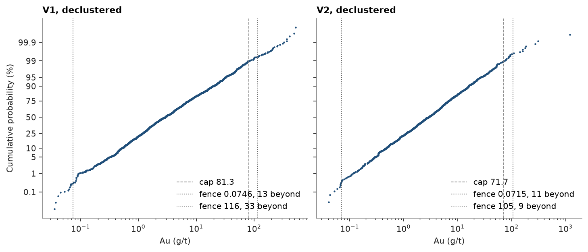

# 8. Top cuts

Gold in four quartz veins, V1 to V4, sampled by diamond holes and underground channels. A handful of extreme assays
carry much of the metal, and one of them next to a block would lend it its grade. Capping the grades at a top cut
limits their influence; the question is where to cut and what it costs in metal.

<details><summary>Python</summary>

```python
import ceres as cs
import matplotlib.pyplot as plt
import numpy as np
from common import ACCENT, save

data = cs.datasets.vein_gold_grade_control()
intervals = cs.merge_intervals(data["assays"], data["lithology"])
holes = cs.Drillholes(data["collars"], data["surveys"], intervals)
composites = holes.composite(1.0, ["AU_GPT"], domain="LITH", categories=["VEIN"])
quartz = composites.filter((composites["LITH"] == "QV") & ~np.isnan(composites["AU_GPT"]))
au = quartz["AU_GPT"]
print(f"{len(quartz)} composites of 1 m in quartz vein, mean Au {au.mean():.2f} g/t, max {au.max():.0f} g/t")
```

</details>

```text
5826 composites of 1 m in quartz vein, mean Au 9.10 g/t, max 1192 g/t
```

Channels crowd the developed levels, so the composites are declustered first, in 20 m cells (topic 7).

<details><summary>Python</summary>

```python
weights = cs.cell_declustering(quartz, "AU_GPT", cell_size=20.0).weights
print(f"declustered mean Au {np.average(au, weights=weights):.2f} g/t")
```

</details>

```text
declustered mean Au 8.33 g/t
```

## How much metal sits in the tail

`capping` tries caps at high quantiles and reports, for each, the share of weight above it, the metal removed and
the capped mean and CV.

<details><summary>Python</summary>

```python
caps = cs.capping("AU_GPT", weights=weights, data=quartz)
print(f"{'cap':>7}{'above (%)':>11}{'metal (%)':>11}{'mean':>7}{'CV':>6}")
for cap, above, metal, mean, cv in zip(*(caps[c] for c in caps.column_names), strict=True):
    print(f"{cap:>7.1f}{100 * above:>11.2f}{100 * metal:>11.1f}{mean:>7.2f}{cv:>6.2f}")
```

</details>

```text
    cap  above (%)  metal (%)   mean    CV
   18.1       9.99       36.5   5.29  1.07
   30.8       5.00       25.5   6.21  1.30
   49.2       2.50       17.6   6.86  1.51
   81.4       1.00       11.5   7.38  1.74
  120.3       0.44        8.1   7.66  1.92
  297.7       0.10        3.4   8.05  2.34
```

The top 1 % of the weight holds 10.6 % of the metal, the top 10 % holds 35.1 %. The CV climbs from 1.07 at the
lowest cap to 2.25 at the highest: the tail, not the body, makes gold grades erratic.

The log-probability plot shows where the tail breaks away from the body of the distribution. The dotted Tukey
fences sit 1.5 interquartile ranges beyond the quartiles of log Au; the dashed line is a cap at the declustered
P99 of the vein.

<details><summary>Python</summary>

```python
stats = cs.describe_by("AU_GPT", "VEIN", weights=weights, quantiles=[0.5, 0.99], data=quartz)
top = dict(zip(stats["category"][:-1], stats["P99"][:-1], strict=True))
vein = quartz["VEIN"]
fig, axes = plt.subplots(1, 2, figsize=(9, 3.8), layout="constrained", sharey=True)
for ax, name in zip(axes, ["V1", "V2"], strict=True):
    keep = vein == name
    cs.plot.probability(
        au[keep], weights=weights[keep], log=True, cap=top[name], fences=1.5, ax=ax, color=ACCENT, ms=2
    )
    ax.set(title=f"{name}, declustered", xlabel="Au (g/t)")
    ax.legend(loc="lower right")
axes[1].set_ylabel("")
save(fig, "probability")
```

</details>



Both veins plot near a straight line, a lognormal body, up to about P99; above it the points thin out, with the
1192 g/t channel alone at the top of V2. The upper fences, near 110 g/t, agree with a cap around P99.

## One cap per vein

`capping_report` applies one cap per domain and compares the declustered statistics before and after, with the
metal removed; the last row pools the veins.

<details><summary>Python</summary>

```python
report = cs.capping_report("AU_GPT", top, domain_column="VEIN", weights=weights, data=quartz)
columns = ["domain", "cap", "n", "n_capped", "mean", "mean_capped", "cv", "cv_capped"]
print(
    f"{'vein':<5}{'cap':>7}{'n':>6}{'cut':>5}{'mean':>7}{'capped':>8}{'CV':>6}{'capped':>8}{'metal (%)':>11}"
)
for name, c, n, cut, mean, capped, cv, cv_capped in zip(*(report[k] for k in columns), strict=True):
    shown = "" if np.isnan(c) else f"{c:.1f}"
    print(
        f"{name:<5}{shown:>7}{n:>6.0f}{cut:>5.0f}{mean:>7.2f}{capped:>8.2f}{cv:>6.2f}{cv_capped:>8.2f}"
        f"{100 * (1 - capped / mean):>11.1f}"
    )
```

</details>

```text
vein     cap     n  cut   mean  capped    CV  capped  metal (%)
V1      81.3  3659   47   8.52    7.60  2.60    1.72       10.8
V2      71.7  1968   23   7.95    6.73  4.31    1.67       15.4
V3      67.5    94    0   6.59    6.59  1.65    1.65        0.0
V4     183.5   105    1  15.06   14.96  2.04    2.01        0.7
all           5826   71   8.33    7.41  3.22    1.78       11.1
```

The caps cut 50 composites in V1 and 24 in V2, and remove 10.1 % and 14.5 % of their metal; pooled, 10.2 % of the
metal goes and the CV falls from 3.08 to 1.76. V3 and V4 hold about a hundred composites each, too few for a P99 to
mean much: in V3 it is the maximum and cuts nothing. A small domain is better capped with the cap of a similar,
larger one.

Full script: [`example_08.py`](example_08.py)
