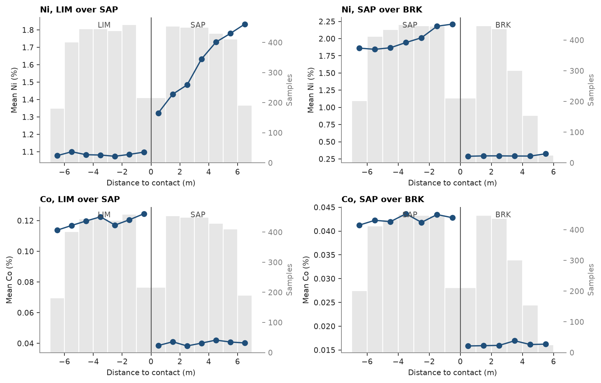

# 9. Contacts

A nickel laterite logged down each hole as ferricrete (FERR), limonite (LIM), saprolite (SAP) and bedrock (BRK). Should
the horizons be estimated apart? Grade against distance to a contact tells a hard boundary, where grade jumps, from a
soft one, where it changes gradually and samples on one side say something about the other.

<details><summary>Python</summary>

```python
import ceres as cs
import matplotlib.pyplot as plt
from common import save

data = cs.datasets.nickel_laterite_profile()
assays = cs.merge_intervals(data["assays"], data["horizons"])
points = cs.Drillholes(data["collars"], data["surveys"], assays).samples()
print(f"{len(points)} assays of 1 m in {len(data['collars'])} holes")
```

</details>

```text
10810 assays of 1 m in 448 holes
```

`contact` measures, down each hole, the distance from every sample of the two horizons to the nearest sample of the
other, negative inside, and bins them; `plot.contact` draws the mean per bin with the counts as light bars. The same
call runs on composites or on any points with hole ids and a domain column.

<details><summary>Python</summary>

```python
pairs = [("LIM", "SAP"), ("SAP", "BRK")]
tables = {
    (grade, inside): cs.contact(
        points,
        grade,
        domain_column="HORIZON",
        holes="HOLE_ID",
        inside=inside,
        outside=outside,
        max_distance=6.5,
        bin=1.0,
    )
    for grade in ["NI_PCT", "CO_PCT"]
    for inside, outside in pairs
}
for (grade, inside), table in tables.items():
    mean = dict(zip(table["distance"], table["mean"], strict=True))
    print(f"{grade} {inside} contact: {mean[-0.5]:.2f} % at -0.5 m, {mean[0.5]:.2f} % at +0.5 m")

fig, axes = plt.subplots(2, 2, figsize=(10, 6.4))
for ax, ((grade, inside), table) in zip(axes.flat, tables.items(), strict=True):
    outside = dict(pairs)[inside]
    cs.plot.contact(table, labels=(inside, outside), ax=ax)
    ax.set(title=f"{grade.split('_')[0].title()}, {inside} over {outside}", xlabel="Distance to contact (m)")
    ax.set_ylabel(f"Mean {grade.split('_')[0].title()} (%)")
fig.tight_layout()
save(fig, "contacts")
```

</details>

```text
NI_PCT LIM contact: 1.10 % at -0.5 m, 1.32 % at +0.5 m
NI_PCT SAP contact: 2.21 % at -0.5 m, 0.29 % at +0.5 m
CO_PCT LIM contact: 0.12 % at -0.5 m, 0.04 % at +0.5 m
CO_PCT SAP contact: 0.04 % at -0.5 m, 0.02 % at +0.5 m
```



Ni is the soft one at the LIM/SAP contact: it rises from 1.10 to 1.32 % across it, then keeps climbing for several
meters into the saprolite, so Ni in either horizon near the contact can borrow samples from the other. At the base
of the saprolite it falls from 2.21 to 0.29 % within a meter: a hard boundary, and bedrock samples must not dilute
the saprolite estimate. Co has the other pattern: it steps from 0.12 to 0.04 % at the LIM/SAP contact and stays
flat on each side. The same horizons can be a hard boundary for one grade and a soft one for another.

Full script: [`example_09.py`](example_09.py)
