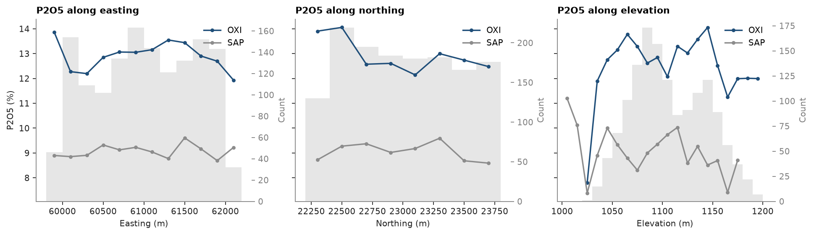

# 10. Swaths

Phosphate concentrated by weathering, drilled by 217 RC and 34 diamond holes through soil (SOIL), an aluminous
horizon (ALU), the oxidized ore (OXI), saprolite (SAP) and fresh rock (ROCK). A swath is the mean grade in slices along
one direction: a trend in the data shows up as a slope, and the same call on a block model checks the estimate for
local bias (topic 44).

<details><summary>Python</summary>

```python
import ceres as cs
import matplotlib.pyplot as plt
from common import save

data = cs.datasets.phosphate_weathering_profile()
intervals = cs.merge_intervals(data["assays"], data["horizons"])
samples = cs.Drillholes(data["collars"], data["surveys"], intervals).samples()
stats = cs.describe_by("P2O5_PCT", "HORIZON", data=samples)
for name, n, mean in zip(stats["category"], stats["n"], stats["mean"], strict=True):
    print(f"{name:<5}{n:>6.0f} samples, mean P2O5 {mean:5.2f} %")
length = samples["TO"] - samples["FROM"]
print(f"sample length {length.min():.1f} to {length.max():.1f} m")
```

</details>

```text
ALU    1042 samples, mean P2O5  4.92 %
OXI    1432 samples, mean P2O5 12.92 %
ROCK   1316 samples, mean P2O5  5.09 %
SAP     998 samples, mean P2O5  9.07 %
SOIL    251 samples, mean P2O5  1.94 %
all    5039 samples, mean P2O5  7.91 %
sample length 0.5 to 6.6 m
```

The ore is the OXI horizon, with SAP below it half as rich. `swath` bins the samples in slices of a given width along
`axis` ("x", "y", "z") or any `azimuth`, weighted here by sample length since the samples run from 0.5 to 6.6 m, and
`plot.swath` draws several swaths on one axis with the counts of the first as bars. Slices of 200 m along easting
and northing, 10 m in elevation, one line per horizon.

<details><summary>Python</summary>

```python
horizons = ["OXI", "SAP"]
fig, axes = plt.subplots(1, 3, figsize=(12, 3.4), layout="constrained", sharey=True)
for ax, axis, width, label in zip(
    axes, "xyz", [200.0, 200.0, 10.0], ["Easting", "Northing", "Elevation"], strict=True
):
    swaths = []
    for name in horizons:
        horizon = samples.filter(samples["HORIZON"] == name)
        length = horizon["TO"] - horizon["FROM"]
        swaths.append(cs.swath(horizon, "P2O5_PCT", width, axis=axis, weights=length))
    cs.plot.swath(swaths, labels=horizons, ax=ax)
    ax.set(title=f"P2O5 along {label.lower()}", xlabel=f"{label} (m)")
    ax.set_ylabel("")
    for name, swath in zip(horizons, swaths, strict=True):
        mean = swath["mean"][swath["n"] >= 30]
        print(
            f"{name} along {label.lower()}: {mean.min():.1f} to {mean.max():.1f} %, slices of 30 samples or more"
        )
axes[0].set_ylabel("P2O5 (%)")
save(fig, "swaths")
```

</details>

```text
OXI along easting: 11.9 to 13.9 %, slices of 30 samples or more
SAP along easting: 8.7 to 9.6 %, slices of 30 samples or more
OXI along northing: 12.1 to 14.1 %, slices of 30 samples or more
SAP along northing: 8.6 to 9.6 %, slices of 30 samples or more
OXI along elevation: 11.3 to 14.1 %, slices of 30 samples or more
SAP along elevation: 7.4 to 10.0 %, slices of 30 samples or more
```



Within each horizon the swaths are flat: OXI stays between 11.9 and 14.1 % along easting and northing, SAP between
8.6 and 9.6 %, about what a hundred-odd samples per slice leave as noise. The step between the two lines is much
larger than any slope along them, so the horizon, not the position, sets the grade: estimate each horizon on its own
samples, with no trend. In elevation the lines are noisier because the horizons follow the rolling topography, and
a slice of elevation cuts OXI on a hill and SAP in a valley at once. The slices at the ends hold few samples and the
bars say how far to trust them.

Full script: [`example_10.py`](example_10.py)
