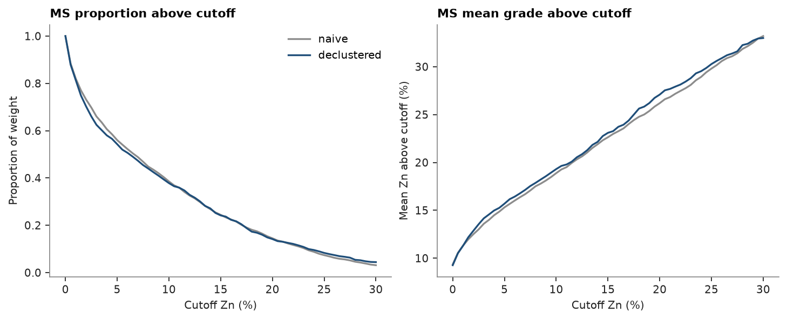
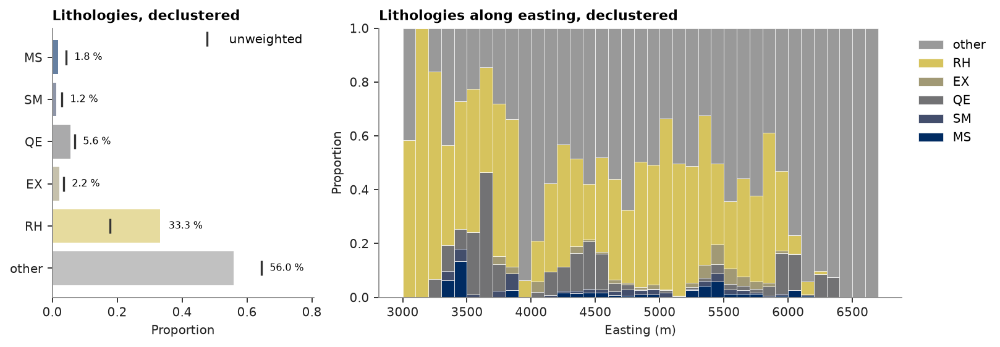
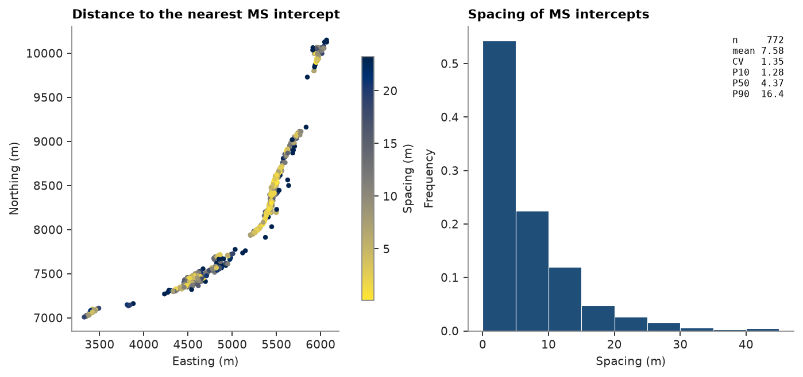
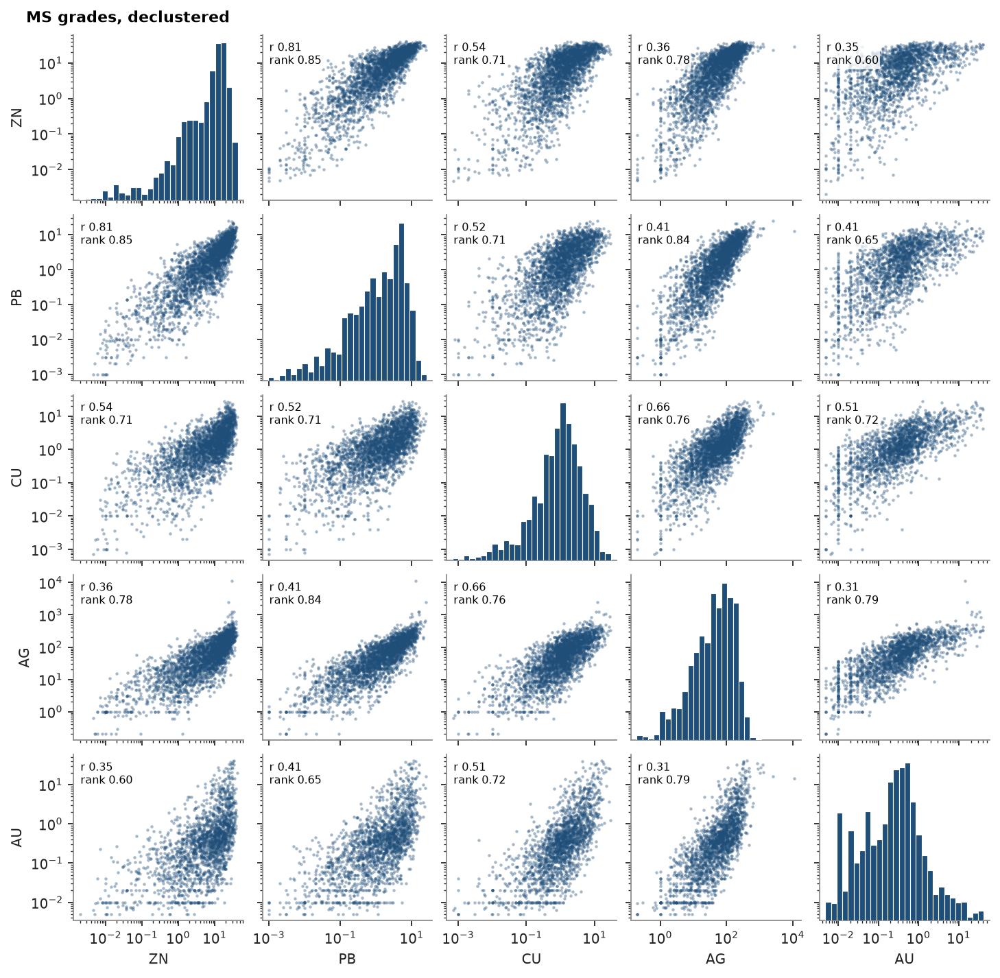
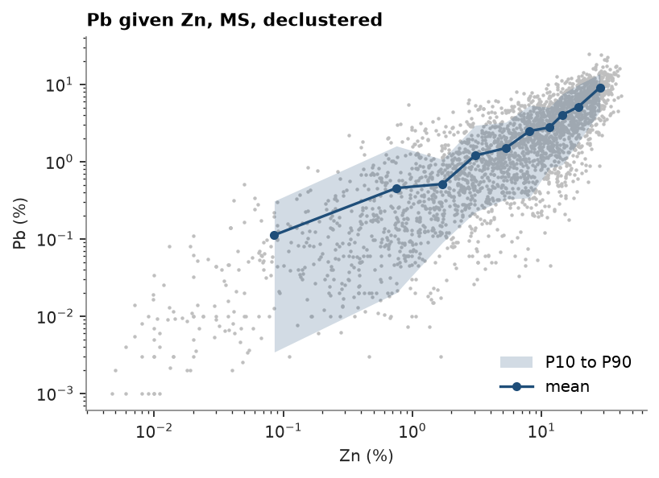

# 13. Exploratory data analysis

Grade-tonnage, contacts, swaths, categories, data spacing, h-scatterplots and correlations on the 2 m composites of the
drillhole dataset. Every function skips missing values, so raw columns go in as they are.

<details><summary>Python</summary>

```python
import ceres as cs
import matplotlib.pyplot as plt
import numpy as np
from common import ACCENT, GRAY, INK, map_axes, save
```

</details>

The tables are checked and fixed with the default rules first, as in topic 3:
overlapping assays keep the one that starts first and abruptly deviating survey stations are dropped. Composites
of holes collared at the same point are merged, keeping the first (topic 4), and each composite is weighted by cell
declustering in 50 m cells, domain by domain (topic 7).

<details><summary>Python</summary>

```python
tables = cs.datasets.drillhole_tables()
flags, _ = cs.check_drillholes(
    tables["collar"],
    tables["survey"],
    {"assay": tables["assay"], "geology": tables["geology"]},
    hole="HOLEID",
)
tables, _ = cs.fix_drillholes(flags, tables)
intervals = cs.merge_intervals(tables["assay"], tables["geology"], hole="HOLEID")
dh = cs.Drillholes(tables["collar"], tables["survey"], intervals, hole="HOLEID")
grades = ["ZN", "PB", "CU", "AG", "AU"]
composites = cs.duplicates(dh.composite(2.0, grades, domain="LITH"), merge="first")
print(f"{len(composites)} composites")
xyz = composites.coords
zn = composites["ZN"]
lith, hole = composites["LITH"], composites["hole"]
domains = ["MS", "SM", "QE", "EX", "RH"]
weights = np.zeros(len(zn))
for name in domains:
    keep = (lith == name) & ~np.isnan(zn)
    weights[keep] = cs.cell_declustering(xyz[keep], zn[keep], cell_size=50.0).weights
ms = (lith == "MS") & ~np.isnan(zn)
```

</details>

```text
62463 composites
```

## Grade-tonnage of the data

`grade_tonnage` sums the weight of the composites at or above each cutoff and their mean grade: a first look at
selectivity on composite support, here as a proportion of the total. Declustering moves the MS curves only a
little: slightly less material above low cutoffs, slightly richer above most of them. Blocks are
less selective than composites; topic 32 models that change of support.

<details><summary>Python</summary>

```python
cutoffs = np.linspace(0, 30, 61)
fig, (a, b) = plt.subplots(1, 2, figsize=(9, 3.6), layout="constrained")
for w, color, label in ((None, GRAY, "naive"), (weights[ms], ACCENT, "declustered")):
    gt = cs.grade_tonnage("ZN", cutoffs, weights=w, data=composites.filter(ms))
    a.plot(cutoffs, gt["tonnage"] / gt["tonnage"][0], color=color, label=label)
    b.plot(cutoffs, gt["mean_grade"], color=color)
a.set(title="MS proportion above cutoff", xlabel="Cutoff Zn (%)", ylabel="Proportion of weight")
a.legend()
b.set(title="MS mean grade above cutoff", xlabel="Cutoff Zn (%)", ylabel="Mean Zn above cutoff (%)")
save(fig, "grade_tonnage")
```

</details>



## Contact analysis

Zn against distance to a contact of MS, measured down each hole to the nearest composite of the other domain:
negative inside MS, positive outside. Into the RH host rock, Zn drops from about 9 % to under 2 % within a composite:
a sharp step that supports a hard boundary in estimation. Into the semi-massive sulphide SM it steps down by only
about 2 %, and SM keeps 6 to 10 % out to 30 m: near the contact the samples of one domain say much about the other,
the case for a soft boundary (tutorial 2).

<details><summary>Python</summary>

```python
fig, axes = plt.subplots(1, 2, figsize=(9, 3.4), layout="constrained", sharey=True)
for ax, other in zip(axes, ["RH", "SM"], strict=True):
    c = cs.contact(
        composites,
        "ZN",
        domain_column="LITH",
        holes="hole",
        inside="MS",
        outside=other,
        max_distance=30.0,
        bin=2.0,
    )
    ax.axvline(0, color=GRAY, lw=0.8, ls="--")
    ax.plot(c["distance"], c["mean"], color=ACCENT, lw=1)
    ax.scatter(c["distance"], c["mean"], s=np.sqrt(c["n"]), color=ACCENT)
    ax.text(-15, 13, "inside MS", color=INK, ha="center")
    ax.text(15, 13, f"in {other}", color=INK, ha="center")
    ax.set(title=f"Zn across the MS/{other} contact", xlabel="Distance to contact (m)", ylim=(0, 14))
axes[0].set_ylabel("Zn (%), points sized by count")
save(fig, "contact")
```

</details>


## Swath

Mean Zn in 100 m slices along easting, with the counts of the first swath as bars. The same call on a block model
and its column of estimates gives the model swath, weighted by block volume, to check for local bias.

<details><summary>Python</summary>

```python
swaths = [cs.swath(composites.filter(lith == name), "ZN", 100.0, axis="x") for name in ["MS", "SM"]]
fig, ax = plt.subplots(figsize=(8, 3.4), layout="constrained")
cs.plot.swath(swaths, labels=["MS", "SM"], ax=ax)
ax.set(title="Zn swath along easting", xlabel="Easting (m)", ylabel="Zn (%)")
save(fig, "swath")
```

</details>


## Categories

How much of each lithology do the composites hold? A `Categories` scheme keeps the five domains and lumps the many
minor lithology codes into "other", its last code; `Categories.from_values(lith, weights=w, min_share=0.02)` would
instead keep every lithology above 2 % of the weight. Given the scheme, `plot.proportions` draws the shares weighted by cell
declustering over all composites (50 m cells), with the unweighted shares as ticks; `plot.category_swath` stacks
the declustered shares per 100 m slice of easting, to see where each lithology sits along strike. Drilling targets
the sulphides, so declustering lowers the share of MS and SM and nearly doubles that of the RH host rock.

<details><summary>Python</summary>

```python
assayed = ~np.isnan(zn)
cell_weights = cs.cell_declustering(xyz[assayed], zn[assayed], cell_size=50.0).weights
lithology = cs.Categories(domains, other="other")
rock = lithology.encode(lith[assayed])
fig, (a, b) = plt.subplots(1, 2, figsize=(10, 3.4), layout="constrained", width_ratios=[1, 2])
cs.plot.proportions(rock, weights=cell_weights, scheme=lithology, ax=a)
a.set_title("Lithologies, declustered")
cs.plot.category_swath(xyz[assayed], rock, 100.0, axis="x", weights=cell_weights, scheme=lithology, ax=b)
b.set(title="Lithologies along easting, declustered", xlabel="Easting (m)")
save(fig, "categories")
```

</details>



## Data spacing

The spacing of the drilling is read between holes, not along them: each hole's MS intercept stands at the mean
location of its MS composites, and `data_spacing(..., horizontal=True)` measures, in plan, the distance from each
intercept to its nearest neighbor. The same call with `targets=` a block model gives the spacing at every block,
a common basis for resource classification.

<details><summary>Python</summary>

```python
in_ms = lith == "MS"
names, which = np.unique(hole[in_ms], return_inverse=True)
intercepts = np.column_stack([np.bincount(which, xyz[in_ms, k]) / np.bincount(which) for k in range(3)])
spacing = cs.data_spacing(intercepts, horizontal=True)
print(f"{len(names)} MS intercepts, nearest neighbor in plan: median {np.median(spacing):.0f} m, ", end="")
print(f"P90 {np.percentile(spacing, 90):.0f} m")
fig, (a, b) = plt.subplots(1, 2, figsize=(10, 4), layout="constrained", width_ratios=[1.4, 1])
drawn = a.scatter(*intercepts[:, :2].T, c=spacing, s=8, cmap="cividis_r", vmax=np.percentile(spacing, 95))
fig.colorbar(drawn, ax=a, shrink=0.8, label="Spacing (m)")
map_axes(a, "Distance to the nearest MS intercept")
cs.plot.histogram(
    spacing, bins=np.arange(0, np.percentile(spacing, 99) + 5, 5), stats=True, ax=b, color=ACCENT
)
b.set(title="Spacing of MS intercepts", xlabel="Spacing (m)")
save(fig, "spacing")
```

</details>

```text
772 MS intercepts, nearest neighbor in plan: median 4 m, P90 16 m
```



## h-scatterplots

Pairs of composites a lag apart: tail value against head value. Correlation drops as the lag grows, the mirror image
of the variogram rising.

<details><summary>Python</summary>

```python
log_zn = np.log10(np.where(zn > 0, zn, np.nan))
fig, axes = plt.subplots(1, 3, figsize=(10, 3.4), layout="constrained", sharey=True)
for ax, lag in zip(axes, [2.0, 10.0, 50.0], strict=True):
    head, tail, r = cs.h_scatter(xyz, log_zn, lag, 0.1 * lag)
    ax.hexbin(tail, head, gridsize=40, bins="log", linewidths=0)
    ax.set(title=f"h = {lag:g} m, ρ = {r:.2f}", xlabel="log₁₀ Zn at x", aspect="equal")
axes[0].set_ylabel("log₁₀ Zn at x + h")
save(fig, "h_scatter")
```

</details>


## Correlations

The scatter-plot matrix of the MS grades on log axes, with declustered histograms on the diagonal and, in each
panel, the declustered Pearson (r) and rank correlation of the pair. Pearson's r, on the raw grades, falls well
below the rank correlation wherever a few high values dominate a pair; on skewed grades the rank correlation is the
one to read. Zn, Pb and Ag move together most closely. The rows of points at Ag 1 g/t and Au 0.01 g/t are
detection limits.

<details><summary>Python</summary>

```python
ms = lith == "MS"
fig, axes = cs.plot.scatter_matrix(composites.filter(ms), columns=grades, weights=weights[ms], log=True)
fig.suptitle("MS grades, declustered", x=0.02, ha="left", fontweight="bold", fontsize=10)
save(fig, "scatter_matrix")
```

</details>



Not every composite is assayed for every grade, and each correlation only uses the composites where both grades
are. `plot.completeness` counts the composites by the number of grades present, the complete ones in color: Au is
assayed in only half of them, so the correlations with Au rest on half the data.

<details><summary>Python</summary>

```python
assays = {g: composites[g] for g in grades}
print("  ".join(f"{g} {np.mean(~np.isnan(v)):.0%}" for g, v in assays.items()), "assayed")
fig, (a, b) = plt.subplots(1, 2, figsize=(9, 3.6), layout="constrained", width_ratios=[1, 1.2])
cs.plot.completeness(composites, columns=grades, ax=a)
a.set_title("Composites by grades assayed")
cs.plot.correlation(composites, columns=grades, method="spearman", ax=b)
b.set_title("Spearman correlation, all composites")
save(fig, "correlation")
```

</details>

```text
ZN 100%  PB 99%  CU 100%  AG 96%  AU 52% assayed
```


A scatter plot hides how many points sit on top of one another. The mean of Pb and its P10 to P90 in ten bins of
Zn, each holding a tenth of the MS composites, show the relation itself: Pb rises steadily with Zn, and its spread
narrows from two orders of magnitude in the lowest bins to less than one in the richest.

<details><summary>Python</summary>

```python
fig, ax = plt.subplots(figsize=(5, 3.6), layout="constrained")
cs.plot.conditional(composites["ZN"][ms], composites["PB"][ms], weights=weights[ms], log=True, ax=ax)
ax.set(title="Pb given Zn, MS, declustered", xlabel="Zn (%)", ylabel="Pb (%)")
ax.legend(loc="lower right")
save(fig, "conditional")
```

</details>



Full script: [`example_13.py`](example_13.py)
