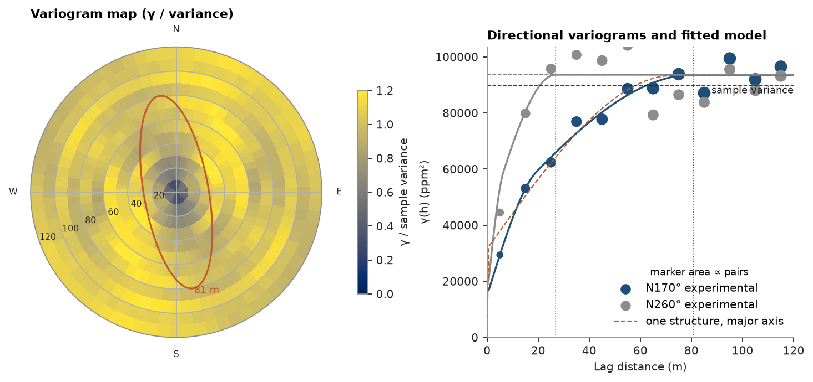
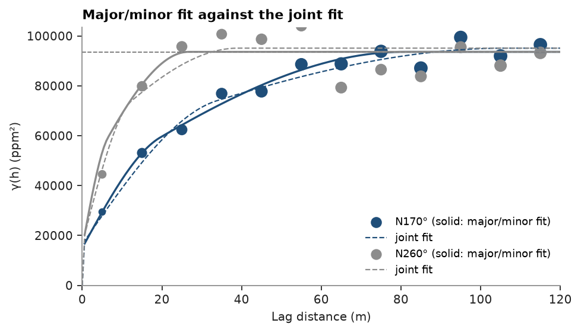

# 19. Variogram fitting

An anisotropic nested spherical model of `V`, fitted to directional experimental variograms along and across the
direction of greatest continuity (topic 18 builds them), then to all directions at once with `fit_directional`.

<details><summary>Python</summary>

```python
import ceres as cs
import matplotlib.pyplot as plt
import numpy as np
from common import ACCENT, GRAY, HIGHLIGHT, INK, save

samples = cs.datasets.walker_lake()
xy, v = samples.coords, samples["V"]
lag, max_lag = 10.0, 120.0
```

</details>

The variogram map picks the major axis: the direction whose fitted range is longest.

<details><summary>Python</summary>

```python
vmap = cs.variogram_map(xy, v, lag, max_lag)
angle = vmap.angles[np.nanargmax(vmap.ranges)]
azimuth = (90 - np.degrees(angle)) % 180
```

</details>

Fit along and across the major axis. Weighting each lag by N(h)/γ(h)² lets the few short-lag pairs steer the fit
near the origin, where the nugget and the short ranges are decided.

<details><summary>Python</summary>

```python
major = cs.experimental_variogram(xy, v, lag, max_lag, azimuth=azimuth)
minor = cs.experimental_variogram(xy, v, lag, max_lag, azimuth=azimuth + 90)
weighting = "count/gamma"
single = major.fit("spherical", weighting=weighting)
along = major.fit(["spherical", "spherical"], weighting=weighting)
print(single, along, minor.fit(["spherical", "spherical"], weighting=weighting), sep="\n")
```

</details>

```text
Variogram(nugget=31621.585548875744, structures=[Structure("spherical", sill=61718.46041352483, range=72.70834074501036)], rotation=(0.0, 0.0, 0.0), ratios=(1.0, 1.0))
Variogram(nugget=14993.35122178715, structures=[Structure("spherical", sill=25261.581155025888, range=19.578360959734756), Structure("spherical", sill=53364.6905008533, range=80.65434681410247)], rotation=(0.0, 0.0, 0.0), ratios=(1.0, 1.0))
Variogram(nugget=23378.007796960097, structures=[Structure("spherical", sill=0, range=2.5), Structure("spherical", sill=68505.76265942639, range=23.87806723833898)], rotation=(0.0, 0.0, 0.0), ratios=(1.0, 1.0))
```

Along the major axis γ climbs to two thirds of the sill within 25 m, then keeps rising slowly to about 80 m: two
scales of continuity. One structure (dashed below) splits the difference, overshoots the first lags and puts a third
of the sill in the nugget. Two nested spherical structures follow both scales and halve the nugget. Across the axis
the short structure takes no sill: γ reaches the sill by 25 m, and one structure is all those data support.

The structures share one anisotropy. Fitting the minor direction with the nugget and sills fixed at their major-axis
values moves only its ranges; the long structure, with two thirds of the sill, sets the minor/major ratio.
`rotation` is azimuth, dip, rake in degrees; `ratios` are semi-major/major and minor/major ranges.

<details><summary>Python</summary>

```python
sills = [s.sill for s in along.structures]
across = minor.fit(["spherical", "spherical"], weighting=weighting, nugget=along.nugget, sills=sills)
a_major = along.structures[-1].range
ratio = min(across.structures[-1].range / a_major, 1.0)
model = along.with_anisotropy(rotation=(azimuth, 0, 0), ratios=(ratio, 1.0))
print(across)
print(model)
```

</details>

```text
Variogram(nugget=14993.35122178715, structures=[Structure("spherical", sill=25261.581155025888, range=12.181126916520325), Structure("spherical", sill=53364.6905008533, range=26.669590607377888)], rotation=(0.0, 0.0, 0.0), ratios=(1.0, 1.0))
Variogram(nugget=14993.35122178715, structures=[Structure("spherical", sill=25261.581155025888, range=19.578360959734756), Structure("spherical", sill=53364.6905008533, range=80.65434681410247)], rotation=(170.0, 0.0, 0.0), ratios=(0.33066526059466755, 1.0))
```

The ellipse on the map is the model range in each direction:

<details><summary>Python</summary>

```python
variance = v.var()
fig = plt.figure(figsize=(9.2, 4.2), layout="constrained")
a = fig.add_subplot(1, 2, 1, projection="polar")
gamma = np.where(vmap.counts >= 30, vmap.gammas, np.nan)
step = vmap.angles[1] - vmap.angles[0]
theta = np.r_[vmap.angles, vmap.angles + np.pi, 2 * np.pi] - step / 2
radius = np.r_[vmap.lags - lag / 2, vmap.lags[-1] + lag / 2]
mesh = a.pcolormesh(theta, radius, np.vstack([gamma, gamma]).T / variance, vmin=0, vmax=1.2, shading="flat")
t = np.linspace(0, 2 * np.pi, 361)
direction = np.radians(90 - azimuth)
a_minor = a_major * ratio
ellipse = a_major * a_minor / np.hypot(a_minor * np.cos(t - direction), a_major * np.sin(t - direction))
a.plot(t, ellipse, color=HIGHLIGHT, lw=1.4)
a.text(direction, a_major * 1.05, f"{a_major:.0f} m", color=HIGHLIGHT, fontsize=8)
a.set_rlim(0, radius[-1])
a.set_xticks(np.radians([0, 90, 180, 270]), ["E", "N", "W", "S"])
a.set_rlabel_position(200)
a.tick_params(labelsize=7)
a.set_title("Variogram map (γ / variance)")
fig.colorbar(mesh, ax=a, shrink=0.7, label="γ / sample variance")

b = fig.add_subplot(1, 2, 2)
for exp, color, az, rng in ((major, ACCENT, azimuth, a_major), (minor, GRAY, azimuth + 90, a_minor)):
    cs.plot.variogram(
        exp, variogram=model, direction=(az, 0), ax=b, color=color, label=f"N{az % 360:.0f}° experimental"
    )
    b.axvline(rng, color=color, lw=0.8, ls=":")
h = np.linspace(0, max_lag, 200)
b.plot(h, single.gamma(h), color=HIGHLIGHT, lw=1, ls="--", label="one structure, major axis")
b.axhline(variance, color=INK, lw=0.8, ls="--")
b.text(max_lag, variance, "sample variance", va="top", ha="right", color=INK, fontsize=8)
b.set_xlim(0, max_lag)
b.set_ylim(bottom=0)
b.set_title("Directional variograms and fitted model")
b.set_xlabel("Lag distance (m)")
b.set_ylabel("γ(h) (ppm²)")
b.legend(loc="lower right", title="marker area ∝ pairs", title_fontsize=8)
save(fig, "variogram")
```

</details>



`Variogram.fit_directional` fits one anisotropic model to experimental variograms in many directions at once:
azimuth, range ratio, ranges, sills and nugget together, the ranges along the major axis. The directions here are
horizontal, every 22.5°, so the fit is 2D: dip, rake and the minor/major ratio stay 0, 0 and 1.

<details><summary>Python</summary>

```python
azimuths = np.arange(0, 180, 22.5)
directional = [cs.experimental_variogram(xy, v, lag, max_lag, azimuth=a) for a in azimuths]
joint = cs.Variogram.fit_directional(
    directional, [(a, 0) for a in azimuths], ["spherical", "spherical"], weighting=weighting
)
print(joint)
```

</details>

```text
Variogram(nugget=16458.274347134982, structures=[Structure("spherical", sill=39532.52873902907, range=36.61764354287077), Structure("spherical", sill=39110.92894638225, range=115)], rotation=(161.46018248305683, 0.0, 0.0), ratios=(0.33583539147294017, 1.0))
```

The joint fit puts the major axis at N161°, nine degrees off the map's pick, with the same one-third ratio; its long
range stops at 115 m, the largest lag, where free ranges are capped unless `ranges` bounds them. It spreads its
effort over all eight directions, so it fits the major and minor axes worse than the fits made along them: the
dashed curves fall below the short lags on both.

<details><summary>Python</summary>

```python
fig, ax = plt.subplots(figsize=(6, 3.4), layout="constrained")
origin = np.zeros((h.size, 3))
for exp, color, az in ((major, ACCENT, azimuth), (minor, GRAY, azimuth + 90)):
    cs.plot.variogram(
        exp,
        variogram=model,
        direction=(az, 0),
        ax=ax,
        color=color,
        label=f"N{az % 360:.0f}° (solid: major/minor fit)",
    )
    unit = np.array([np.sin(np.radians(az)), np.cos(np.radians(az)), 0])
    ax.plot(h, joint.gamma_between(origin, h[:, None] * unit), color=color, lw=1, ls="--", label="joint fit")
ax.set_xlim(0, max_lag)
ax.set_title("Major/minor fit against the joint fit")
ax.set_xlabel("Lag distance (m)")
ax.set_ylabel("γ(h) (ppm²)")
ax.legend(loc="lower right", fontsize=8)
save(fig, "joint")
```

</details>



Full script: [`example_19.py`](example_19.py)
