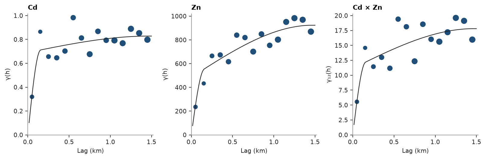

# 21. Coregionalization

Jura: 259 soil samples of heavy metals (mg/kg, coordinates in km). Cd correlates with Zn; a linear model of
coregionalization (LMC) describes both variograms and their cross-variogram with one set of structures.

<details><summary>Python</summary>

```python
import ceres as cs
import matplotlib.pyplot as plt
import numpy as np
from common import ACCENT, INK, save

samples = cs.datasets.jura()["prediction"]
xy = samples.coords
cd, zn = samples["Cd"], samples["Zn"]
lag, max_lag = 0.1, 1.5
print(f"{len(cd)} samples, corr(Cd, Zn) {np.corrcoef(cd, zn)[0, 1]:.2f}")
```

</details>

```text
259 samples, corr(Cd, Zn) 0.67
```

The cross-variogram is the half mean product of the Cd and Zn increments between co-located samples. The LMC is
fitted to the two variograms and the cross-variogram together. The variables share the structures, a nugget and two
spherical ranges, and each structure's sill matrix stays positive semi-definite: its smallest eigenvalue is never
negative. The short structure takes the place of the nugget, which fits to zero.

<details><summary>Python</summary>

```python
experimentals = [
    [
        cs.experimental_variogram(xy, cd, lag, max_lag),
        cs.experimental_variogram(xy, cd, lag, max_lag, other=zn),
    ],
    [None, cs.experimental_variogram(xy, zn, lag, max_lag)],
]
lmc = cs.Coregionalization.fit(experimentals, ["spherical", "spherical"])
for name, matrix in [("nugget", lmc.nugget)] + [(f"{m} {a:.2f} km", s) for m, a, s in lmc.structures]:
    print(f"{name}: {np.round(matrix, 3).tolist()}, smallest eigenvalue {np.linalg.eigvalsh(matrix)[0]:.3g}")
```

</details>

```text
nugget: [[0.0, 0.0], [0.0, 0.0]], smallest eigenvalue 0
spherical 0.15 km: [[0.69, 11.146], [11.146, 485.455]], smallest eigenvalue 0.434
spherical 1.47 km: [[0.138, 6.658], [6.658, 437.931]], smallest eigenvalue 0.0368
```

Each curve is the fitted LMC's C(0) − C(h), and the three experimental variograms follow the shared short and long
structures in their own proportions:

<details><summary>Python</summary>

```python
h = np.linspace(0, max_lag, 101)[1:]
origin = np.zeros((h.size, 3))
away = np.c_[h, np.zeros((h.size, 2))]
panels = (
    (0, 0, "Cd", experimentals[0][0]),
    (1, 1, "Zn", experimentals[1][1]),
    (0, 1, "Cd × Zn", experimentals[0][1]),
)
fig, axes = plt.subplots(1, 3, figsize=(10, 3.2), layout="constrained")
for ax, (i, j, name, experimental) in zip(axes, panels):
    cs.plot.variogram(experimental, ax=ax, color=ACCENT)
    model = lmc.cross_covariance(i, j, origin, origin) - lmc.cross_covariance(i, j, origin, away)
    ax.plot(h, model, color=INK, lw=1)
    ax.set(title=name, xlabel="Lag (km)", ylabel="γ(h)" if i == j else "γ₁₂(h)")
save(fig, "variograms")
```

</details>



Given directional variograms, the fit also finds the anisotropy the structures share: the angles and range ratios
are searched together with the sill matrices. Cd and Zn are most continuous along a north-west to south-east axis.

<details><summary>Python</summary>

```python
azimuths = [0.0, 45.0, 90.0, 135.0]


def directional(u, v=None):
    return [cs.experimental_variogram(xy, u, lag, max_lag, azimuth=a, other=v) for a in azimuths]


anisotropic = cs.Coregionalization.fit(
    [[directional(cd), directional(cd, zn)], [None, directional(zn)]],
    ["spherical", "spherical"],
    directions=[(a, 0.0) for a in azimuths],
)
print(
    f"major axis azimuth {anisotropic.rotation[0]:.0f}°, semi-major/major ratio {anisotropic.ratios[0]:.2f}, "
    f"major ranges {', '.join(f'{r:.2f}' for _, r, _ in anisotropic.structures)} km"
)
```

</details>

```text
major axis azimuth 132°, semi-major/major ratio 0.31, major ranges 0.67, 1.45 km
```

Full script: [`example_21.py`](example_21.py)
