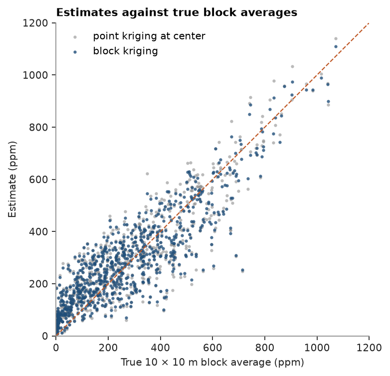
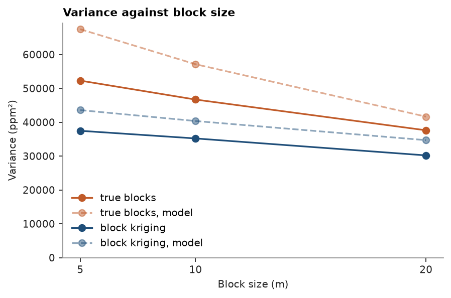

# 25. Block kriging

Block kriging estimates the average of `V` over a block, not its value at the center. On Walker Lake the true block
averages are known, so block and point estimates can both be checked against them, for several block sizes.

<details><summary>Python</summary>

```python
import ceres as cs
import matplotlib.pyplot as plt
import numpy as np
from common import ACCENT, GRAY, HIGHLIGHT, save

samples = cs.datasets.walker_lake()
truth = cs.datasets.walker_lake_exhaustive()["V"].reshape(300, 260)

azimuths = np.arange(0, 180, 22.5)
directional = [cs.experimental_variogram(samples, "V", 10.0, 120.0, azimuth=a) for a in azimuths]
model = cs.Variogram.fit_directional(
    directional, [(a, 0) for a in azimuths], ["spherical", "spherical"], weighting="count/gamma"
)
search = cs.Search(radius=80, max_samples=24, min_samples=4, rotation=model.rotation, ratios=(0.5, 1.0))
```

</details>

`BlockKriging` averages the variogram between the samples and a grid of points inside each block,
`discretization` of them along x, y and z. Its targets are block centers. The truth is the mean of the 100
exhaustive values in each 10 × 10 m block.

<details><summary>Python</summary>

```python
blocks = cs.BlockModel(origin=(0, 0), size=(10, 10), count=(26, 30))
block = cs.BlockKriging(model, search, size=(10, 10), discretization=(5, 5, 1)).fit(samples, "V")
point = cs.OrdinaryKriging(model, search).fit(samples, "V")
block_estimate, block_variance = block.predict(blocks, return_variance=True)
point_estimate, point_variance = point.predict(blocks, return_variance=True)
true_blocks = truth.reshape(30, 10, 26, 10).mean(axis=(1, 3)).ravel()
for name, e, var in (
    ("block kriging", block_estimate, block_variance),
    ("point kriging", point_estimate, point_variance),
):
    rmse = np.sqrt(np.nanmean((e - true_blocks) ** 2))
    print(f"{name}: RMSE {rmse:.1f} ppm, mean kriging variance {np.nanmean(var):.0f}")
print(f"actual mean squared error of block kriging {np.nanmean((block_estimate - true_blocks) ** 2):.0f}")
```

</details>

```text
block kriging: RMSE 101.5 ppm, mean kriging variance 19404
point kriging: RMSE 105.8 ppm, mean kriging variance 54073
actual mean squared error of block kriging 10303
```

The two estimates are close, and block kriging is slightly more accurate against the block averages. The larger
difference is in the variance: point kriging reports the error of predicting one point, nugget included, while
block kriging reports the error of predicting the block mean, a third of it here. The actual mean squared error of
the block estimates, 10 303, is below even that, as the model's variance was pessimistic in topic 22 too.

<details><summary>Python</summary>

```python
fig, ax = plt.subplots(figsize=(4.8, 4.6), layout="constrained")
ax.scatter(
    true_blocks, point_estimate, s=8, color=GRAY, alpha=0.6, linewidths=0, label="point kriging at center"
)
ax.scatter(true_blocks, block_estimate, s=8, color=ACCENT, alpha=0.8, linewidths=0, label="block kriging")
ax.plot([0, 1200], [0, 1200], color=HIGHLIGHT, lw=1, ls="--")
ax.set(xlim=(0, 1200), ylim=(0, 1200), xlabel="True 10 × 10 m block average (ppm)", ylabel="Estimate (ppm)")
ax.set_aspect("equal")
ax.set_title("Estimates against true block averages")
ax.legend(loc="upper left")
save(fig, "blocks")
```

</details>



## Block size

Larger blocks average more of the short-scale variation away. `diagnostics` reports `support_variance`, the variance
of true block values the model predicts (sill minus the mean variogram within the block, nugget excluded), and
`estimate_variance`, the variance of the estimates it predicts.

<details><summary>Python</summary>

```python
sizes = (5, 10, 20)
rows = []
for size in sizes:
    grid = cs.BlockModel(origin=(0, 0), size=(size, size), count=(260 // size, 300 // size))
    d = cs.BlockKriging(model, search, size=(size, size)).fit(samples, "V").predict(grid, diagnostics=True)
    true = truth.reshape(300 // size, size, 260 // size, size).mean(axis=(1, 3)).ravel()
    rows.append(
        (
            np.nanvar(d["value"]),
            np.nanmean(d["estimate_variance"]),
            true.var(),
            np.nanmean(d["support_variance"]),
        )
    )
    print(
        f"{size:>2} m blocks: variance of estimates {rows[-1][0]:6.0f} (model {rows[-1][1]:6.0f}), "
        f"of true blocks {rows[-1][2]:6.0f} (model {rows[-1][3]:6.0f})"
    )

fig, ax = plt.subplots(figsize=(5.5, 3.6), layout="constrained")
rows = np.array(rows)
ax.plot(sizes, rows[:, 2], "o-", color=HIGHLIGHT, label="true blocks")
ax.plot(sizes, rows[:, 3], "o--", color=HIGHLIGHT, alpha=0.5, label="true blocks, model")
ax.plot(sizes, rows[:, 0], "o-", color=ACCENT, label="block kriging")
ax.plot(sizes, rows[:, 1], "o--", color=ACCENT, alpha=0.5, label="block kriging, model")
ax.set(xlabel="Block size (m)", ylabel="Variance (ppm²)", ylim=(0, None))
ax.set_xticks(sizes)
ax.set_title("Variance against block size")
ax.legend()
save(fig, "sizes")
```

</details>

```text
 5 m blocks: variance of estimates  37470 (model  43577), of true blocks  52287 (model  67472)
10 m blocks: variance of estimates  35212 (model  40356), of true blocks  46694 (model  57129)
20 m blocks: variance of estimates  30203 (model  34703), of true blocks  37617 (model  41648)
```



The variance of true block values falls with block size, from 52 287 for 5 m blocks to 37 617 for 20 m blocks,
and the estimates stay below it at every size: kriging smooths, so selecting blocks on the estimates misclassifies
some of them. The gap narrows as the blocks grow, which is one reason not to estimate blocks much smaller than the
data spacing. The model overstates both variances, the true one most for small blocks, but gets their order
and trend right.

Full script: [`example_25.py`](example_25.py)
