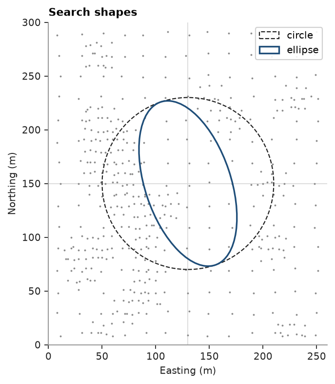
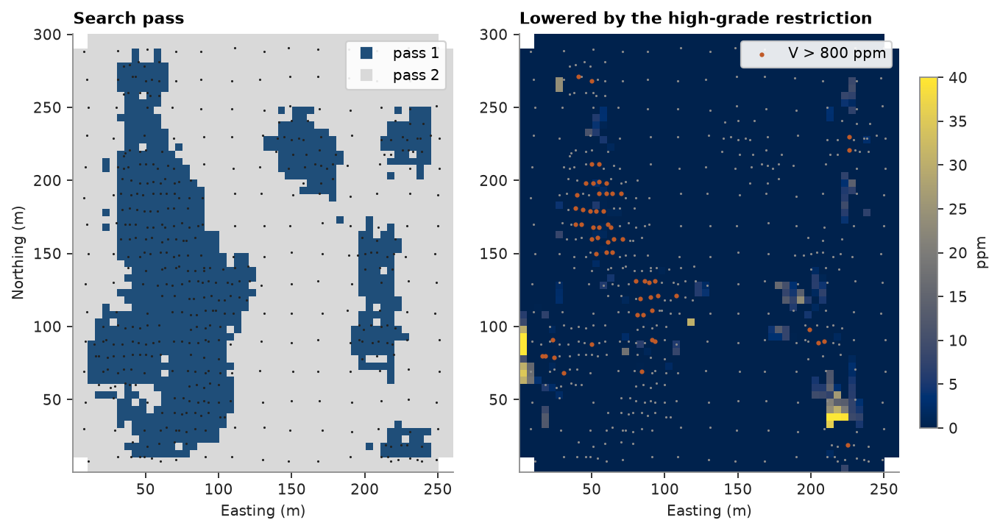

# 26. Search

The search decides which samples inform each node: an ellipse along the continuity, octants against clustering,
passes that relax the search where the first finds too few samples, and a high-grade restriction on rich samples.
Ordinary kriging of Walker Lake `V`, checked against the exhaustive values.

<details><summary>Python</summary>

```python
import ceres as cs
import matplotlib.pyplot as plt
import numpy as np
from common import ACCENT, GRAY, HIGHLIGHT, INK, LIGHT, map_axes, save
from matplotlib.colors import ListedColormap
from matplotlib.patches import Circle, Ellipse

samples = cs.datasets.walker_lake()
xy, v = samples.coords, samples["V"]
truth = cs.datasets.walker_lake_exhaustive()["V"].reshape(300, 260)
grid = cs.BlockModel(origin=(0.5, 0.5), size=(5, 5), count=(52, 60))
nodes = grid.centroids.astype(int)
true_at_nodes = truth[nodes[:, 1] - 1, nodes[:, 0] - 1]

azimuths = np.arange(0, 180, 22.5)
directional = [cs.experimental_variogram(samples, "V", 10.0, 120.0, azimuth=a) for a in azimuths]
model = cs.Variogram.fit_directional(
    directional, [(a, 0) for a in azimuths], ["spherical", "spherical"], weighting="count/gamma"
)
kriging = cs.OrdinaryKriging(model, cs.Search(radius=80)).fit(samples, "V")


def rmse(estimate):
    ok = ~np.isnan(estimate)
    return np.sqrt(np.mean((estimate[ok] - true_at_nodes[ok]) ** 2))
```

</details>

## Ellipse and octants

`radius` is the major semi-axis; `rotation` orients the ellipse like a variogram, and `ratios` shrink the other
axes. `octant=True` takes at most `max_samples / 8` samples from each octant around the node, split along the
coordinate axes, so a dense cluster on one side cannot fill the neighborhood. In 2D the samples fall in four of the
eight octants, the quadrants drawn below, so at most half of `max_samples` are used. `with_search` keeps the fitted samples and the variogram, and swaps the search.

<details><summary>Python</summary>

```python
ellipse = {"rotation": model.rotation, "ratios": (0.5, 1.0)}
searches = {
    "circle": cs.Search(radius=80, max_samples=24, min_samples=4),
    "ellipse": cs.Search(radius=80, max_samples=24, min_samples=4, **ellipse),
    "ellipse, octants": cs.Search(radius=80, max_samples=24, min_samples=4, octant=True, **ellipse),
}
print(f"{'search':>16}  RMSE  samples  mean distance  cross-validation RMSE")
for name, search in searches.items():
    estimator = kriging.with_search(search)
    d = estimator.predict(grid, diagnostics=True)
    print(
        f"{name:>16}  {rmse(d['value']):5.1f}  {np.nanmean(d['n_samples']):5.1f}  {np.nanmean(d['mean_distance']):9.1f} m"
        f"  {estimator.cross_validate().rmse:12.1f}"
    )

fig, ax = plt.subplots(figsize=(4.4, 4.8), layout="constrained")
ax.scatter(*xy[:, :2].T, s=3, color=GRAY, linewidths=0)
center = (130, 150)
azimuth = model.rotation[0]
ax.add_patch(Circle(center, 80, fill=False, color=INK, lw=1, ls="--", label="circle"))
ax.add_patch(Ellipse(center, 160, 80, angle=90 - azimuth, fill=False, color=ACCENT, lw=1.5, label="ellipse"))
ax.axhline(center[1], color=LIGHT, lw=0.8, zorder=0)
ax.axvline(center[0], color=LIGHT, lw=0.8, zorder=0)
ax.set(xlim=(0, 260), ylim=(0, 300))
map_axes(ax, "Search shapes")
ax.legend(loc="upper right", framealpha=0.9, frameon=True)
save(fig, "shapes")
```

</details>

```text
          search  RMSE  samples  mean distance  cross-validation RMSE
          circle  154.8   21.4       31.0 m         185.5
         ellipse  155.1   23.5       29.5 m         185.4
ellipse, octants  154.3   11.0       21.9 m         184.9
```



The three searches give almost the same accuracy. The ellipse reaches closer samples along the continuity, and the
octants halve the neighborhood to 11 samples without loss: kriging already gives far and redundant samples little
weight, so the search matters more for speed, for extrapolation and for limiting negative weights than for the
estimate at well-informed nodes.

## Passes

A list of searches runs as passes: nodes the first leaves unestimated go to the next, and `diagnostics` reports the
pass behind each. A first pass wanting eight samples within 30 m labels the nodes by how well they are informed,
which classification uses.

<details><summary>Python</summary>

```python
search = searches["ellipse, octants"]
passes = [cs.Search(radius=30, min_samples=8, max_samples=24, octant=True, **ellipse), search]
d = kriging.with_search(passes).predict(grid, diagnostics=True)
for p in (1, 2):
    s = d["pass"] == p
    error = np.sqrt(np.mean((d["value"][s] - true_at_nodes[s]) ** 2))
    print(
        f"pass {p}: {s.mean():4.0%} of nodes, mean slope {np.mean(d['slope'][s]):.2f}, RMSE {error:.0f} ppm"
    )
print(f"RMSE of all nodes {rmse(d['value']):.1f} ppm")
```

</details>

```text
pass 1:  30% of nodes, mean slope 0.98, RMSE 172 ppm
pass 2:  69% of nodes, mean slope 0.93, RMSE 146 ppm
RMSE of all nodes 154.6 ppm
```

Pass-1 nodes have the higher slope of regression but also the larger errors: Walker Lake was sampled densely where
`V` is high and variable, so the best-informed nodes are also the hardest ones.

## High-grade restriction

`high_grade=(800, 20)` keeps samples above 800 ppm from informing nodes more than 20 m away.

<details><summary>Python</summary>

```python
print(f"{np.mean(v > 800):.0%} of the samples are above 800 ppm")
free = kriging.with_search(search)
capped = kriging.with_search(
    cs.Search(radius=80, max_samples=24, min_samples=4, octant=True, high_grade=(800, 20), **ellipse)
)
before, after = free.predict(grid), capped.predict(grid)
difference = after - before
changed = np.abs(difference) > 5
error = before[changed] - true_at_nodes[changed]
print(
    f"{changed.sum()} nodes move by over 5 ppm; their mean error goes from {error.mean():+.0f} ppm to "
    f"{(error + difference[changed]).mean():+.0f} ppm"
)
print(
    f"cross-validation mean error {free.cross_validate().mean_error:+.1f} ppm without the restriction, "
    f"{capped.cross_validate().mean_error:+.1f} with"
)
```

</details>

```text
12% of the samples are above 800 ppm
163 nodes move by over 5 ppm; their mean error goes from +12 ppm to +8 ppm
cross-validation mean error +8.2 ppm without the restriction, +8.8 with
```

<details><summary>Python</summary>

```python
shape = (60, 52)
extent = (0.5, 260.5, 0.5, 300.5)
fig, (a, b) = plt.subplots(1, 2, figsize=(8.4, 4.4), layout="constrained")
a.imshow(
    d["pass"].reshape(shape),
    origin="lower",
    extent=extent,
    cmap=ListedColormap([ACCENT, LIGHT]),
    vmin=0.5,
    vmax=2.5,
)
a.scatter(*xy[:, :2].T, s=2, color=INK, linewidths=0)
map_axes(a, "Search pass")
a.legend(
    handles=[
        plt.Line2D([], [], marker="s", ls="", color=c, label=f"pass {p}")
        for p, c in ((1, ACCENT), (2, LIGHT))
    ],
    loc="upper right",
    framealpha=0.9,
    frameon=True,
)
im = b.imshow(-difference.reshape(shape), origin="lower", extent=extent, cmap="cividis", vmin=0, vmax=40)
rich = v > 800
b.scatter(*xy[~rich, :2].T, s=2, color=GRAY, linewidths=0)
b.scatter(*xy[rich, :2].T, s=8, color=HIGHLIGHT, linewidths=0, label="V > 800 ppm")
map_axes(b, "Lowered by the high-grade restriction")
b.set_ylabel("")
b.legend(loc="upper right", framealpha=0.9, frameon=True)
fig.colorbar(im, ax=b, shrink=0.8, label="ppm")
save(fig, "passes")
```

</details>



The restriction only lowers estimates, near isolated rich samples where kriging overestimates most, and there it
brings the mean error of the moved nodes closer to zero. It is a local correction: over all samples the
cross-validation mean error hardly changes.

Full script: [`example_26.py`](example_26.py)
