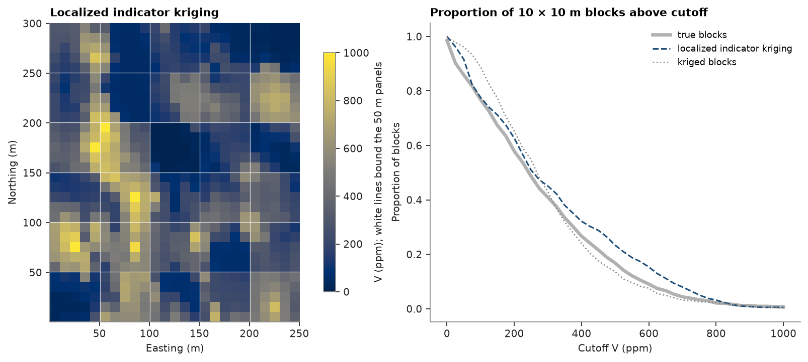

# 34. MIK localization

Multiple indicator kriging reaches the selective blocks inside a panel without a Gaussian model. Kriged at each
panel centroid, its conditional distribution describes point grades; an affine correction shrinks it to block
support, and ranked blocks share its bands. The exhaustive Walker Lake grid gives the true 10 m blocks.

<details><summary>Python</summary>

```python
import ceres as cs
import matplotlib.pyplot as plt
import numpy as np
from common import ACCENT, GRAY, INK, save

samples = cs.datasets.walker_lake()
truth = cs.datasets.walker_lake_exhaustive()["V"].reshape(300, 260)
xy, v = samples.coords, samples["V"]
weights = cs.cell_declustering(samples, "V", sizes=np.arange(2.5, 102.5, 2.5)).weights
size = 10
true_smu = truth[:, :250].reshape(30, size, 25, size).mean(axis=(1, 3))
```

</details>

The grade variogram, fitted along and across N170° (topic 19), and one omnidirectional indicator variogram at each
decile:

<details><summary>Python</summary>

```python
azimuths = (170, 260)
experimental = [cs.experimental_variogram(xy, v, 10, 120, azimuth=a) for a in azimuths]
grade = cs.Variogram.fit_directional(
    experimental, [(a, 0) for a in azimuths], ["spherical", "spherical"], rotation=[170, 0, 0]
)
deciles = np.quantile(v, np.linspace(0.1, 0.9, 9))
indicators = [
    cs.experimental_variogram(xy, (v <= t).astype(float), 10, 120).fit("spherical") for t in deciles
]
print(grade)
```

</details>

```text
Variogram(nugget=23074.121724005312, structures=[Structure("spherical", sill=21197.378384424104, range=35.64044049883205), Structure("spherical", sill=48385.01811413661, range=79.3306247959381)], rotation=(170.0, 0.0, 0.0), ratios=(0.3439680551606079, 1.0))
```

The 50 × 50 m panels over the western 250 m hold 25 blocks of 10 m each, ranked by their ordinary block kriging.
`localize` kriges the indicators at each panel centroid and shrinks the distribution about its mean by the variance
factor f, the variance of 10 m blocks within a panel over that of points within it, computed here from the grade
variogram. The block ranked i receives the mean of the i-th of 25 equal-probability bands.

<details><summary>Python</summary>

```python
search = cs.Search(radius=100, max_samples=24, min_samples=4)
panels = cs.BlockModel(origin=(0.5, 0.5), size=(50, 50), count=(5, 6))
smus = panels.discretize(5)
kriged = cs.BlockKriging(grade, search, size=(size, size), discretization=(5, 5, 1)).fit(xy, v).predict(smus)
smus = smus.with_column("kriged", kriged)
mik = cs.MultipleIndicatorKriging(indicators, search, deciles, tails=(0.0, v.max()))
mik.fit(xy, v, weights=weights)
localized = mik.localize(smus, "kriged", panels, variance_factor=grade)["localized"]
for label, values in (("kriged", kriged), ("localized", localized)):
    print(
        f"{label}: variance {values.var():.0f}, correlation with truth {np.corrcoef(values, true_smu.ravel())[0, 1]:.2f}"
    )
print(f"true blocks: variance {true_smu.var():.0f}")
```

</details>

```text
kriged: variance 35064, correlation with truth 0.89
localized: variance 54348, correlation with truth 0.82
true blocks: variance 47350
```

Grade-tonnage of the three sets of blocks:

<details><summary>Python</summary>

```python
cutoffs = np.linspace(0, 1000, 41)


def empirical(values):
    tonnage = np.array([(values > c).mean() for c in cutoffs])
    grade = np.array([values[values > c].mean() if (values > c).any() else np.nan for c in cutoffs])
    return tonnage, grade


true_curve, kriged_curve, mik_curve = empirical(true_smu.ravel()), empirical(kriged), empirical(localized)
for c in (300, 500, 800):
    k = np.searchsorted(cutoffs, c)
    print(
        f"above {c} ppm: localized {mik_curve[0][k]:.1%}, kriged {kriged_curve[0][k]:.1%}, true {true_curve[0][k]:.1%}"
    )

fig, (a, b) = plt.subplots(1, 2, figsize=(10, 4.4), layout="constrained", width_ratios=(1, 1.3))
extent = (0.5, 250.5, 0.5, 300.5)
image = a.imshow(np.reshape(localized, (30, 25)), origin="lower", extent=extent, vmin=0, vmax=1000)
a.vlines(np.arange(50.5, 250, 50), 0.5, 300.5, color="white", lw=0.6, alpha=0.7)
a.hlines(np.arange(50.5, 300, 50), 0.5, 250.5, color="white", lw=0.6, alpha=0.7)
a.set_aspect("equal")
a.set(title="Localized indicator kriging", xlabel="Easting (m)", ylabel="Northing (m)")
fig.colorbar(image, ax=a, shrink=0.8, label="V (ppm); white lines bound the 50 m panels")
for (tonnage, _), color, style, label in (
    (true_curve, INK, {"lw": 3, "alpha": 0.35}, "true blocks"),
    (mik_curve, ACCENT, {"lw": 1.4, "ls": "--"}, "localized indicator kriging"),
    (kriged_curve, GRAY, {"lw": 1.2, "ls": ":"}, "kriged blocks"),
):
    b.plot(cutoffs, tonnage, color=color, label=label, **style)
b.set(
    title=f"Proportion of {size} × {size} m blocks above cutoff",
    xlabel="Cutoff V (ppm)",
    ylabel="Proportion of blocks",
)
b.legend(fontsize=8)
save(fig, "localized-mik")
```

</details>

```text
above 300 ppm: localized 45.1%, kriged 42.9%, true 40.9%
above 500 ppm: localized 23.3%, kriged 13.6%, true 16.8%
above 800 ppm: localized 3.2%, kriged 2.3%, true 2.1%
```



The localized blocks spread wider than the true ones (variance 53 981 against 47 350) where kriging smooths them to
35 064, and they follow the truth block by block a little less well than kriging (correlation 0.82 against 0.89).
The affine correction keeps the shape of each point distribution, so its long upper tail survives the shrinking:
at 500 ppm the localized blocks put 23.5% above cutoff against a true 16.8%, overshooting as much as kriging falls
short. Topic 33 localizes the same panels from a Gaussian model instead.

Full script: [`example_34.py`](example_34.py)
