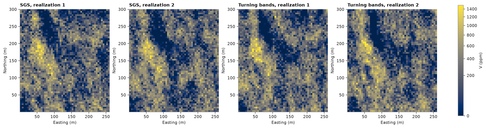
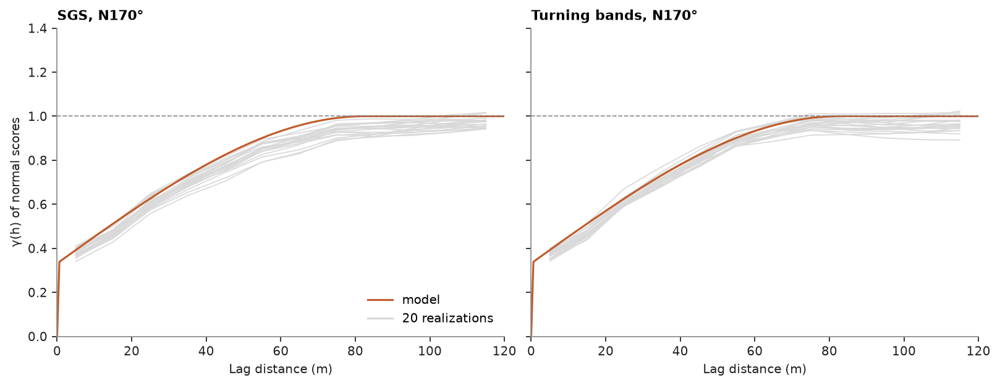

# 38. Turning bands

Turning bands sums many one-dimensional processes along random lines into an unconditional Gaussian field, then
conditions it to the data by kriging the residuals. It draws the same kind of realizations as SGS (topic 36) without a
random path.

<details><summary>Python</summary>

```python
import ceres as cs
import matplotlib.pyplot as plt
import numpy as np
from common import GRAY, HIGHLIGHT, LIGHT, map_axes, save
from matplotlib.colors import PowerNorm

samples = cs.datasets.walker_lake()
xy, v = samples.coords, samples["V"]
grid = cs.BlockModel(origin=(0.5, 0.5), size=(5, 5), count=(52, 60))
```

</details>

Declustered normal scores and their variogram along N170°, the direction of greatest continuity (topic 19), and
across it, scaled to a unit sill:

<details><summary>Python</summary>

```python
weights = cs.cell_declustering(xy, v, sizes=np.arange(2.5, 102.5, 2.5)).weights
y = cs.NormalScore(tails=(0.0, v.max())).fit_transform(v, weights=weights)
major = cs.experimental_variogram(xy, y, 10.0, 120.0, azimuth=170).fit("spherical")
minor = cs.experimental_variogram(xy, y, 10.0, 120.0, azimuth=260).fit("spherical")
(structure,) = major.structures
ratio = min(minor.structures[0].range / structure.range, 1.0)
gaussian = cs.Variogram(
    [("spherical", structure.sill / major.sill, structure.range)],
    nugget=major.nugget / major.sill,
    rotation=(170, 0, 0),
    ratios=(ratio, 1.0),
)
print(gaussian)
```

</details>

```text
Variogram(nugget=0.3315861183518779, structures=[Structure("spherical", sill=0.6684138816481222, range=82.43111673409601)], rotation=(170.0, 0.0, 0.0), ratios=(0.42564072265384956, 1.0))
```

Both methods normal-score the data, simulate and back-transform; `bands` sets how many lines turning bands sums.

<details><summary>Python</summary>

```python
sgs = cs.SGS(gaussian, cs.Search(radius=100, max_samples=24)).fit(samples, "V", weights=weights)
tb = cs.TurningBands(gaussian, bands=500).fit(samples, "V", weights=weights)
start = time.perf_counter()
by_sgs = sgs.simulate(grid, n=20, seed=5, realizations=True).realizations
sgs_seconds = time.perf_counter() - start
start = time.perf_counter()
by_tb = tb.simulate(grid, n=20, seed=5, realizations=True).realizations
tb_seconds = time.perf_counter() - start
for name, reals, seconds in (("SGS", by_sgs, sgs_seconds), ("turning bands", by_tb, tb_seconds)):
    print(
        f"{name:>13}: 20 realizations in {seconds:.2f} s, mean {reals.mean():.0f} ppm, variance {reals.var():.0f} ppm²"
    )
```

</details>

```text
          SGS: 20 realizations in 0.45 s, mean 299 ppm, variance 72759 ppm²
turning bands: 20 realizations in 0.24 s, mean 295 ppm, variance 69673 ppm²
```

Both follow the same high-grade trends, with the same short-scale scatter:

<details><summary>Python</summary>

```python
shape = (60, 52)
extent = (0.5, 260.5, 0.5, 300.5)
norm = PowerNorm(0.5, vmin=0, vmax=1500)
fig, axes = plt.subplots(1, 4, figsize=(15, 4.4), layout="constrained")
panels = [
    (by_sgs[0], "SGS, realization 1"),
    (by_sgs[1], "SGS, realization 2"),
    (by_tb[0], "Turning bands, realization 1"),
    (by_tb[1], "Turning bands, realization 2"),
]
for ax, (image, title) in zip(axes, panels):
    im = ax.imshow(image.reshape(shape), origin="lower", extent=extent, norm=norm)
    map_axes(ax, title)
fig.colorbar(im, ax=axes, shrink=0.8, label="V (ppm)")
save(fig, "realizations")
```

</details>



Along the major axis both follow the model, from its nugget at the first lags to the sill at its range. Turning bands
simulates the nugget as independent noise at each node, since the bands carry only the structures:

<details><summary>Python</summary>

```python
h = np.linspace(0, 120, 200)
fig, axes = plt.subplots(1, 2, figsize=(10, 3.8), layout="constrained", sharey=True)
for ax, (name, reals) in zip(axes, (("SGS", by_sgs), ("Turning bands", by_tb))):
    for r in reals:
        scores = cs.NormalScore().fit_transform(r)
        exp = cs.experimental_variogram(grid.centroids, scores, 10.0, 120.0, azimuth=170)
        ax.plot(exp.lags, exp.gammas, color=LIGHT, lw=0.8)
    ax.plot(h, gaussian.gamma(h), color=HIGHLIGHT, lw=1.4, label="model")
    ax.plot([], [], color=LIGHT, label="20 realizations")
    ax.axhline(1.0, color=GRAY, lw=0.8, ls="--")
    ax.set(xlim=(0, 120), ylim=(0, 1.4), xlabel="Lag distance (m)", title=f"{name}, N170°")
axes[0].set_ylabel("γ(h) of normal scores")
axes[0].legend(loc="lower right")
save(fig, "variograms")
```

</details>



Full script: [`example_38.py`](example_38.py)
