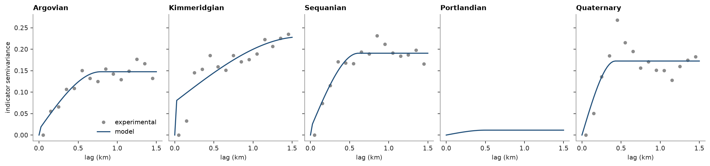
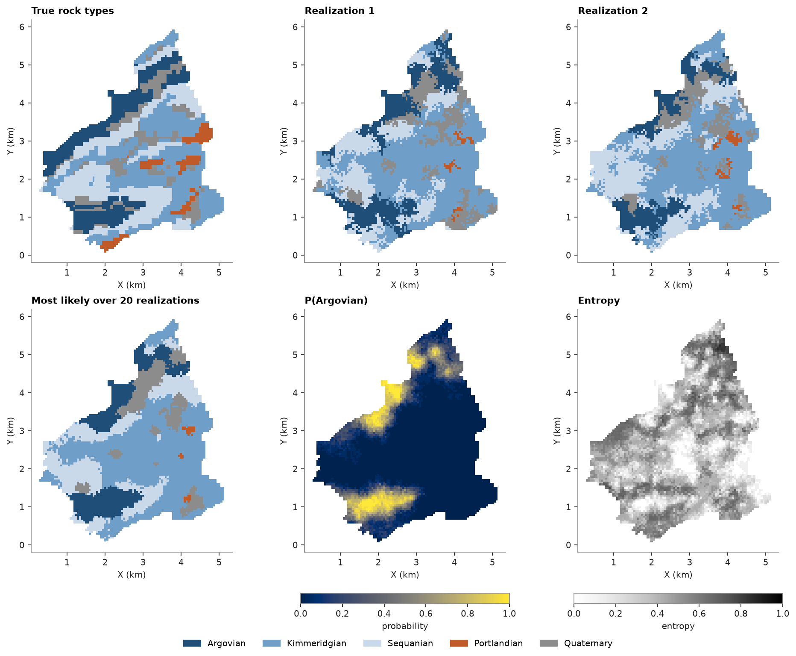

# 40. Sequential indicator simulation

Sequential indicator simulation (SIS) draws categories. Visiting the nodes along a random path, it krigs the indicator
of every category from its own variogram, using the samples and the nodes already drawn, and draws a category from
those probabilities. Each realization is one possible rock-type map; over many realizations, the frequency of each
category at a node is its probability. Topic 64 estimates such probabilities directly by categorical indicator
kriging, without simulating.

<details><summary>Python</summary>

```python
import ceres as cs
import matplotlib.pyplot as plt
import numpy as np
from common import ACCENT, GRAY, save
```

</details>

## Rock types

Jura's rock types are known everywhere on the prediction grid, so simulated maps can be compared with the real
geology. A `Categories` scheme names the five types and gives each a color: `encode` turns labels into the codes 0
to 4 that SIS takes, and `shares` gives their proportions.

<details><summary>Python</summary>

```python
jura = cs.datasets.jura()
train, grid = jura["prediction"], jura["grid"]
names = ["Argovian", "Kimmeridgian", "Sequanian", "Portlandian", "Quaternary"]
rock_types = cs.Categories(names, colors=["#1f4e79", "#6f9fc9", "#c9d9ea", "#c05a28", "#8c8c8c"])
rock = rock_types.encode(train["Rock"]).astype(int)
true_rock = rock_types.encode(grid["Rock"]).astype(int)
print(f"{len(rock)} samples, {len(true_rock)} grid nodes")
print(f"{'':<13}{'samples':>8}{'share':>7}{'true grid':>11}")
for k, name in enumerate(names):
    print(f"{name:<13}{np.sum(rock == k):8d}{np.mean(rock == k):7.2f}{np.mean(true_rock == k):11.2f}")
```

</details>

```text
259 samples, 5957 grid nodes
              samples  share  true grid
Argovian           53   0.20       0.20
Kimmeridgian       85   0.33       0.34
Sequanian          63   0.24       0.27
Portlandian         3   0.01       0.05
Quaternary         55   0.21       0.13
```

## Indicator variograms

Each rock type gets the variogram of its indicator, 1 inside the type and 0 outside. Portlandian has too few
samples for an experimental variogram, so it gets a short spherical model with the indicator's variance as sill.

<details><summary>Python</summary>

```python
experimental, variograms = [], []
for k in range(5):
    indicator = (rock == k).astype(float)
    if indicator.sum() >= 5:
        experimental.append(cs.experimental_variogram(train.coords, indicator, 0.1, 1.5))
        variograms.append(experimental[-1].fit("spherical"))
    else:
        experimental.append(None)
        variograms.append(cs.Variogram([("spherical", indicator.var(), 0.5)]))
for name, v in zip(names, variograms):
    s = v.structures[0]
    print(f"{name:<13}nugget {v.nugget:.3f}, sill {s.sill:.3f}, range {s.range:.2f} km")
```

</details>

```text
Argovian     nugget 0.013, sill 0.135, range 0.79 km
Kimmeridgian nugget 0.077, sill 0.152, range 1.62 km
Sequanian    nugget 0.015, sill 0.176, range 0.61 km
Portlandian  nugget 0.000, sill 0.011, range 0.50 km
Quaternary   nugget 0.000, sill 0.172, range 0.43 km
```

<details><summary>Python</summary>

```python
h = np.linspace(0, 1.5, 61)
fig, axes = plt.subplots(1, 5, figsize=(14, 3.2), layout="constrained", sharey=True)
for ax, name, e, v in zip(axes, names, experimental, variograms):
    if e is not None:
        ax.plot(e.lags, e.gammas, "o", color=GRAY, ms=4, label="experimental")
    ax.plot(h, v.gamma(h), color=ACCENT, label="model")
    ax.set(title=name, xlabel="lag (km)")
axes[0].set_ylabel("indicator semivariance")
axes[0].legend(loc="lower right")
save(fig, "variograms")
```

</details>



## Realizations

`simulate` returns a summary over `n` realizations: `probabilities` holds each type's frequency, one row per node,
`most_likely` the most frequent type and `entropy`, scaled to [0, 1], how evenly the realizations disagree.
`realizations=True` keeps the maps themselves.

<details><summary>Python</summary>

```python
sis = cs.SIS(variograms, cs.Search(radius=1.5, max_samples=16)).fit(train, rock)
summary = sis.simulate(grid, n=20, seed=3, realizations=True)
maps = summary.realizations
shares = np.array([rock_types.shares(m) for m in maps])
print(f"{'':<13}{'true grid':>10}{'mean':>7}{'min':>7}{'max':>7}")
for k, name in enumerate(names):
    print(
        f"{name:<13}{np.mean(true_rock == k):10.2f}{shares[:, k].mean():7.2f}"
        f"{shares[:, k].min():7.2f}{shares[:, k].max():7.2f}"
    )
match = np.mean(maps == true_rock, axis=1)
print(f"a realization matches the true rock type at {match.min():.0%} to {match.max():.0%} of the nodes")
print(
    f"the most likely type matches at {np.mean(summary.most_likely == true_rock):.0%}; "
    f"mean entropy {summary.entropy.mean():.2f}"
)
```

</details>

```text
              true grid   mean    min    max
Argovian           0.20   0.16   0.14   0.19
Kimmeridgian       0.34   0.44   0.39   0.49
Sequanian          0.27   0.24   0.20   0.28
Portlandian        0.05   0.02   0.01   0.03
Quaternary         0.13   0.14   0.12   0.16
a realization matches the true rock type at 53% to 60% of the nodes
the most likely type matches at 64%; mean entropy 0.38
```

<details><summary>Python</summary>

```python
cmap, norm = cs.plot.category_colors(rock_types)
xy = grid.coords[:, :2].T
fig, axes = plt.subplots(2, 3, figsize=(12, 9.5), layout="constrained")
categorical = [(true_rock, "True rock types"), (maps[0], "Realization 1"), (maps[1], "Realization 2")]
for ax, (cats, title) in zip(axes[0], categorical):
    ax.scatter(*xy, c=cats, cmap=cmap, norm=norm, s=7, marker="s", linewidths=0)
    ax.set_title(title)
axes[1, 0].scatter(*xy, c=summary.most_likely, cmap=cmap, norm=norm, s=7, marker="s", linewidths=0)
axes[1, 0].set_title("Most likely over 20 realizations")
for ax, values, title, label, color in (
    (axes[1, 1], summary.probabilities[:, 0], "P(Argovian)", "probability", "cividis"),
    (axes[1, 2], summary.entropy, "Entropy", "entropy", "Greys"),
):
    im = ax.scatter(*xy, c=values, s=7, marker="s", linewidths=0, vmin=0, vmax=1, cmap=color)
    ax.set_title(title)
    fig.colorbar(im, ax=ax, shrink=0.8, orientation="horizontal", label=label)
for ax in axes.flat:
    ax.set_aspect("equal")
    ax.set(xlabel="X (km)", ylabel="Y (km)")
cs.plot.category_legend(rock_types, fig, loc="outside lower center", ncol=5)
save(fig, "realizations")
```

</details>



Each realization matches the true rock type at 53 % to 60 % of the nodes, and two realizations differ wherever the
samples leave room. The proportions drift from the samples: Kimmeridgian, whose indicator has the longest range,
grows to 0.44 on average against 0.33 in the samples, while Argovian and Portlandian shrink; none recovers
Portlandian's 5 % of the area from 3 of 259 samples. The most likely type matches at 64 %, more than any
realization, but it is a smooth estimate rather than a possible map. Entropy is highest at the contacts and far
from the samples.

Full script: [`example_40.py`](example_40.py)
