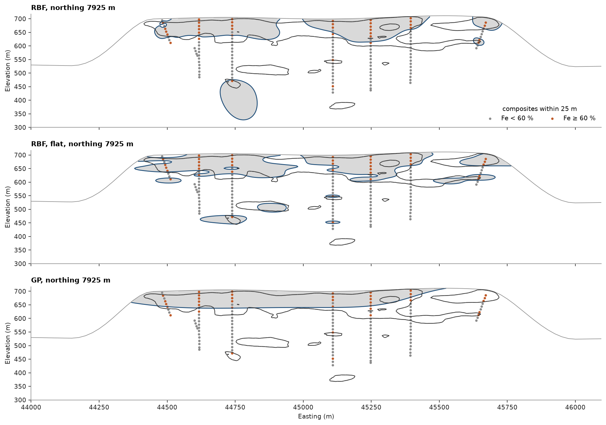

# 52. Grade shells

An implicit model fits a scalar field to the data and takes a surface as one of its level sets, instead of
digitizing outlines section by section. Here a Fe ≥ 60 % shell of the iron formation plateau is modeled from the
drill-hole composites and compared with the supplied `high_grade.stl` solid.

<details><summary>Python</summary>

```python
import ceres as cs
import matplotlib.pyplot as plt
import numpy as np
from common import ACCENT, GRAY, HIGHLIGHT, LIGHT, save
```

</details>

With `cutoff=60` each composite is coded +1 at or above the cutoff and −1 below, so the shell is the zero level of
the field. A radial basis function (RBF) interpolates the codes exactly by solving one dense system, whose cost
grows with the cube of the sample count, so 12 m composites keep it to a few thousand samples. The plateau's
layers are flat, so a second RBF shrinks distances across them (`ratios`: vertical ranges a fifth of the
horizontal). A sparse Gaussian process (GP) smooths through the codes and learns its own ranges.

<details><summary>Python</summary>

```python
data = cs.datasets.iron_formation_plateau()
holes = cs.Drillholes(data["collars"], data["surveys"], data["assays"])
composites = holes.composite(12.0, ["FE_PCT"])
fe = np.asarray(composites["FE_PCT"])
xyz, fe = composites.coords[~np.isnan(fe)], fe[~np.isnan(fe)]
code = np.where(fe >= 60, 1.0, -1.0)
print(f"{len(xyz)} composites, {(code > 0).sum()} at or above 60 % Fe")

models = {
    "RBF": cs.ImplicitModel("rbf", degree=0),
    "RBF, flat": cs.ImplicitModel("rbf", degree=0, rotation=(0, 0, 0), ratios=(1, 0.2)),
    "GP": cs.ImplicitModel("gp", degree=0),
}
for name, model in models.items():
    model.fit(xyz, fe, cutoff=60)
    print(f"{name:>9}: {np.mean(np.sign(model.predict(xyz)) == code):.1%} of composites on their side")
print(f"GP ranges {[round(r) for r in models['GP'].report['lengthscales']]} m")
```

</details>

```text
3437 composites, 658 at or above 60 % Fe
      RBF: 100.0% of composites on their side
RBF, flat: 100.0% of composites on their side
       GP: 87.2% of composites on their side
GP ranges [744, 1475, 262] m
```

Each field is evaluated on the supplied block model, 25 × 25 × 12 m blocks below topography, and compared with
the solid: the volume of the shell, the share of the solid it covers and the share of its own volume outside the
solid. The solid is scored on the composites too.

<details><summary>Python</summary>

```python
solid, blocks = data["high_grade"], data["block_model"]
in_solid = solid.contains(blocks.centroids)
on_side = np.mean(np.where(solid.contains(xyz), 1, -1) == code)
print(f"    solid: {solid.volume / 1e6:5.1f} Mm3, {on_side:.1%} of composites on their side")
for name, model in models.items():
    inside = model.predict(blocks) > 0
    print(
        f"{name:>9}: {blocks.volumes[inside].sum() / 1e6:5.1f} Mm3, "
        f"covers {blocks.volumes[inside & in_solid].sum() / blocks.volumes[in_solid].sum():.0%} of the solid, "
        f"{(inside & ~in_solid).sum() / inside.sum():.0%} outside it"
    )
```

</details>

```text
    solid:  75.5 Mm3, 91.4% of composites on their side
      RBF:  57.0 Mm3, covers 56% of the solid, 29% outside it
RBF, flat:  67.4 Mm3, covers 65% of the solid, 29% outside it
       GP:  47.7 Mm3, covers 50% of the solid, 23% outside it
```

Both RBFs honor every code, yet they cover only 56 % and 65 % of the solid, and the solid itself leaves 8.6 % of
the composites on the wrong side: a cutoff on Fe and a solid drawn around the hematite units are not the same
surface. Flattening the RBF adds a tenth of the solid at no cost in spill. The GP explains an eighth of the codes
as noise and returns a smooth sheet. On an east–west section through the high-grade composites, at true scale,
with the trace of the solid in black and topography as a thin line:

<details><summary>Python</summary>

```python
northing = 25 * round(np.median(xyz[code > 0, 1]) / 25)
x, z = np.meshgrid(np.arange(44000, 46100, 5.0), np.arange(300, 720, 3.0))
section = np.c_[x.ravel(), np.full(x.size, northing), z.ravel()]
topography = data["topography"]
row = np.isclose(topography.centroids[:, 1], northing, atol=12.5)
ground = np.interp(x[0], topography.centroids[row, 0], np.asarray(topography["Z"])[row])
plane = ((0, northing, 0), 90, 90)
fig, axes = plt.subplots(3, 1, figsize=(12, 8.5), layout="constrained", sharex=True)
for ax, (name, model) in zip(axes, models.items(), strict=True):
    field = np.where(z <= ground, model.predict(section).reshape(x.shape), np.nan)
    ax.contourf(x, z, field, levels=[0, np.inf], colors=[LIGHT])
    ax.contour(x, z, field, levels=[0], colors=[ACCENT], linewidths=1.2)
    ax.plot(x[0], ground, color=GRAY, lw=0.8)
    style = {"plane": plane, "thickness": 50, "ax": ax}
    cs.plot.slab(xyz[code < 0], s=6, color=GRAY, label="Fe < 60 %", meshes=solid, **style)
    cs.plot.slab(xyz[code > 0], s=6, color=HIGHLIGHT, label="Fe ≥ 60 %", **style)
    ax.set(title=f"{name}, northing {northing:.0f} m", xlim=(x[0, 0], x[0, -1]), ylim=(z[0, 0], z[-1, 0]))
    if ax is not axes[-1]:
        ax.set_xlabel("")
axes[0].legend(loc="lower right", title="composites within 25 m", ncol=2)
save(fig, "section")
```

</details>



The isotropic RBF grows a round body around one deep high-grade composite; the flat one keeps it a
thin pod, as the solid does. `isosurface` triangulates the zero level at the centroids of a regular grid. With `closed=True` the shell is
capped where it leaves the grid, so it bounds a volume close to that of the cells inside. The grid is the full
box of the block model: the shell is not cut at topography.

<details><summary>Python</summary>

```python
box = cs.BlockModel(origin=blocks.origin, size=blocks.size, count=blocks.count)
shell = models["RBF, flat"].isosurface(box, closed=True)
inside = models["RBF, flat"].predict(box) > 0
print(
    f"flat RBF shell: {len(shell.triangles):,} triangles, closed {shell.is_closed}, {shell.volume / 1e6:.1f} Mm3; "
    f"cells inside {box.volumes[inside].sum() / 1e6:.1f} Mm3"
)
```

</details>

```text
flat RBF shell: 93,624 triangles, closed True, 81.4 Mm3; cells inside 84.9 Mm3
```

Full script: [`example_52.py`](example_52.py)
