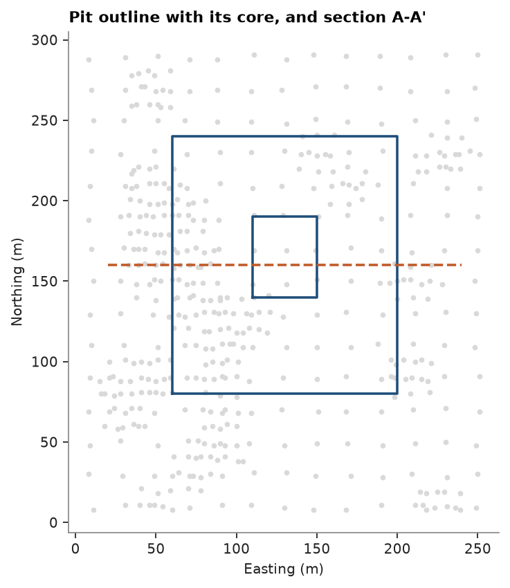

# 57. Storing containers in Parquet

`write_parquet` saves a `PointSet`, `BlockModel` or `Polylines` with its geometry, layout and CRS in the file metadata;
`read_parquet` returns the same container. The file is ordinary Parquet, so polars, pandas or DuckDB read it as a
table. Fitted estimators and categorical estimates are saved the same way.

<details><summary>Python</summary>

```python
import tempfile

import ceres as cs
import matplotlib.pyplot as plt
import numpy as np
import polars as pl
from common import ACCENT, HIGHLIGHT, LIGHT, map_axes, save
```

</details>

Walker Lake `V` is kriged on a 1 m grid with a variogram fitted in eight directions (topic 19 explains the fit), and
the cells above 500 ppm are kept in a masked model.

<details><summary>Python</summary>

```python
samples = cs.datasets.walker_lake()
azimuths = np.arange(0, 180, 22.5)
directional = [cs.experimental_variogram(samples, "V", 10.0, 120.0, azimuth=a) for a in azimuths]
model = cs.Variogram.fit_directional(
    directional, [(a, 0) for a in azimuths], ["spherical", "spherical"], weighting="count/gamma"
)
grid = cs.BlockModel(origin=(0.5, 0.5), size=(1, 1), count=(260, 300), crs="local grid")
kriging = cs.OrdinaryKriging(model, cs.Search(radius=100, max_samples=24, min_samples=4)).fit(samples, "V")
estimate, variance = kriging.predict(grid, return_variance=True)
grid = grid.with_column("estimate", estimate).with_column("variance", variance)
rich = grid.mask(grid["estimate"] > 500)
print(grid)
print(rich)
```

</details>

```text
BlockModel(regular, 78000 of 78000 cells, count [260, 300, 1], size [1.0, 1.0, 1.0], rotation [0.0, 0.0, 0.0])
  estimate: Float64
  variance: Float64
BlockModel(masked, 10273 of 78000 cells, count [260, 300, 1], size [1.0, 1.0, 1.0], rotation [0.0, 0.0, 0.0])
  estimate: Float64
  variance: Float64
```

The masked model keeps 10273 of the 78000 cells; its cell index is stored with the attributes.

<details><summary>Python</summary>

```python
folder = Path(tempfile.mkdtemp())
cs.write_parquet(folder / "grid.parquet", grid)
cs.write_parquet(folder / "rich.parquet", rich)
cs.write_csv(folder / "grid.csv", grid)
for name in ("grid.parquet", "rich.parquet", "grid.csv"):
    print(f"{name:>13}: {(folder / name).stat().st_size / 1e6:.2f} MB")

back = cs.read_parquet(folder / "rich.parquet")
print(back)
print("same cells:", np.array_equal(back.index, rich.index), "| crs:", back.crs)
```

</details>

```text
 grid.parquet: 1.47 MB
 rich.parquet: 0.22 MB
     grid.csv: 4.04 MB
BlockModel(masked, 10273 of 78000 cells, count [260, 300, 1], size [1.0, 1.0, 1.0], rotation [0.0, 0.0, 0.0])
  estimate: Float64
  variance: Float64
same cells: True | crs: local grid
```

The full grid takes 1.47 MB in Parquet against 4.04 MB as CSV. Grouping and summaries belong to polars, which reads
the same file. A regular model stores no coordinates: its geometry is implicit and the row number is the cell index,
x fastest, so a 1 m row of 260 cells is one northing.

<details><summary>Python</summary>

```python
table = pl.read_parquet(folder / "grid.parquet")
bands = (
    table.with_columns((pl.int_range(pl.len()) // 260 // 50 * 50).alias("northing band"))
    .group_by("northing band")
    .agg(
        pl.col("estimate").mean().round(0).alias("mean V"),
        (pl.col("estimate") > 500).mean().round(3).alias("share > 500"),
    )
    .sort("northing band")
)
print(bands)
```

</details>

```text
shape: (6, 3)
┌───────────────┬────────┬─────────────┐
│ northing band ┆ mean V ┆ share > 500 │
│ ---           ┆ ---    ┆ ---         │
│ i64           ┆ f64    ┆ f64         │
╞═══════════════╪════════╪═════════════╡
│ 0             ┆ 315.0  ┆ 0.103       │
│ 50            ┆ 366.0  ┆ 0.175       │
│ 100           ┆ 338.0  ┆ 0.182       │
│ 150           ┆ 304.0  ┆ 0.17        │
│ 200           ┆ 261.0  ┆ 0.111       │
│ 250           ┆ 166.0  ┆ 0.049       │
└───────────────┴────────┴─────────────┘
```

A fitted estimator is saved the same way: its samples become columns and its variogram, search and options JSON
in the file metadata. The estimator read back predicts exactly the same values. `ImplicitModel` and
`LocalAnisotropy` save the same way.

<details><summary>Python</summary>

```python
kriging.to_parquet(folder / "kriging.parquet")
print(pl.read_parquet(folder / "kriging.parquet").head(3))
again = cs.OrdinaryKriging.from_parquet(folder / "kriging.parquet")
print("same estimates:", np.array_equal(again.predict(grid), estimate, equal_nan=True))
```

</details>

```text
shape: (3, 7)
┌──────┬──────┬─────┬───────┬──────┬────────────────┬────────┐
│ x    ┆ y    ┆ z   ┆ value ┆ hole ┆ error_variance ┆ domain │
│ ---  ┆ ---  ┆ --- ┆ ---   ┆ ---  ┆ ---            ┆ ---    │
│ f64  ┆ f64  ┆ f64 ┆ f64   ┆ f64  ┆ f64            ┆ f64    │
╞══════╪══════╪═════╪═══════╪══════╪════════════════╪════════╡
│ 11.0 ┆ 8.0  ┆ 0.0 ┆ 0.0   ┆ null ┆ 0.0            ┆ null   │
│ 8.0  ┆ 30.0 ┆ 0.0 ┆ 0.0   ┆ null ┆ 0.0            ┆ null   │
│ 9.0  ┆ 48.0 ┆ 0.0 ┆ 224.4 ┆ null ┆ 0.0            ┆ null   │
└──────┴──────┴─────┴───────┴──────┴────────────────┴────────┘
same estimates: True
```

A categorical estimate keeps its `Categories` scheme, the names and colors of the codes. Walker Lake's type `T`
(1 and 2) is kriged as indicators on a 5 m grid (topic 64); the probabilities are saved as columns and the scheme
as JSON in the metadata.

<details><summary>Python</summary>

```python
scheme = cs.Categories(["T1", "T2"], mapping={1: "T1", 2: "T2"}, colors=[LIGHT, ACCENT])
types = cs.CategoricalIndicatorKriging(
    cs.Variogram([("spherical", 0.25, 60.0)]), cs.Search(radius=80, max_samples=16), scheme=scheme
).fit(samples, "T")
summary = types.predict(cs.BlockModel(origin=(2.5, 2.5), size=(5, 5), count=(52, 60)))
summary.to_parquet(folder / "types.parquet")
print(pl.read_parquet(folder / "types.parquet").head(3))
kept = cs.CategoricalIndicatorSummary.from_parquet(folder / "types.parquet")
print(
    "same scheme:",
    kept.scheme == scheme,
    "| same probabilities:",
    np.array_equal(kept.probabilities, summary.probabilities),
)
```

</details>

```text
shape: (3, 3)
┌────────────┬─────┬─────┐
│ correction ┆ p_0 ┆ p_1 │
│ ---        ┆ --- ┆ --- │
│ f64        ┆ f64 ┆ f64 │
╞════════════╪═════╪═════╡
│ 2.2204e-16 ┆ 0.0 ┆ 1.0 │
│ 0.0        ┆ 0.0 ┆ 1.0 │
│ 0.0        ┆ 0.0 ┆ 1.0 │
└────────────┴─────┴─────┘
same scheme: True | same probabilities: True
```

Lines and polygons are `Polylines`: one attribute row per feature, each feature made of parts. A closed part is a
ring whose last vertex joins the first; a ring inside another ring of the same feature is a hole. In Parquet a
feature is one row whose `geometry` lists its parts, each a list of vertices; `Polylines.from_table` builds features
from a long table with one row per vertex.

<details><summary>Python</summary>

```python
pit = [[60, 80], [60, 240], [200, 240], [200, 80]]
core = [[110, 140], [150, 140], [150, 190], [110, 190]]
pits = cs.Polylines([pit, core], closed=True, features=[0, 0], attributes={"name": ["pit"]}, crs="local grid")
cs.write_parquet(folder / "pit.parquet", pits)
print(pl.read_parquet(folder / "pit.parquet"))
pits = cs.read_parquet(folder / "pit.parquet")
print(pits)

vertices = pl.DataFrame({"ID": ["A-A'", "A-A'"], "X": [20.0, 240.0], "Y": [160.0, 160.0]})
lines = cs.Polylines.from_table(vertices)
print(lines)

fig, ax = plt.subplots(figsize=(5, 5.2), layout="constrained")
ax.scatter(*samples.coords[:, :2].T, s=6, color=LIGHT)
for part, closed in zip(pits.parts, pits.closed):
    ring = np.vstack([part, part[:1]]) if closed else part
    ax.plot(ring[:, 0], ring[:, 1], color=ACCENT, lw=1.6)
for part in lines.parts:
    ax.plot(part[:, 0], part[:, 1], color=HIGHLIGHT, lw=1.6, ls="--")
map_axes(ax, "Pit outline with its core, and section A-A'")
save(fig, "polylines")
```

</details>

```text
shape: (1, 3)
┌──────┬─────────────────────────────────┬──────────────┐
│ name ┆ geometry                        ┆ closed       │
│ ---  ┆ ---                             ┆ ---          │
│ str  ┆ list[list[struct[3]]]           ┆ list[bool]   │
╞══════╪═════════════════════════════════╪══════════════╡
│ pit  ┆ [[{60.0,80.0,0.0}, {60.0,240.0… ┆ [true, true] │
└──────┴─────────────────────────────────┴──────────────┘
Polylines(1 features, 2 parts, crs: local grid)
  name: Utf8
Polylines(1 features, 1 parts, crs: none)
  ID: Utf8View
```



Full script: [`example_57.py`](example_57.py)
