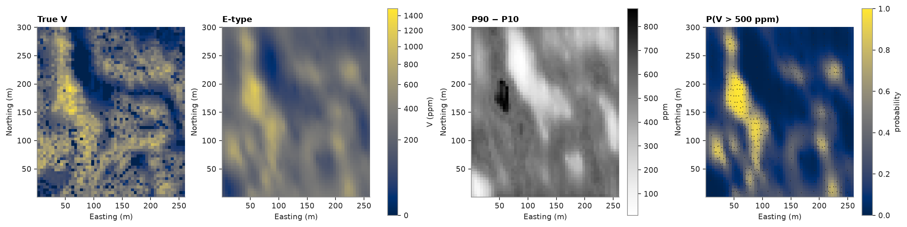
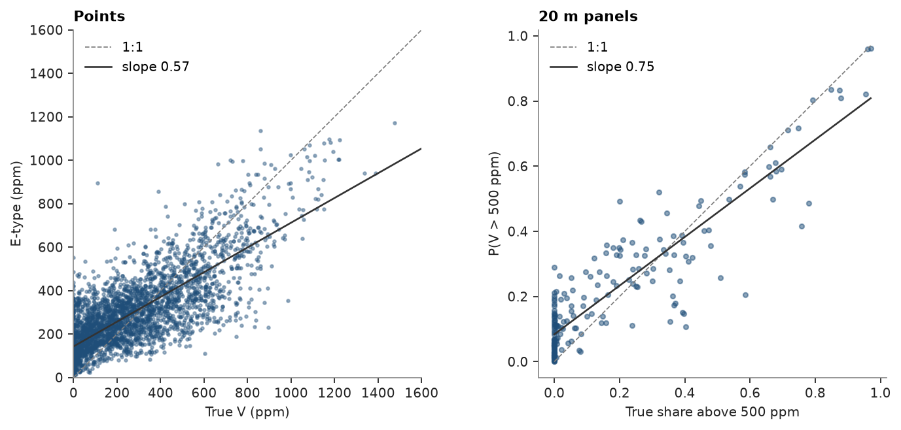

# 68. Multigaussian kriging

Multigaussian kriging estimates a full distribution at every target from a single variogram. The samples take a
normal-score transform; the scores are simple-kriged about 0; and, if the scores are multivariate Gaussian, the
unknown score at a target is Gaussian with the kriged mean and the kriging variance. Back-transformed into data units,
that distribution gives the E-type mean, its variance, quantiles and the probability above any cutoff.

<details><summary>Python</summary>

```python
import ceres as cs
import matplotlib.pyplot as plt
import numpy as np
from common import ACCENT, INK, map_axes, save
from matplotlib.colors import PowerNorm

samples = cs.datasets.walker_lake()
truth = cs.datasets.walker_lake_exhaustive()["V"].reshape(300, 260)
xy, v = samples.coords, samples["V"]
azimuth = cs.Variogram.from_json((HERE.parent / "model.json").read_text()).rotation[0]
```

</details>

## Scores and their variogram

The declustering weights set the transform, so the E-type follows the declustered histogram rather than the
clustered high-grade samples. Some samples are tied at 0 ppm; `despike=True` in `fit` breaks the ties as
[`despike`](../61-despiking/README.md) does, so they get distinct scores. The scores' variogram, along N170° and
N260°, is scaled to a unit sill: the kriging variance is then the variance of the conditional Gaussian.

<details><summary>Python</summary>

```python
weights = cs.cell_declustering(xy, v, sizes=np.arange(2.5, 102.5, 2.5)).weights
print(f"{np.sum(v == 0)} samples at 0 ppm")
y = cs.NormalScore().fit_transform(cs.despike(xy, v), weights=weights)

lag, max_lag = 10.0, 120.0
major = cs.experimental_variogram(xy, y, lag, max_lag, azimuth=azimuth).fit("spherical")
minor = cs.experimental_variogram(xy, y, lag, max_lag, azimuth=azimuth + 90).fit("spherical")
a_major = major.structures[0].range
gaussian = cs.Variogram(
    [("spherical", major.structures[0].sill / major.sill, a_major)],
    nugget=major.nugget / major.sill,
    rotation=(azimuth, 0, 0),
    ratios=(min(minor.structures[0].range / a_major, 1.0), 1.0),
)
print(gaussian)
```

</details>

```text
22 samples at 0 ppm
Variogram(nugget=0.35175731509510166, structures=[Structure("spherical", sill=0.6482426849048983, range=88.80893128585629)], rotation=(170.0, 0.0, 0.0), ratios=(0.4191037941481459, 1.0))
```

## Distributions at points

`predict` returns an `IndicatorSummary`, the same summary multiple indicator kriging gives: here the E-type mean,
the 10th and 90th percentiles and the probability above 500 ppm on a 5 m grid. The tails bound the back-transform
to 0 and the largest sample.

<details><summary>Python</summary>

```python
grid = cs.BlockModel(origin=(0.5, 0.5), size=(5, 5), count=(52, 60))
mg = cs.MultigaussianKriging(gaussian, cs.Search(radius=100, max_samples=24), tails=(0.0, v.max()))
mg.fit(samples, "V", weights=weights, despike=True)
summary = mg.predict(grid, cutoffs=[500.0], quantiles=[0.1, 0.9])
etype, (p10, p90), p500 = summary.mean, summary.quantile_values, summary.probability_above[0]

nodes = grid.centroids.astype(int)
true_at_nodes = truth[nodes[:, 1] - 1, nodes[:, 0] - 1]
print(f"mean E-type {etype.mean():.0f} ppm, true {true_at_nodes.mean():.0f}")
print(f"correlation with the truth {np.corrcoef(etype, true_at_nodes)[0, 1]:.2f}")
print(
    f"truth inside the 80% interval at {np.mean((true_at_nodes >= p10) & (true_at_nodes <= p90)):.0%} of nodes"
)
print(f"expected area above 500 ppm {p500.mean():.1%}, true {np.mean(true_at_nodes > 500):.1%}")
```

</details>

```text
mean E-type 300 ppm, true 276
correlation with the truth 0.78
truth inside the 80% interval at 85% of nodes
expected area above 500 ppm 22.4%, true 18.9%
```

The E-type is smooth like kriging; the probability map says where grade above 500 ppm is likely, and the interval
width where the samples leave the grade uncertain.

<details><summary>Python</summary>

```python
shape = (60, 52)
extent = (0.5, 260.5, 0.5, 300.5)
norm = PowerNorm(0.5, vmin=0, vmax=1500)
fig, axes = plt.subplots(1, 4, figsize=(15, 4.4), layout="constrained")
for ax, image, title in ((axes[0], true_at_nodes, "True V"), (axes[1], etype, "E-type")):
    im = ax.imshow(image.reshape(shape), origin="lower", extent=extent, norm=norm)
    map_axes(ax, title)
fig.colorbar(im, ax=axes[:2], shrink=0.8, label="V (ppm)")
width = axes[2].imshow((p90 - p10).reshape(shape), origin="lower", extent=extent, cmap="Greys")
map_axes(axes[2], "P90 − P10")
fig.colorbar(width, ax=axes[2], shrink=0.8, label="ppm")
p = axes[3].imshow(p500.reshape(shape), origin="lower", extent=extent, vmin=0, vmax=1)
map_axes(axes[3], "P(V > 500 ppm)")
axes[3].scatter(xy[:, 0], xy[:, 1], s=1, color=INK, linewidths=0)
fig.colorbar(p, ax=axes[3], shrink=0.8, label="probability")
save(fig, "maps")
```

</details>



## Panels

With `discretization`, each 20 m panel takes the average of the distributions at 4 × 4 points within it: the
distribution of the point grades inside the panel. Its probability above 500 ppm is then the expected share of the
panel above the cutoff, compared here with the share of the 400 exhaustive values in each panel.

<details><summary>Python</summary>

```python
panels = cs.BlockModel(origin=(0.0, 0.0), size=(20, 20), count=(13, 15))
blocks = mg.predict(panels, cutoffs=[500.0], discretization=(4, 4, 1))
cells = truth.reshape(15, 20, 13, 20)
true_share = (cells > 500).mean(axis=(1, 3)).ravel()
true_mean = cells.mean(axis=(1, 3)).ravel()
print(f"panel means: r {np.corrcoef(blocks.mean, true_mean)[0, 1]:.2f}")
print(f"panel shares above 500 ppm: r {np.corrcoef(blocks.probability_above[0], true_share)[0, 1]:.2f}")

fig, (a, b) = plt.subplots(1, 2, figsize=(9, 4), layout="constrained")
cs.plot.scatter(true_at_nodes, etype, ax=a, s=4, color=ACCENT, alpha=0.4)
a.set(xlim=(0, 1600), ylim=(0, 1600), xlabel="True V (ppm)", ylabel="E-type (ppm)", title="Points")
cs.plot.scatter(true_share, blocks.probability_above[0], ax=b, s=10, color=ACCENT)
b.set(xlabel="True share above 500 ppm", ylabel="P(V > 500 ppm)", title="20 m panels")
for ax in (a, b):
    ax.set_aspect("equal")
    ax.legend(loc="upper left")
save(fig, "checks")
```

</details>

```text
panel means: r 0.91
panel shares above 500 ppm: r 0.90
```



## Checks

Over the whole area the E-type averages to about the declustered mean. Cross-validation re-estimates every sample's
distribution from the others: `accuracy(p)` is the share of samples inside their central `p` interval, close to `p`
when the distributions have the right spread.

<details><summary>Python</summary>

```python
print(f"mean E-type {etype.mean():.0f} ppm, declustered sample mean {np.average(v, weights=weights):.0f} ppm")
cv = mg.cross_validate()
print(f"cross-validation: ME {cv.mean_error:.1f}  RMSE {cv.rmse:.1f}  goodness {cv.goodness:.2f}")
for p, a in zip([0.5, 0.8, 0.9], cv.accuracy([0.5, 0.8, 0.9])):
    print(f"inside the central {p:.0%} interval: {a:.0%}")
```

</details>

```text
mean E-type 300 ppm, declustered sample mean 291 ppm
cross-validation: ME 9.6  RMSE 189.4  goodness 0.96
inside the central 50% interval: 56%
inside the central 80% interval: 87%
inside the central 90% interval: 94%
```

## Compared with multiple indicator kriging

[Multiple indicator kriging](../29-multiple-indicator-kriging/README.md) builds the distribution from indicators
kriged at a set of thresholds, one variogram each, then corrects order relations and fills in between the thresholds
and in the tails. It lets each grade range have its own continuity, such as high grades less continuous than low ones.
Multigaussian kriging needs one variogram and no order-relation correction, and gives smooth distributions at any
cutoff, but it assumes the Gaussian model: high and low scores are equally continuous, and extremes are disconnected.
Where the data show connected high grades, indicators follow them better.

Full script: [`example_68.py`](example_68.py)
