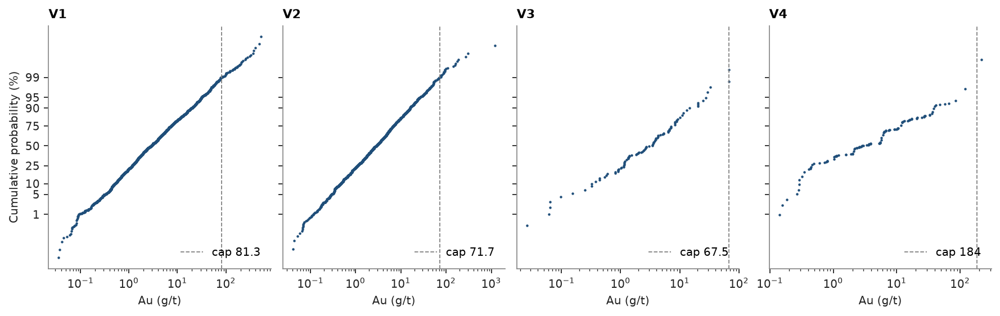
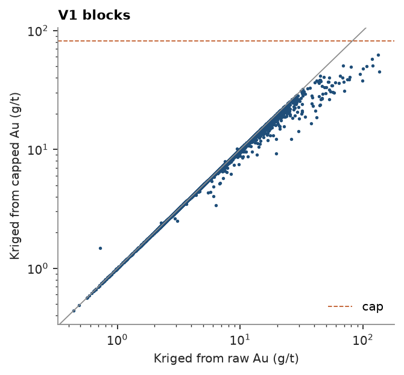

# 69. Capping transform

`Capping` makes the top cut a pipeline step: `fit` chooses a cap per domain from the data, `transform` clips values
to it, and the fitted caps travel with the object to new data, to JSON and to pickle. The cap is either given or
chosen by a rule: a weighted quantile, a target fraction of metal removed, or a target coefficient of variation.

<details><summary>Python</summary>

```python
import ceres as cs
import matplotlib.pyplot as plt
import numpy as np
from common import ACCENT, GRAY, HIGHLIGHT, save
```

</details>

The quartz-vein composites of [topic 8](../08-top-cuts/README.md): gold in four veins, V1 to V4, sampled by
diamond holes and underground channels, composited to 1 m and declustered in 20 m cells.

<details><summary>Python</summary>

```python
data = cs.datasets.vein_gold_grade_control()
intervals = cs.merge_intervals(data["assays"], data["lithology"])
holes = cs.Drillholes(data["collars"], data["surveys"], intervals)
composites = holes.composite(1.0, ["AU_GPT"], domain="LITH", categories=["VEIN"])
quartz = composites.filter((composites["LITH"] == "QV") & ~np.isnan(composites["AU_GPT"]))
weights = cs.cell_declustering(quartz, "AU_GPT", cell_size=20.0).weights
quartz = quartz.with_column("w", weights)
veins = sorted(set(quartz["VEIN"]))
print(f"{len(quartz)} composites in {len(veins)} veins")
```

</details>

```text
5826 composites in 4 veins
```

## One cap per vein

Each rule is fitted per vein on the declustered composites. The quantile rule caps at the declustered P99; the
metal rule finds the cap that removes 5 % of each vein's metal; the CV rule the largest cap whose capped
coefficient of variation is 1.5. `caps_` and `metal_removed_` are dicts by vein.

<details><summary>Python</summary>

```python
rules = {
    "P99": cs.Capping(quantile=0.99),
    "5 % metal": cs.Capping(metal_removed=0.05),
    "CV 1.5": cs.Capping(cv=1.5),
}
for rule in rules.values():
    rule.fit("AU_GPT", domain_column="VEIN", weights="w", data=quartz)
print(f"{'vein':<6}" + "".join(f"{name:>11}{'metal (%)':>11}" for name in rules))
for vein in veins:
    row = "".join(f"{r.caps_[vein]:>11.1f}{100 * r.metal_removed_[vein]:>11.2f}" for r in rules.values())
    print(f"{vein:<6}{row}")
```

</details>

```text
vein          P99  metal (%)  5 % metal  metal (%)     CV 1.5  metal (%)
V1           81.3      10.76      160.6       5.00       48.4      17.07
V2           71.7      15.38      591.8       5.00       48.7      19.38
V3           67.5       0.00       50.5       5.00       54.0       3.97
V4          183.5       0.71      111.6       5.00       52.0      30.36
```

The rules disagree most where the tail is longest. V1 and V2 lose 10 and 14 % of their metal at the P99;
holding the loss to 5 % lifts their caps to 144 and 514 g/t, the latter just under V2's extreme channels. In the
small veins the P99 barely cuts: it is the maximum of V3. A CV of 1.5 caps V1 and V2 near 50 g/t and costs them
15 to 18 % of their metal.

## The same numbers as topic 8

Topic 8 read each vein's declustered P99 off `describe_by` and passed it to `capping_report`. The quantile rule
fits the same caps, and its `metal_removed_` is the report's `1 - mean_capped / mean`.

<details><summary>Python</summary>

```python
capping = rules["P99"]
stats = cs.describe_by("AU_GPT", "VEIN", weights="w", quantiles=[0.99], data=quartz)
top = dict(zip(stats["category"][:-1], stats["P99"][:-1], strict=True))
report = cs.capping_report("AU_GPT", top, domain_column="VEIN", weights="w", data=quartz)
removed = 1 - report["mean_capped"] / report["mean"]
print(f"{'vein':<5}{'P99':>8}{'fitted cap':>12}{'report (%)':>12}{'fitted (%)':>12}")
for k, vein in enumerate(report["domain"][:-1]):
    print(
        f"{vein:<5}{top[vein]:>8.2f}{capping.caps_[vein]:>12.2f}"
        f"{100 * removed[k]:>12.2f}{100 * capping.metal_removed_[vein]:>12.2f}"
    )
```

</details>

```text
vein      P99  fitted cap  report (%)  fitted (%)
V1      81.35       81.35       10.76       10.76
V2      71.68       71.68       15.38       15.38
V3      67.53       67.53        0.00        0.00
V4     183.55      183.55        0.71        0.71
```

On a log-probability plot the dashed caps cut the last percent of each vein's tail.

<details><summary>Python</summary>

```python
fig, axes = plt.subplots(1, len(veins), figsize=(11, 3.4), layout="constrained", sharey=True)
for ax, vein in zip(axes, veins, strict=True):
    keep = quartz["VEIN"] == vein
    cs.plot.probability(
        quartz["AU_GPT"][keep],
        weights=weights[keep],
        log=True,
        cap=capping.caps_[vein],
        ax=ax,
        color=ACCENT,
        ms=2,
    )
    ax.set(title=vein, xlabel="Au (g/t)")
    ax.legend(loc="lower right")
for ax in axes[1:]:
    ax.set_ylabel("")
save(fig, "probability")
```

</details>



## Capped kriging

The capped grades feed the estimate as any other column. Blocks of 5 m inside the V1 solid are kriged from the
raw and from the capped composites of V1 with one variogram and search. The extreme channels no longer spread
their grade over their neighborhood: the richest blocks drop below the diagonal while the low-grade ones stay on
it. The blocks lose 6 % of their mean grade, against 10 % for the declustered composites: most blocks are
estimated from samples below the cap, which capping leaves unchanged.

<details><summary>Python</summary>

```python
v1 = quartz.filter(quartz["VEIN"] == "V1")
v1 = v1.with_column("AU_CAPPED", capping.transform("AU_GPT", domain_column="VEIN", data=v1))
blocks = cs.BlockModel.from_extents(data["vein_V1"], size=(5.0, 5.0, 5.0))
targets = blocks.centroids[data["vein_V1"].contains(blocks.centroids)]
model = cs.experimental_variogram(v1, "AU_CAPPED", 10.0, 150.0).fit("spherical")
search = cs.Search(80.0, max_samples=24)
kriged = {
    column: cs.OrdinaryKriging(model, search).fit(v1, column).predict(targets)
    for column in ("AU_GPT", "AU_CAPPED")
}
for column, grades in kriged.items():
    print(f"{column}: {np.isfinite(grades).sum()} blocks, mean {np.nanmean(grades):.2f} g/t")
print(
    f"composites: {v1['AU_GPT'] @ v1['w'] / v1['w'].sum():.2f} and {v1['AU_CAPPED'] @ v1['w'] / v1['w'].sum():.2f} g/t"
)
```

</details>

```text
AU_GPT: 5225 blocks, mean 7.73 g/t
AU_CAPPED: 5225 blocks, mean 7.31 g/t
composites: 8.52 and 7.60 g/t
```

<details><summary>Python</summary>

```python
fig, ax = plt.subplots(figsize=(4.5, 4))
ax.scatter(kriged["AU_GPT"], kriged["AU_CAPPED"], s=2, color=ACCENT)
ax.axline((0, 0), slope=1, color=GRAY, lw=0.8)
ax.axhline(capping.caps_["V1"], color=HIGHLIGHT, ls="--", lw=0.8, label="cap")
ax.set(xscale="log", yscale="log", xlabel="Kriged from raw Au (g/t)", ylabel="Kriged from capped Au (g/t)")
ax.set_title("V1 blocks")
ax.legend(loc="lower right")
save(fig, "kriged")
```

</details>



## In a pipeline

`Capping` has `fit`, `transform` and `fit_transform` like `NormalScore`, so the two chain: cap, then score, the
usual preparation for a Gaussian simulation. Fitted once, both apply to new samples: 500 g/t is capped to
77 g/t before scoring, so its score is that of the cap. The fitted caps round-trip through JSON and pickle.

<details><summary>Python</summary>

```python
pipeline = cs.Capping(quantile=0.99)
capped = pipeline.fit_transform("AU_GPT", domain_column="VEIN", weights="w", data=v1)
scores = cs.NormalScore().fit(capped, weights=v1["w"])
new = np.array([0.5, 5.0, 50.0, 500.0])
print(scores.transform(pipeline.transform(new, domains=["V1"] * 4)).round(3))
restored = cs.Capping.from_json(pipeline.to_json())
print(restored.caps_ == pipeline.caps_)
```

</details>

```text
[-1.305  0.386  1.981  2.658]
True
```

Full script: [`example_69.py`](example_69.py)
