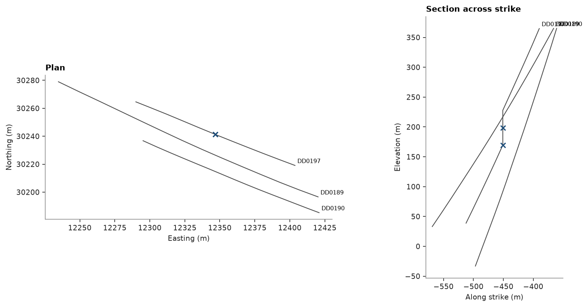

# 89. Hole traces with deviation flags

`cs.plot.holes` generalizes topic 1's single hand-rolled trace (one hole, `ax.plot(path["x"], path["z"])`) to any
set of holes at once: grouped by hole, one line each, labeled, in plan or projected on a section, with extra points
marked on top.

<details><summary>Python</summary>

```python
import ceres as cs
import matplotlib.pyplot as plt
import numpy as np
from common import save
```

</details>

## The flagged stations

`check_drillholes` (topic 1) flags two survey stations of `DD0197`, where the azimuth flips and back. Their
positions come from `Drillholes.at`, at the flagged stations' measured depths; `cs.plot.holes` itself knows
nothing about deviation, only about points to mark.

<details><summary>Python</summary>

```python
data = cs.datasets.stacked_sulphide_lenses(raw=True)
collar, survey = data["collars"], data["surveys"]
flags, _, _ = cs.check_drillholes(
    collar, survey, {"assays": data["assays"], "lithology": data["lithology"]}, max_depth="LENGTH"
)
deviated = np.asarray(flags["survey"]["deviation"], dtype=bool)
flagged_holes = np.asarray(survey["HOLE_ID"], dtype=object)[deviated]
flagged_depths = np.asarray(survey["DEPTH"], dtype=float)[deviated]
print(f"{deviated.sum()} flagged stations, in {sorted(set(flagged_holes))}")

drillholes = cs.Drillholes(collar, survey)
marked = drillholes.at(list(flagged_holes), flagged_depths)
```

</details>

```text
2 flagged stations, in ['DD0197']
```

## Plan and section

The holes within 40 m of `DD0197`'s collar, in plan view and on a section across strike (113°, as in topics 53,
80 and 85) through it: one call each, instead of one `ax.plot` per hole.

<details><summary>Python</summary>

```python
at_dd0197 = np.asarray(collar["HOLE_ID"]) == "DD0197"
x0, y0, z0 = (float(np.asarray(collar[c])[at_dd0197][0]) for c in ("X", "Y", "Z"))
near = np.hypot(np.asarray(collar["X"]) - x0, np.asarray(collar["Y"]) - y0) < 40.0
nearby = set(np.asarray(collar["HOLE_ID"])[near])

paths = drillholes.paths()
local = paths.filter(np.isin(np.asarray(paths["HOLE_ID"]), list(nearby)))

fig, axes = plt.subplots(1, 2, figsize=(11, 5.2), layout="constrained")
cs.plot.holes(local, mark=marked, ax=axes[0])
axes[0].set_title("Plan")
cs.plot.holes(local, plane=((x0, y0, z0), 113.0, 90.0), mark=marked, ax=axes[1])
axes[1].set_title("Section across strike")
save(fig, "traces")
```

</details>



Full script: [`example_89.py`](example_89.py)
