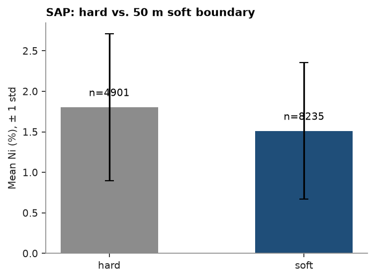

# 91. Soft-boundary statistics

`contact()` (topic 9) showed nickel tapering into the LIM/SAP contact rather than stepping at it: a gradational,
soft boundary. Topic 30 opens `SAP`'s search to `LIM` samples within 50 m rather than restricting it to `SAP`
alone. `soft_boundary()` puts a number on what that buffer draws in: `SAP` statistics computed alone (hard)
against also folding in `LIM` samples within the buffer of their nearest `SAP` sample (soft).

<details><summary>Python</summary>

```python
import ceres as cs
import matplotlib.pyplot as plt
import numpy as np
from common import ACCENT, GRAY, save

data = cs.datasets.nickel_laterite_profile()
intervals = cs.merge_intervals(data["assays"], data["horizons"])
samples = cs.Drillholes(data["collars"], data["surveys"], intervals).samples()
samples = samples.filter(np.isin(np.asarray(samples["HORIZON"]), ["LIM", "SAP"]))
```

</details>

`contact` put Ni at 1.10 % just outside the LIM/SAP contact and 1.32 % just inside, still climbing several meters
into the saprolite rather than stepping there. That gradation is why topic 30 opens `SAP`'s search to `LIM` within
50 m instead of restricting it to `SAP` alone; here, straight 3-D distance rather than the search's flattened
ellipsoid.

<details><summary>Python</summary>

```python
added, stats = cs.soft_boundary(samples, "NI_PCT", domain_column="HORIZON", target="SAP", buffer=50.0)
print(f"{added.sum()} of {len(added)} LIM samples fall within 50 m of a SAP sample")
for kind, n, mean, variance in zip(stats["kind"], stats["n"], stats["mean"], stats["variance"], strict=True):
    print(f"{kind:>4}: n={n:.0f}, mean={mean:.2f} % Ni, variance={variance:.3f}")
```

</details>

```text
3334 of 3334 LIM samples fall within 50 m of a SAP sample
hard: n=4901, mean=1.81 % Ni, variance=0.822
soft: n=8235, mean=1.51 % Ni, variance=0.714
```

Every `LIM` sample sits within 50 m, straight-line, of some `SAP` sample: the holes are on a 50 m mesh (25 m
infill), so this isotropic buffer folds the whole of `LIM` in, and `SAP`'s soft row becomes the pooled statistics
of both horizons. That is the ceiling on what opening the boundary at 50 m could do: `SAP`'s mean falls from
1.81 % (hard, its own 4901 samples) to 1.51 % Ni once all 3334 `LIM` samples join it (variance falls too, from
0.82 to 0.71, though the CV rises since the mean moves further than the spread). The search's anisotropic
ellipsoid is far tighter, reaching only about 5 m up or down at 50 m across, so the shift kriging actually sees
is local and much smaller: topic 30 found 1.55 % against 1.28 % held out in the last meter of `SAP` hardened,
1.34 % opened one way. `soft_boundary` bounds the dilution a distance-only buffer would risk and shows why the
search measures it in the fitted ellipsoid, not straight-line.

<details><summary>Python</summary>

```python
fig, ax = plt.subplots(figsize=(4.6, 3.4), layout="constrained")
kinds = list(stats["kind"])
ax.bar(kinds, stats["mean"], yerr=stats["std"], color=[GRAY, ACCENT], capsize=4, width=0.5)
for i, (n, m) in enumerate(zip(stats["n"], stats["mean"], strict=True)):
    ax.annotate(f"n={n:.0f}", (i, m), textcoords="offset points", xytext=(0, 10), ha="center")
ax.set(ylabel="Mean Ni (%), ± 1 std", title="SAP: hard vs. 50 m soft boundary")
save(fig, "soft_boundary")
```

</details>



Full script: [`example_91.py`](example_91.py)
