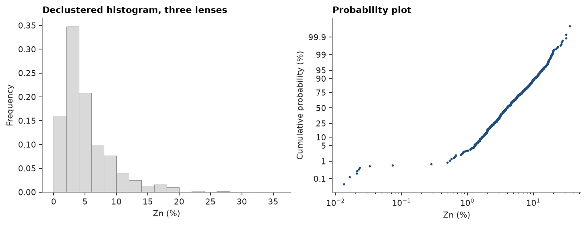
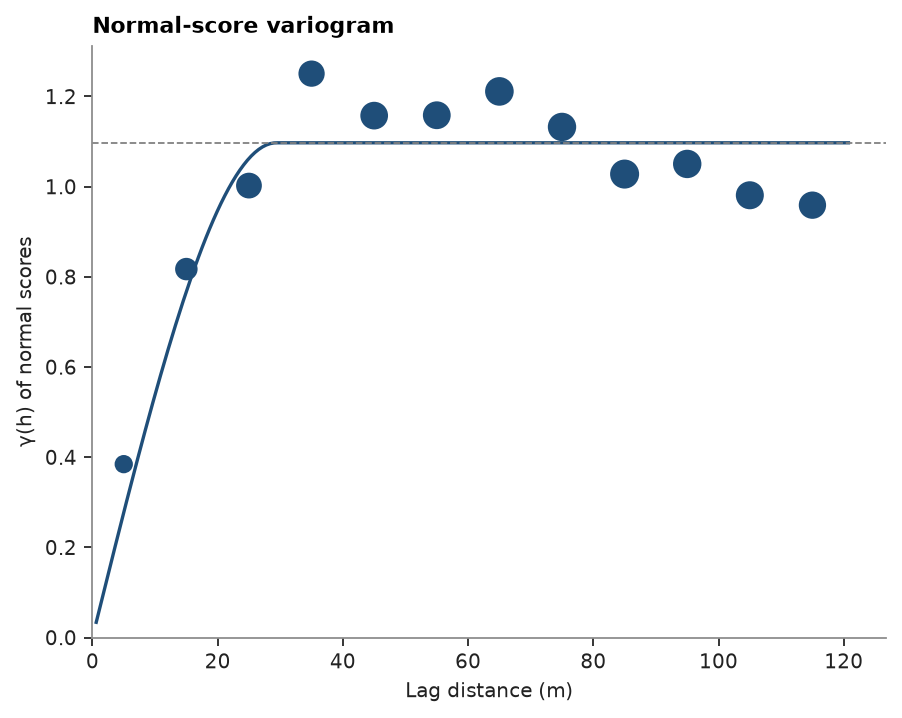
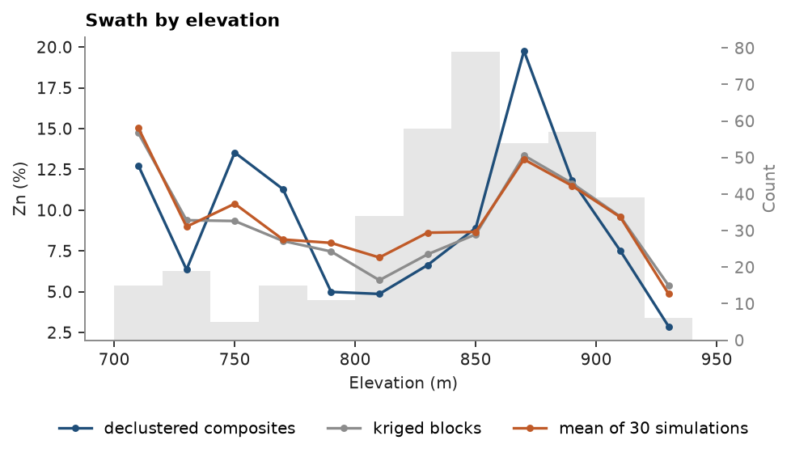
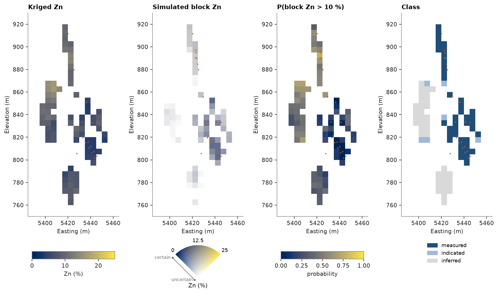

# 2. From drill holes to a classified model

A resource estimate of three stacked sulphide lenses, end to end: drill-hole tables to composites inside each
lens wireframe, declustered statistics and a capping check, the Zn variogram, a sub-blocked model built from the
wireframes, Zn and density kriged in search passes, block-support simulation for risk, validation, classification,
and tonnes and metal per lens saved to Parquet.

<details><summary>Python</summary>

```python
import tempfile

import ceres as cs
import matplotlib.pyplot as plt
import numpy as np
from common import ACCENT, GRAY, HIGHLIGHT, LIGHT, save
```

</details>

## Drill holes

Collars, surveys and assays become desurveyed drill holes; each assay sits at the midpoint of its interval.

<details><summary>Python</summary>

```python
data = cs.datasets.stacked_sulphide_lenses()
drillholes = cs.Drillholes(data["collars"], data["surveys"], data["assays"])
samples = drillholes.samples()
print(f"{len(drillholes)} holes, {len(samples)} assays")
```

</details>

```text
289 holes, 16995 assays
```

## Samples inside each lens

Each lens wireframe is a closed mesh, so it has an inside. Each assay takes the name of the lens around its
midpoint, and 2 m composites never cross from one lens to another or into the host rock.

<details><summary>Python</summary>

```python
lenses = {name: data[name] for name in ("lens_1", "lens_2", "lens_3")}
for name, mesh in lenses.items():
    print(f"{name}: closed {mesh.is_closed}, {mesh.volume / 1e6:.2f} Mm3")

lens = np.full(len(samples), "host", dtype=object)
for name, mesh in lenses.items():
    lens[mesh.contains(samples.coords)] = name
intervals = samples.with_columns({"LENS": list(lens)}).attributes
drillholes = cs.Drillholes(data["collars"], data["surveys"], intervals)
composites = drillholes.composite(2.0, ["ZN_PCT", "DENSITY"], domain="LENS", residual="merge")
composites = composites.filter(np.array(composites["LENS"], dtype=object) != "host")
names = np.array(composites["LENS"], dtype=object)
for name in lenses:
    inside = names == name
    measured = np.isfinite(composites["DENSITY"][inside]).sum()
    holes = len(set(composites["HOLE_ID"][inside]))
    print(f"{name}: {inside.sum()} composites from {holes} holes, {measured} with a density")
```

</details>

```text
lens_1: closed True, 2.79 Mm3
lens_2: closed True, 1.90 Mm3
lens_3: closed True, 1.65 Mm3
lens_1: 609 composites from 78 holes, 408 with a density
lens_2: 279 composites from 53 holes, 234 with a density
lens_3: 263 composites from 49 holes, 200 with a density
```

## Declustering and capping

Holes cluster where a lens is rich, so each lens is cell-declustered on its own. The capping table then shows how
much metal the top composites carry.

<details><summary>Python</summary>

```python
weights = np.zeros(len(composites))
for name in lenses:
    inside = names == name
    zn = composites["ZN_PCT"][inside]
    declustering = cs.cell_declustering(composites.coords[inside], zn, sizes=np.arange(10, 105, 5))
    weights[inside] = declustering.weights / declustering.weights.mean()
    print(
        f"{name}: mean {zn.mean():.2f} % Zn, declustered {declustering.mean:.2f} % ({declustering.cell_size:.0f} m cells)"
    )
composites = composites.with_column("weight", weights)

caps = cs.capping("ZN_PCT", weights="weight", data=composites)
for cap, fraction, removed in zip(caps["cap"], caps["fraction"], caps["metal_removed"], strict=True):
    print(f"cap {cap:5.1f} % Zn: {fraction:5.1%} of composites cut, {removed:5.1%} of the metal removed")

fig, (a, b) = plt.subplots(1, 2, figsize=(9, 3.4), layout="constrained")
cs.plot.histogram(
    "ZN_PCT", weights="weight", data=composites, bins=np.arange(0, 38, 2), ax=a, color=LIGHT, edgecolor=GRAY
)
a.set(xlabel="Zn (%)", title="Declustered histogram, three lenses")
cs.plot.probability("ZN_PCT", weights="weight", data=composites, log=True, ax=b, color=ACCENT, ms=3)
b.set(xlabel="Zn (%)", title="Probability plot")
save(fig, "statistics")
```

</details>

```text
lens_1: mean 6.26 % Zn, declustered 5.22 % (90 m cells)
lens_2: mean 6.17 % Zn, declustered 5.24 % (40 m cells)
lens_3: mean 5.99 % Zn, declustered 5.17 % (80 m cells)
cap  10.3 % Zn: 10.0% of composites cut,  8.2% of the metal removed
cap  13.4 % Zn:  5.0% of composites cut,  3.8% of the metal removed
cap  16.6 % Zn:  2.5% of composites cut,  1.6% of the metal removed
cap  18.9 % Zn:  1.0% of composites cut,  0.9% of the metal removed
cap  21.8 % Zn:  0.5% of composites cut,  0.5% of the metal removed
cap  31.3 % Zn:  0.1% of composites cut,  0.0% of the metal removed
```



Declustering lowers every lens mean, most in lens 1. The top 1 % of composites, above 19.6 % Zn, holds 0.8 % of
the metal, and the probability plot shows no break in the upper tail: the grades are left uncapped.

## Zn variogram of lens 1

Lens 1 has the most composites. A thin lens leaves few pairs across it, so the variogram is omnidirectional;
kriging uses the variogram of the grades, simulation that of the declustered normal scores, rescaled to a unit
sill.

<details><summary>Python</summary>

```python
one = composites.filter(names == "lens_1")
grades = cs.experimental_variogram(one, "ZN_PCT", 10.0, 150.0)
variogram = grades.fit("spherical")
scores = cs.NormalScore().fit(one["ZN_PCT"], weights=one["weight"])
fitted = cs.experimental_variogram(one.coords, scores.transform(one["ZN_PCT"]), 10.0, 150.0).fit("spherical")
structure = fitted.structures[0]
gaussian = cs.Variogram(
    [("spherical", structure.sill / fitted.sill, structure.range)], nugget=fitted.nugget / fitted.sill
)
for label, model in (("Zn", variogram), ("normal scores", gaussian)):
    s = model.structures[0]
    print(f"{label}: nugget {model.nugget:.2f}, spherical sill {s.sill:.2f}, range {s.range:.0f} m")

fig, ax = cs.plot.variogram(grades, variogram=variogram, color=ACCENT)
ax.set(xlabel="Lag distance (m)", ylabel="γ(h), Zn (%²)", title="Zn variogram, lens 1")
save(fig, "variogram")
```

</details>

```text
Zn: nugget 9.90, spherical sill 13.27, range 38 m
normal scores: nugget 0.49, spherical sill 0.51, range 43 m
```



## A sub-blocked model

Parent blocks of 10 m are split into 5 m sub-blocks wherever a wireframe cuts them, so the model keeps each
lens's volume; blocks outside every lens are dropped.

<details><summary>Python</summary>

```python
low = np.min([m.bounds[0] for m in lenses.values()], axis=0)
high = np.max([m.bounds[1] for m in lenses.values()], axis=0)
origin = np.floor(low / 10) * 10
count = [int(c) for c in np.ceil((high - origin) / 10)]
blocks = cs.BlockModel.from_meshes(
    origin, (10, 10, 10), count, [(mesh, "inside", name) for name, mesh in lenses.items()], 2, column="LENS"
)
block_lens = np.array(blocks["LENS"], dtype=object)
for name, mesh in lenses.items():
    volume = blocks.volumes[block_lens == name].sum()
    print(
        f"{name}: {np.sum(block_lens == name)} blocks, {volume / 1e6:.3f} Mm3 against {mesh.volume / 1e6:.3f} Mm3"
    )
```

</details>

```text
lens_1: 7511 blocks, 2.789 Mm3 against 2.788 Mm3
lens_2: 6575 blocks, 1.900 Mm3 against 1.901 Mm3
lens_3: 5895 blocks, 1.651 Mm3 against 1.653 Mm3
```

## Kriging in passes

Each lens is kriged from its own composites (`domain_column`). The first pass wants six composites within the
variogram range, at most two per hole, so at least three holes; blocks it leaves go to a pass at twice the range,
and a last one reaches every block. Two per hole matters here: holes with long intercepts tend to be the richer
ones, and would otherwise fill the search with their own composites. Density, measured on fewer samples, is
kriged the same way with the shape of the Zn variogram: kriging weights do not depend on the sill.

<details><summary>Python</summary>

```python
reach = variogram.structures[0].range
passes = [
    cs.Search(reach, max_samples=12, min_samples=6, max_per_hole=2),
    cs.Search(2 * reach, max_samples=12, min_samples=4, max_per_hole=2),
    cs.Search(250, max_samples=12, max_per_hole=2),
]
zn = cs.OrdinaryKriging(variogram, passes).fit(composites, "ZN_PCT", holes="HOLE_ID", domain_column="LENS")
kriged = zn.predict(blocks, diagnostics=True, domain_column="LENS")
measured = composites.filter(np.isfinite(composites["DENSITY"]))
density = cs.OrdinaryKriging(variogram, passes).fit(
    measured, "DENSITY", holes="HOLE_ID", domain_column="LENS"
)
blocks = blocks.with_columns(
    {
        "zn": kriged["value"],
        "density": density.predict(blocks, domain_column="LENS"),
        "pass": kriged["pass"],
        "slope": kriged["slope"],
    }
)
for p in (1, 2, 3):
    print(f"pass {p}: {np.mean(kriged['pass'] == p):.0%} of blocks")
print(f"density {np.nanmin(blocks['density']):.2f}-{np.nanmax(blocks['density']):.2f} t/m3")
```

</details>

```text
pass 1: 8% of blocks
pass 2: 91% of blocks
pass 3: 1% of blocks
density 3.00-4.22 t/m3
```

## Simulation at block support

Kriging smooths; the risk in a stope comes from simulation. Thirty sequential Gaussian simulations of lens 1
run on 5 m nodes, eight to each 10 m parent block the lens touches, and `blocks=` averages each realization
over those blocks, so the probability above 5 % Zn is that of a 10 m block. The first two kriging passes serve as
the simulation's search.

<details><summary>Python</summary>

```python
grid = cs.BlockModel(origin, (10, 10, 10), count)
parents = grid.mask(np.isin(np.arange(len(grid)), blocks.index[block_lens == "lens_1"]))
nodes = parents.discretize(2)
sgs = cs.SGS(gaussian, passes[:2]).fit(one, "ZN_PCT", weights="weight", holes="HOLE_ID")
summary = sgs.simulate(nodes, n=30, seed=1, cutoffs=[5.0], blocks=parents)
low, high = np.quantile(summary.realization_above[0], [0.1, 0.9])
print(f"{len(parents)} parent blocks: P10 {low:.0%}, P90 {high:.0%} of them above 5 % Zn")
sure = np.mean(summary.probability_above[0] > 0.9)
print(f"mean {summary.mean.mean():.2f} % Zn; blocks above 5 % in more than 90 % of realizations: {sure:.0%}")
```

</details>

```text
4417 parent blocks: P10 43%, P90 49% of them above 5 % Zn
mean 5.27 % Zn; blocks above 5 % in more than 90 % of realizations: 1%
```

In eight realizations out of ten, between 42 and 48 % of the parent blocks exceed 5 % Zn, yet only 1 % of them do
so in more than 90 % of the realizations: at this drill spacing hardly any single block is a sure thing, even
though the share of ore across the lens is well known.

## Validation

The kriged blocks, weighted by volume, should match the declustered composites of each lens, and a nearest-neighbor
model, the other unbiased reference, and follow them along strike and down the lens.

<details><summary>Python</summary>

```python
nearest = cs.NearestNeighbor(cs.Search(250, max_samples=1)).fit(composites, "ZN_PCT", domain_column="LENS")
blocks = blocks.with_column("nn", nearest.predict(blocks, domain_column="LENS"))
for name in lenses:
    inside = block_lens == name
    bias = cs.global_bias(
        blocks["zn"][inside],
        composites["ZN_PCT"][names == name],
        weights=blocks.volumes[inside],
        data_weights=weights[names == name],
    )
    nn = np.average(blocks["nn"][inside], weights=blocks.volumes[inside])
    print(
        f"{name}: kriged {bias['estimate_mean']:.2f} % Zn, declustered composites {bias['data_mean']:.2f} % "
        f"({bias['relative']:+.1%}), nearest neighbor {nn:.2f} % ({bias['estimate_mean'] / nn - 1:+.1%})"
    )

in_one = block_lens == "lens_1"
fig, axes = plt.subplots(1, 2, figsize=(9, 3.4), layout="constrained")
for ax, (axis, label) in zip(axes, (("y", "Northing (m)"), ("z", "Elevation (m)")), strict=True):
    cs.plot.swath(
        [
            cs.swath(one, "ZN_PCT", 40.0, axis=axis),
            cs.swath(
                blocks.centroids[in_one],
                blocks["nn"][in_one],
                40.0,
                axis=axis,
                weights=blocks.volumes[in_one],
            ),
            cs.swath(
                blocks.centroids[in_one],
                blocks["zn"][in_one],
                40.0,
                axis=axis,
                weights=blocks.volumes[in_one],
            ),
        ],
        labels=["composites", "nearest neighbor", "kriged blocks"],
        ax=ax,
    )
    ax.set(xlabel=label, ylabel="Zn (%)")
    ax.get_legend().remove()
axes[0].set_title("Lens 1 swaths")
fig.legend(*axes[0].get_legend_handles_labels(), loc="outside lower center", ncol=3)
save(fig, "swath")
```

</details>

```text
lens_1: kriged 5.49 % Zn, declustered composites 5.22 % (+5.3%), nearest neighbor 5.50 % (-0.1%)
lens_2: kriged 5.46 % Zn, declustered composites 5.24 % (+4.2%), nearest neighbor 4.88 % (+11.8%)
lens_3: kriged 5.30 % Zn, declustered composites 5.17 % (+2.5%), nearest neighbor 4.48 % (+18.3%)
```



In lens 1 the kriged mean equals that of the nearest-neighbor model and lies 7.1 % above the declustered
composites; in lenses 2 and 3 it is within 3 % of the declustered composites but 12 and 18 % above nearest
neighbor. The two references disagree with each other as much as with the model: nearest neighbor spreads each
edge composite over the blocks around it, and cell declustering depends on the cell size it settles on. Along
northing and elevation, kriged blocks and nearest neighbor follow the same course, and the composites swing
around both, as raw data do.

## Classification

Measured blocks come from the first pass with a slope of regression of at least 0.6; indicated, from the first
two passes with a slope of 0.3; the rest is inferred. With a nugget of 43 % of the sill and a 38 m range, only
blocks close to several holes qualify as measured.

<details><summary>Python</summary>

```python
rules = [
    ("measured", {"pass": ("<=", 1), "slope": (">=", 0.6)}),
    ("indicated", {"pass": ("<=", 2), "slope": (">=", 0.3)}),
]
classes = cs.classify(kriged, rules, default="inferred")
categories = cs.Categories(["measured", "indicated", "inferred"], colors=[ACCENT, "#9ebad6", LIGHT])
blocks = blocks.with_column("class", categories.encode(classes))
for name in categories.names:
    print(f"{name:>9}: {np.mean(classes == name):.0%} of blocks")
```

</details>

```text
 measured: 2% of blocks
indicated: 39% of blocks
 inferred: 59% of blocks
```

Lens 1 is seen face on, on the plane through its middle, with its outline on that plane and its composites as
dots. The plane's pole is the least spread direction of the wireframe's vertices.

<details><summary>Python</summary>

```python
parents = parents.with_column("p_above_5", summary.probability_above[0])
vertices = lenses["lens_1"].vertices
pole = np.linalg.eigh(np.cov(vertices.T))[1][:, 0]
pole *= np.sign(pole[2])
strike = (np.degrees(np.arctan2(pole[0], pole[1])) - 90) % 360
dip = np.degrees(np.arccos(pole[2]))
print(f"lens 1 strikes {strike:03.0f}°, dips {dip:.0f}°")
plane = (tuple(vertices.mean(axis=0)), strike, dip)
fig, axes = plt.subplots(3, 1, figsize=(7, 10), layout="constrained", sharex=True)
cs.plot.section(blocks, "zn", plane=plane, ax=axes[0], colorbar=False, vmin=0, vmax=12)
cs.plot.section(parents, "p_above_5", plane=plane, ax=axes[1], colorbar=False, vmin=0, vmax=1)
cs.plot.section(blocks, "class", plane=plane, ax=axes[2], colorbar=False, scheme=categories)
for ax in axes[:2]:
    fig.colorbar(ax.images[0], cax=ax.inset_axes([0.7, 1.04, 0.28, 0.04]), orientation="horizontal")
cs.plot.category_legend(categories, axes[2], loc="lower right", bbox_to_anchor=(1, 1), ncol=3)
titles = ("Kriged Zn (%)", "P(10 m block Zn > 5 %)", "Class")
for ax, title in zip(axes, titles, strict=True):
    cs.plot.slab(one, plane=plane, thickness=60, meshes=[lenses["lens_1"]], s=3, color=HIGHLIGHT, ax=ax)
    ax.set(title=title, aspect="equal")
save(fig, "section")
```

</details>

```text
lens 1 strikes 021°, dips 59°
```



## Tonnes and metal

Tonnes are block volume × kriged density and metal is tonnes × Zn, per lens and class, in all of each lens and
above a 5 % Zn cutoff.

<details><summary>Python</summary>

```python
print(f"{'':20}{'kt':>8}{'Zn %':>7}{'kt Zn':>8}")
for groups in (block_lens, classes):
    table = cs.grade_tonnage(
        "zn", [0.0, 5.0], weights=blocks.volumes, density="density", categories=groups, data=blocks
    )
    for category, cutoff, tonnes, grade, metal in zip(
        *(table[c] for c in ("category", "cutoff", "tonnage", "mean_grade", "metal")), strict=True
    ):
        print(f"{category:10} ≥ {cutoff:1.0f} % Zn{tonnes / 1e3:8.0f}{grade:7.2f}{metal / 1e5:8.1f}")
```

</details>

```text
                          kt   Zn %   kt Zn
lens_1     ≥ 0 % Zn    9564   5.55   530.4
lens_1     ≥ 5 % Zn    4700   7.31   343.4
lens_2     ≥ 0 % Zn    6412   5.51   353.4
lens_2     ≥ 5 % Zn    3566   7.01   249.9
lens_3     ≥ 0 % Zn    5531   5.33   294.9
lens_3     ≥ 5 % Zn    2974   6.38   189.7
all        ≥ 0 % Zn   21507   5.48  1178.7
all        ≥ 5 % Zn   11241   6.97   783.0
indicated  ≥ 0 % Zn    8681   5.73   497.1
indicated  ≥ 5 % Zn    4803   7.26   348.8
inferred   ≥ 0 % Zn   12198   5.21   635.3
inferred   ≥ 5 % Zn    6021   6.58   396.0
measured   ≥ 0 % Zn     628   7.38    46.4
measured   ≥ 5 % Zn     417   9.15    38.2
all        ≥ 0 % Zn   21507   5.48  1178.7
all        ≥ 5 % Zn   11241   6.97   783.0
```

The three lenses hold 21.5 Mt at 5.48 % Zn, 1.18 Mt of zinc, of which 11.2 Mt at 6.97 % lie above 5 % Zn. Lens 1
carries 45 % of the metal; measured blocks, only 628 kt, are its rich core near the top.

The model, sub-blocks, lens names, grades, classes and all, goes to Parquet and back unchanged.

<details><summary>Python</summary>

```python
with tempfile.TemporaryDirectory() as folder:
    path = Path(folder) / "lenses.parquet"
    cs.write_parquet(path, blocks)
    stored = cs.read_parquet(path)
print(f"{len(stored)} blocks, columns {stored.attributes.column_names}")
same = np.array_equal(stored.extents, blocks.extents) and np.array_equal(stored["zn"], blocks["zn"])
print(f"same sub-blocks and Zn: {same}")
```

</details>

```text
19981 blocks, columns ['LENS', 'zn', 'density', 'pass', 'slope', 'nn', 'class']
same sub-blocks and Zn: True
```

Full script: [`tutorial_02.py`](tutorial_02.py)
